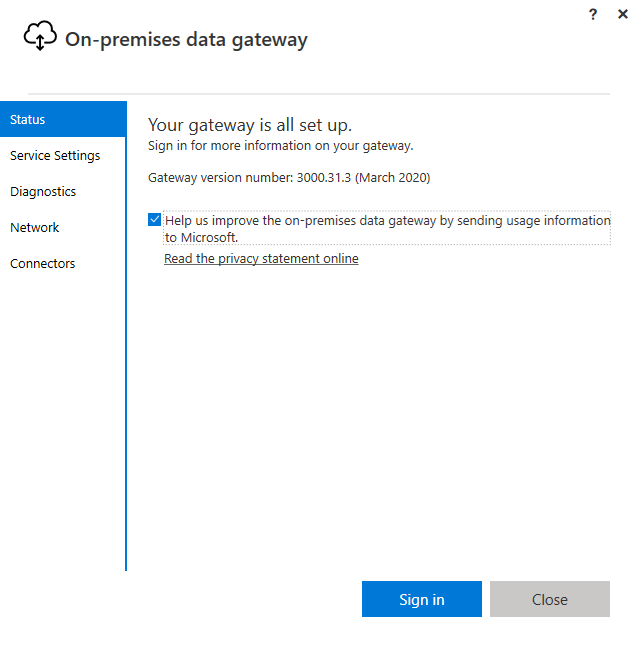
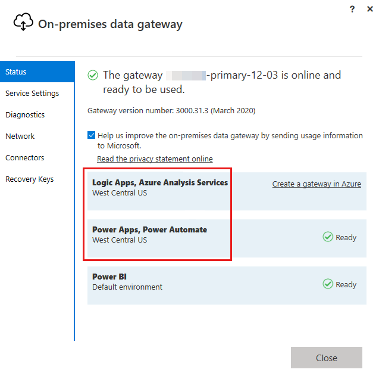

# Check if the gateway is in the right region

This article provides a solution to an issue where you can't see your gateway in Power Automate.

_Applies to:_ &nbsp; Power Automate  
_Original KB number:_ &nbsp; 4555609

## Symptoms

I can't see my gateway in Power Automate, either on the Gateway page and/or when trying to create a desktop flows connection.

## Verifying issue

1. Check the region of your Power Apps environment
    1. Go to the [Power Platform environment admin page](https://admin.powerplatform.microsoft.com/environments).
    1. Verify the region of the environment you're using:

        

    1. Go to [Power Automate](https://flow.microsoft.com/) and verify you're using the expected environment.

        

    1. If you're using the expected environment and can't see your gateway, we need to verify the gateway's region.

2. Verify the region of your gateway
    1. On the computer hosting the gateway, search for **On-premises data gateway** in the **start** menu, and launch the app:
        

    1. On the app's **Status** page, press the **Sign-In** button and sign in with the credentials you used when creating the gateway. If you can't remember the credentials you used when creating the Gateway, go straight to section 3 below (Solving steps).
        

    1. Once signed in, you can see the region of your Gateway on the **Status** page. If the region matches the one of your environments, contact support. Otherwise, continue reading on:
        

## Solving steps

Reinstalling the Gateway in the proper environment.

It's unfortunately not possible to change the region of a gateway that's already installed, so you'll need to do the setup from scratch.

1. Uninstall the Gateway from the **Add or Remove Programs app**. Search for **On-premises Data Gateway**, select **Uninstall** and follow the wizard.
1. Download and run the latest version of the On-Premises Data Gateway installer available [here](https://powerapps.microsoft.com/downloads/).
1. Follow the wizard until reaching the Gateway naming page. Select the **Change region** link:
    

1. Select the region matching your PowerApps environment, and hit **Done**.
1. Keep following the Gateway installation wizard until complete.
1. Go to the Gateway page of the flow portal in the target environment.
1. Verify that the Gateway properly appears in the list of Gateways. If the Gateway is still missing, contact the Microsoft support.
