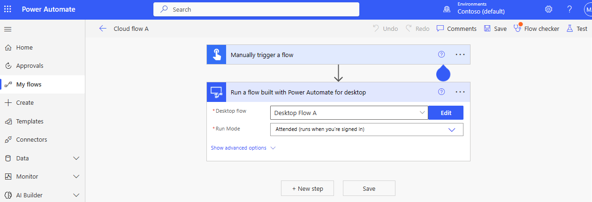
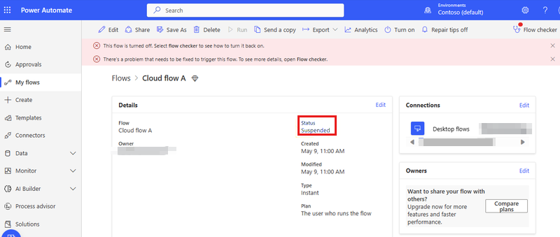
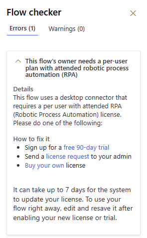
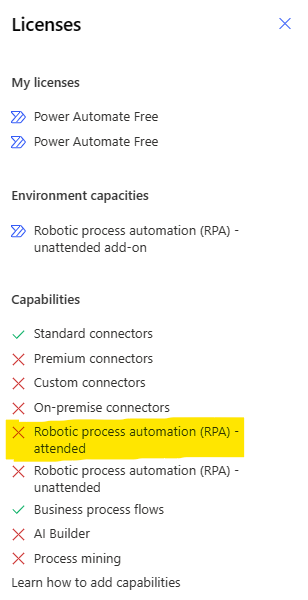
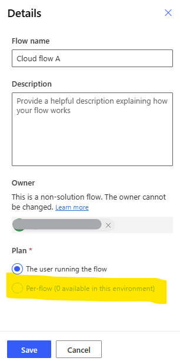

# Cloud flow suspended - Missing attended RPA capability

This article provides a resolution for the issue where a cloud flow is suspended because its owner is missing the attended RPA capability.

_Applies to:_ &nbsp; Power Automate   

## Symptoms

You just created a new cloud flow with a desktop flow card in attended mode :

  

... after save time you see that the cloud flow can't be triggered (the `Run` button on the top panel is also deactivated) and has the status `Suspended` :

   

## Cause

If you click on the `Flow checker` button, a specfic message informs you that the user owning this cloud flow needs the attended RPA capability : 

  

You can double check your user capabilities by clicking on `Settings` (the gear icon on top right) >> `View my Licenses` : 

    

## Resolution

There are 3 solutions to solve this licensing issue : 
- The user owning the cloud flow needs to get assigned a "Per user plan with attended RPA" license as described in the flow checker message. To do so, the flow checker offers 2 options : send a license request to the admin or buy your own license.
- Start a trial as offered in the flow checker message
- Assign a "Per flow plan" to the cloud flow by clicked on `Details` > `Edit` : 

 

> If no Per flow plan is available on the environment, you need to contact your admin to get one allocated.

  
