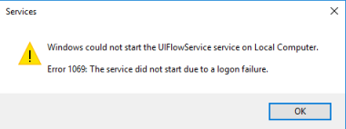

# Troubleshoot errors running attended or unattended desktop flows

This article provides the mitigation steps for the error codes that may occur during a flow run.

_Applies to:_ &nbsp; Power Automate  
_Original KB number:_ &nbsp; 4555406

## Symptoms

When your desktop flow failed to run.

## Cause

Many errors can occur during a flow run. For more information, see below table.

## Resolution

Every error code not present in this table is not actionable. In that case, contact the customer support.

|Error code|HTTP status code|Run mode|Mitigation Steps|
|---|---|---|---|
|InvalidUIFlowsCertificates|401|AttendedUnattended|You'll need to install the latest version of desktop flows on your machine. (The security certificate of the desktop flows app has expired.)|
|WindowsIdentityIncorrect|401|AttendedUnattended|Check that you can sign in to the machine using the connection credentials. Below are supported format: - domain\username -> domain account (domain and AAD) - username@domain... -> AAD account - username -> local account - machine name\username -> local account - local\username -> local account - .\username -> local account|
|NoUnlockedActiveSessionForAttended|400|Attended|Check that you are logged in with the correct user and that the session is unlocked on the machine.|
|SessionCreationError|400|Unattended|Check requirements for unattended scenario: - User the user specified in your connection is a member of the Remote Desktop Users group - Remote Desktop is enabled on the computer|
|SessionExistsForTheUserWhenUnattended|400|Unattended|Check that you are not logged in with the same user (whatever the state of the session) on the machine.|
|TooManyActiveSessions|400|Unattended|Windows Server only. You need to log off at least one active session on the machine.|
|ExistingRecordingSession|400|Local|Windows Server only. Check that there is no other user connected to the machine launching a recording or a test playback.|
|LocalPlaybackOrRecordingOngoing|429|All|Check that there is no recording nor test playback ongoing on the machine for the same user session.|
|UnattendedUnsupportedWithOldConnection|403|Unattended|You need to create a new connection on the portal.|
|RDPIsNotEnabled|400|Unattended|You need to enable Remote Desktop on the machine.|
|UIFlowAlreadyRunning|429|AttendedUnattended|A desktop flow is already running on the machine. You need to wait for its completion.|
|AadLogonFailure|400|Unattended|You need to disable Network Level Authentication (NLA) on the machine if you want to use AAD credentials.|
|Win10AlreadyHasActiveSession|400|Unattended|Windows 10 only. You need to log off from the active session on the machine.|
|UIFlowAgentNotAvailable|400|AttendedUnattended|You need to confirm that the service uiflowservice is up and running on your machine. If you have this error when trying to start uiflowservice, go to the following article: [UI flows run failure: Could not start UI flows due to security policy](https://support.microsoft.com/help/4564550/).|
|UnableToCallCrlEndpoint|400|AttendedUnattended|You need to ensure the revocation list for the certificates can be checked. Ensure that the CRL services are not blocked on the target machine. The services that must be contacted are listed in this article: [Limits for automated, scheduled, and instant flows](/power-automate/limits-and-config#ui-flows-required-services)|
|||||
