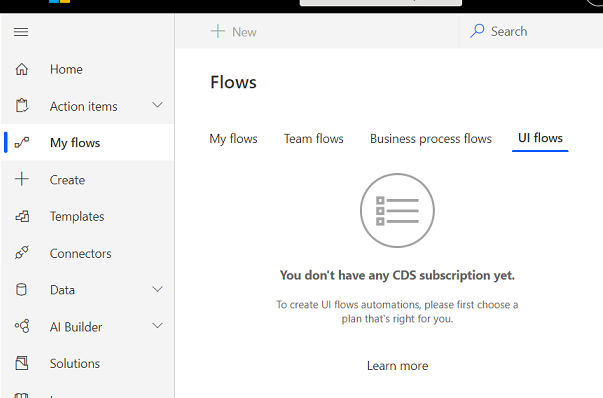

# Unable to create UI Flow: You don't have any CDS subscription yet

This article provides a solution to an error that occurs when trying to create a UI Flow from My flows.

_Applies to:_ &nbsp; Power Automate  
_Original KB number:_ &nbsp; 4553206

## Symptoms

When trying to create a UI Flow from My flows, you may see this message:

## Cause

The current environment doesn't have a CDS (Common Data Service) database provisioned for it, which is a requirement for creating/using UI flows.

If it's the case, then navigating to the **Business process flows** tab and the Solutions page in the sidebar will display a similar message.

## Resolution

- Contact your environment admin to add a CDS database for the environment
- Or if you have sufficient permissions, create a new environment with a CDS database to use

Visit the [Power Platform Admin Center](https://admin.powerplatform.microsoft.com/environments) to do these actions.

## Resources

- [Add a Microsoft Dataverse database](/power-platform/admin/create-database)
