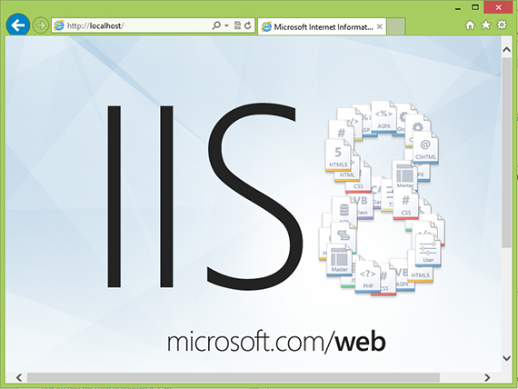
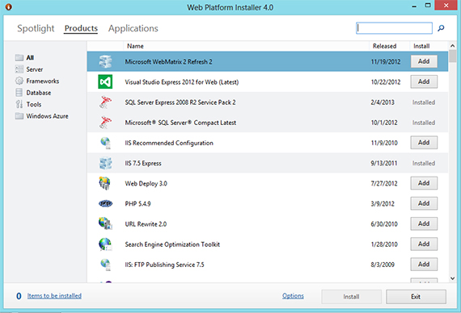
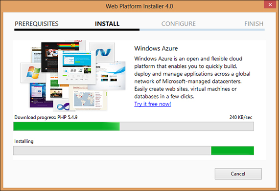

# Install and configure PHP on IIS 8 in Windows 8

This article describes how to install and configure IIS 8.0 and PHP on Windows 8.

_Original product version:_ &nbsp; Internet Information Services 8.0, Windows 8, Windows 8 Pro  
_Original KB number:_ &nbsp; 2819022

## Problem description

If we want to run web application base on PHP platform, we must ensure our computer has IIS 8.0 as web server and PHP engine. By default, Windows 8 does not have one of them. But user can easily to activate IIS 8.0 feature and install PHP engine in Windows 8.

## Solutions

We can activate IIS 8.0 in Windows 8 by using **Turn Windows features on or off** in Control Panel. And there are two ways to install and configure PHP in Windows 8. First, we can install and configure PHP manually. Second, we can use Web Platform Installer that can install and configure PHP automatically.

## How to do

There are three works that we will do in this section:

1. IIS 8.0 installation.
2. Web Platform Installer installation.
3. PHP installation and configuration with Web Platform Installer.

### IIS 8.0 Installation

These are steps to activate IIS 8 in Windows 8:

1. Run **Turn Windows features on or off** with choose **Settings** from charms bar, then choose **Control Panel**.
2. In **Control Panel** window, choose **Programs**.
3. In **Programs and Features**, choose **Turn Windows features on or off**.

    

4. Check **Internet Information Service** and click **OK** button.

    

After the installation process is complete, we can check whether IIS 8.0 is installed correctly by running Internet Explorer. In the address bar, type `<http://localhost>`. If successful, we see web page like this picture below.

### Web Platform Installer Installation  

 Web Platform Installer is a simple, free tool that automates the installation of Microsoft's entire Web Platform including PHP. We can download it form [Web Platform Installer](https://www.microsoft.com/web/downloads/platform.aspx). The name of installer is wpilauncher.exe.

Run wpilauncher.exe and we will see installation status like this picture below.

After installation is completed, we can see **Web Platform Installer 4.0** window like this picture below.

### PHP Installation and Configuration  

These are step to install and configure PHP with Web Platform Installer:

1. In **Web Platform Installer** window, choose **Products** tab and search PHP version that we will install.
2. Click **Add** button as we can see in picture below.

    

3. After click **Add** button, we can see there are two items that will be installed. By click **Items to be installed** link, we can see list of those items.

    

4. Click **Install** button.

    

5. Click **I Accept** button and it will be downloaded item and install them.

    

6. After the installation process is complete, click **Finish** button.

## Testing

To check whether the installation and configuration are success, we can test it by follow these steps:

1. Create *info.php* file and type this code below as content.

    

2. Copy *info.php* file to IIS's root folder in `C:\inetpub\wwwroot`.
3. Run Internet Explorer, and type `http://localhost/infor.php` in address bar.
4. We will see web page like picture below if all installation and configuration are successful.

    

## More information

[Configuring Step 1: Install IIS and PHP](/iis/application-frameworks/scenario-build-a-php-website-on-iis/configuring-step-1-install-iis-and-php)

[!INCLUDE [Community Solutions Content Disclaimer](../../includes/community-solutions-content-disclaimer.md)]
