# Resolving connectivity errors to SQL Server

This article helps you resolve various connectivity issues to SQL server.

_Original product version:_ &nbsp; Microsoft SQL Server  
_Original KB number:_ &nbsp; 4009936

## Prerequisite

To effectively use this troubleshooter, you may want to gather the following information.

1. The complete text of the error message along with the error codes and whether the error is intermittent (happens only sometimes) or consistent (happens all the time).
2. Errorlogs from SQL Server from which you can note the following:
  
    1. Fully qualified domain name (FQDN) of the SQL Server machine or in case of clustered installations, the FQDN virtual name. If you are using a named instance, note down the instance name.

        > [!NOTE]
        > You can search for "Server name is" string to get this info in the errorlog.

    2. Network libraries and ports the SQL instance is listening on. Example messages:

        > Named pipes: Server local connection provider is ready to accept connection on [\\\\.\pipe\sql\query ]. TCP/IP and port number: Server is listening on [ ::1 1433].

3. Application and System event logs from SQL Server and Client systems.

4. If the connections are failing from an application, the connection string from the app. These are typically found in *Web.config* files for ASP.NET applications.

## Checklist

- Ensure SQL server is started and you see the following message in the SQL Server ErrorLog:

    > SQL Server is now ready for client connections. This is an informational message; no user action is required.

- Verify basic connectivity over IP address and check for any abnormalities: `ping -a <SQL Server machine>, ping -a <SQL Server IP address>`. If you notice any issues, work with your network administrator to fix the same.

- Check if SQL is listening on appropriate protocols by reviewing the ErrorLog.

- Check if you are able to connect to SQL server by using a UDL file. If it works, then there may be an issue with the connection string. For instructions on the procedure about UDL test, move to  [Connect to SQL server by using a UDL file](#connect-to-sql-server-by-using-a-udl-file) section.

- Check if you are able to connect to SQL Server from other client systems and different user logins. If you are able to, then the issue could be specific to the client or login that is experiencing the issue. Check the Windows event logs on problematic client for additional pointers. Also check if network drivers are up to date.

- If you are experiencing login failures, ensure the user has a login at the server level and appropriate permissions to connect to the database that the user is trying to connect to.

## A network-related or instance-specific error occurred while establishing a connection to SQL Server

For more information about the relevant error, see the following [Verify connection errors](#verify-connection-errors) section.

### Verify connection errors

The **A network-related or instance-specific error occurred while establishing a connection to SQL Server** error represents one or more of the following error messages:

- A network-related or instance-specific error occurred while establishing a connection to SQL Server. The server was not found or was not accessible. Verify that the instance name is correct and that SQL Server is configured to allow remote connections.

    ```console
    provider: SQL Network Interfaces, error: 26 - Error Locating Server/Instance Specified
    ```

- SQL Server Native Client Data Link Error

    ```console
    [Microsoft SQL Server Native Client 10.0]: Login timeout expired
    [Microsoft SQL Server Native Client 10.0]: A network-related or instance-specific error has occurred while establishing a connection to SQL Server. Server is not found or not accessible. Check if instance name is correct and if SQL Server is configured to allow remote connections. For more information see SQL Server Books Online.
    [Microsoft SQL Server Native Client 10.0]: SQL Server Network Interfaces: Error Locating Server/Instance Specified [xFFFFFFFF].
    ```

- A network-related or instance-specific error occurred while establishing a connection to SQL Server. The server was not found or was not accessible. Verify that the instance name is correct and that SQL Server is configured to allow remote connections.

    ```console
    provider: TCP Provider, error: 0
    A connection attempt failed because the connected party did not properly respond after a period of time, or established connection failed because connected host has failed to respond.
    Microsoft SQL Server, Error: 10060
    ```

- A network-related or instance-specific error occurred while establishing a connection to SQL Server. The server was not found or was not accessible. Verify that the instance name is correct and that SQL Server is configured to allow remote connections.

    ```console
    provider: Named Pipes Provider, error:40 - Could not open a connection to SQL Server
    Microsoft SQL Server, Error:53
    The network path was not found
    ```

- ```console
    [Microsoft][SQL Server Native Client 11.0]TCP Provider: No connection could be made because the target machine actively refused it.
    [Microsoft][SQL Server Native Client 11.0]Login timeout expired
    [Microsoft][SQL Server Native Client 11.0]A network-related or instance-specific error has occurred while establishing a connection to SQL Server. Server is not found or not accessible. Check if instance name is correct and if SQL Server is configured to allow remote connections. For more information see SQL Server Books Online.
  ```

You can start troubleshooting from this section: [Common causes of various connection issues](#common-causes-of-various-connection-issues).

### Common causes of various connection issues

Go through each of the causes that is applicable to your instance below and for each of the applicable causes, try the corresponding resolutions.

#### Cause 1: Incorrect server name being specified in the connection string or in the server name dialog box  

To confirm:

- Ensure the server name you are specifying the application matches what you have in the error log.
- Navigate to the [Editing ASP.NET Configuration Files](/previous-versions/aspnet/ackhksh7(v=vs.100)) file for your application and ensure the **Connection Strings** section point to the right server name and is using the proper [SQL Server Connection Strings for ASP.NET Web Applications](/previous-versions/aspnet/jj653752(v=vs.110)).

    > [!NOTE]
    > To programmatically obtain the connection strings from your application, refer to the sample at [How to: Read Connection Strings from the Web.config File](/previous-versions/ms178411(v=vs.140)).

#### Cause 2: Incorrect alias on the client machine

Aliases are typically used in environments when you need to connect to SQL Server with an alternate name or when there are name resolution issues in the network. An incorrect alias on the client machine can cause the connections from your applications to go to the wrong server resulting in failure.

Things to try:

- Open SQL Server Client Network Utility by typing *cliconfg.exe* in your Run command.
- Check if there are any aliases defined for the server you are trying to connect to.
- If present, do the following:

    1. Click on **Edit** and rename the Server alias. (for example, if your server name is *MySQL*, rename it as *MySQL_test*) and retry the connection. If the connection works, it is an indication that you had an incorrect alias, probably from an old configuration that is no longer needed. If you continue to experience the error, rename the alias back to its original name and proceed to the next step.

    2. Check the Connection parameters for the alias and ensure they are correct. Some of the common scenarios that can cause problems with connectivity are:
       - Incorrect IP address for the Server name parameter. Ensure this IP address matches the entry in the SQL ErrorLog file.
       - Incorrect Server name in the Server name parameter. For example though your Server alias points the correct server name, if the Server name parameter has incorrect value, connections will fail.
       - If you are using a named pipes alias, ensure the pipe name has correct format.

         - For connecting to default instance named *Mydefaultinstance*, the pipe name should be `\\Mydefaultinstance\pipe\sql\query`  
         - For connecting to a named instance *MySQL\Named*, the pipe name should be `\\MySQL\pipe\MSSQL$Named\sql\query`

#### Cause 3(Default instance): Firewall(s) between the client and server blocking the port SQL Server instance is listening on

**Default instance**: A default instance typically runs on port 1433. Some installations also use a non-standard port (other than 1433) for running SQL instances. The firewall may be blocking either of them.  

Things to try:

- Determine the port number your SQL instance is running. If your SQL server default instance is using a non-standard port, see [Running SQL Server ‘Default’ instance on a non-default (or non-standard) TCP port: : tips for making application connectivity work](/archive/blogs/dataaccesstechnologies/running-sql-server-default-instance-on-a-non-default-or-non-standard-tcp-port-tips-for-making-application-connectivity-work).

- Try appending the port number of SQL Server to the server name using the format *\<servername>, portnumber* and see if that works. For example, if your SQL instance name is *MySQLDefaultinstance* and it is running on port 2000, specify the server name as *MySQLServer, 2000* and see if that works. If it does work it is an indication the firewall is blocking the port.

- If confirmed, add the port to Firewall exclusion list. For instructions, move to [Configuring firewalls](#configuring-firewalls) section.

#### Cause 4(Named instance): SQL Browser is not started

Client applications connecting to a named instance of SQL Server use the SQL Browser service on the system where SQL is running to enumerate the port that SQL is listening on. If the browser service is not started, the connections would fail.

Things to try:

On the system running your SQL Server instance, either use the SQL Server Configuration manager or the Services applet in Control panel and start the SQL Browser Service if it is not already started. For more information, see [How to: Start and Stop the SQL Server Browser Service](/previous-versions/sql/sql-server-2008-r2/ms189093(v=sql.105))

#### Cause 5(Named instance): UDP Port 1434 used by SQL browser is blocked on the network

If your SQL instance is a named instance, it may have either been configured to use dynamic ports or a static port. In either case, the underlying network libraries query SQL Browser service running on your SQL Server machine via UDP port 1434 to enumerate the port number for the named instance. If a firewall between the client and the server blocks this UDP port, the client library cannot determine the port (a requirement for connection) and the connection fails.  

To Confirm:

- **Method 1:**

    1. Note down the port your SQL instance is listening on from the SQL Server Errorlog.
    2. Try connecting to the named instance using the port number appended to the server name using the format *<servername\instancename>, portnumber* and see if that works. If it does work it is an indication the firewall is blocking the port UDP port 1434. For example, if your SQL instance name is *MySQL\Namedinstance* and it is running on port 3000, specify the server name as *MySQL\Namedinstance, 3000* and see if that works. If it does work it could either mean that UDP port 1434 is blocked or the static port is blocked or both. To confirm if it is the UDP port or the static port using Portqry from Method 2 below.

- **Method 2:**

    1. Use PortqryUI tool with your named instance and observe the resulting output. If you see the message that the UDP port 1434 is filtered, it is an indication that the port is blocked on the network. For instructions on how to use the tool, move to [Using PortqryUI tool with SQL Server](#using-portqryui-tool-with-sql-server) section.

Things to try:

First determine if the SQL Server instance is listening on dynamic vs static port and use the procedure that is relevant to your scenario. How to tell if SQL is listening on Dynamic vs Static ports, move to [Tell if SQL is listening on Dynamic vs Static ports](#tell-if-sql-is-listening-on-dynamic-vs-static-ports) section.

- Case 1: Dynamic ports. In this case, you need to ensure the SQL browser service is indeed started and UDP port 1434 is not blocked on the firewall between the client and the server. If you cannot do either of them, you should switch your SQL Server instance to use a static port and use the procedure documented in [Configure a Server to Listen on a Specific TCP Port](/sql/database-engine/configure-windows/configure-a-server-to-listen-on-a-specific-tcp-port).

- Case 2: Static port configuration and SQL Browser are not running or UDP 1434 cannot be opened on the firewall. In this case, you need to ensure that the static port is specified in your connection string and that port is not blocked by the firewall. For instructions, move to [Configuring firewalls](#configuring-firewalls) section.

If this does not resolve your issue, move to [Still having problems](#still-having-problems) section.

### Configuring firewalls

- If you are using Windows firewall, use the procedure documented in the topic in SQL Server Books Online:

    [Configure a Windows Firewall for Database Engine Access](/sql/database-engine/configure-windows/configure-a-windows-firewall-for-database-engine-access).

- If you are using a custom firewall, work with your network administrator to open up the necessary ports.  

Below you can find some quick screenshots showing the required configuration of a Windows firewall for successful connections to a default instance and a named instance.

- A default instance of SQL Server listening on the default port 1433 on Windows 2012 R2 server. In this scenario, you need to ensure an exception is added to TCP port 1433 in the Windows firewall.

  1. Open Windows firewall on the system hosting SQL server default instance and click **New Rule** under **Inbound Rules**.

      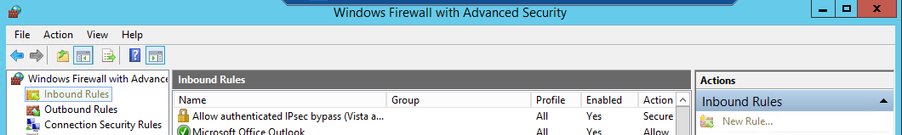

  2. Select the **Port** option and click **Next**.

      

  3. In the next screen:

     - Select **TCP** as the protocol.
     - Select **Specific local ports** and specify the value as *1433* and click **Next**.

       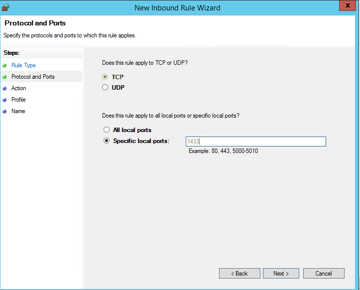

  4. In the next screen, select **Allow the connection** and click **Next**.

     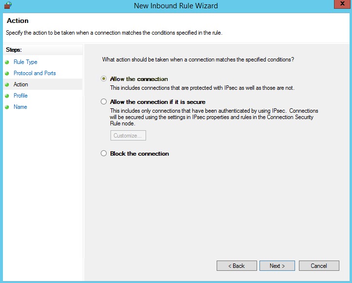

  5. In the next screen, select the option that best suits your environment and click **Next**.

     

  6. In the next screen, give the name to your rule and provide a clear description for future reference and click **Finish**.

     

  7. Once done, you should see that rule is created and is enabled by default.

     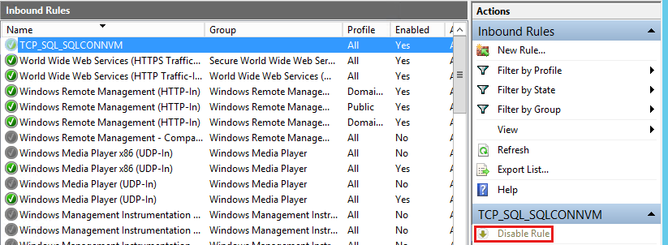  

- Adding an exception for UDP port 1434 to enable connections to a named instance of SQL server:

  1. Open Windows firewall on the system hosting SQL server default instance and click **New Rule** under **Inbound Rules**.

       

  2. Select the **Port** option and click **Next**.
  
     
  
  3. In the next screen:

      - Select **UDP** as the protocol.
      - Select **Specific local ports** and specify the value as *1434* and click **Next**.

        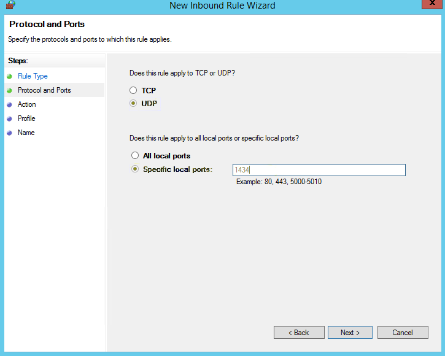  
  
  4. In the next screen, select **Allow the connection** and click **Next**.
  
     
  
  5. In the next screen, select the option that best suits your environment and click **Next**.
  
     
  
  6. In the next screen, give the name to your rule and provide a clear description for future reference and click **Finish**.

     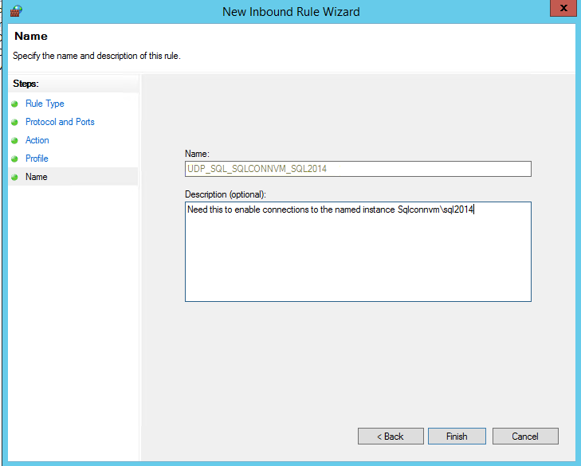  
  
  7. Once done, you should see that rule is created and is enabled by default.

     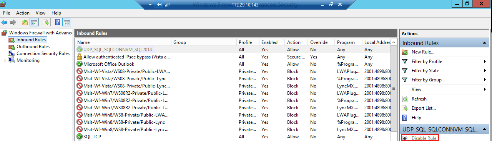  

If this does not resolve your issue, move to [Still having problems](#still-having-problems) section.

### Using PortqryUI tool with SQL Server

Download location: [PortqryUI](https://www.microsoft.com/download/details.aspx?id=24009)

1. Launch PortqryUI tool on your client machine. (the machine where you are having connection issues, for web apps, this could be the IIS server)
2. Specify server name of the SQL Server instance or the SQL vitutal server name in the **Destination IP** or **FQDN** to query.
3. Select **Query predefined service** and select **SQL Service** in the dropdown list.
4. Click **Query** and examine the output and use the following table for additional pointers.

|Type of instance|Output from Portqry|Potential causes for connection issues|What to try?|
|---|---|---|---|
|Default instance|TCP port 1433 (ms-sql-s service): **NOT LISTENING**|Indicates one of the following: <ul><li>SQL is not started.</li><li> TCP/IP is not enabled on SQL server protocol list.</li><li> SQL is listening on a non-default port. (check errorlog)</li><li> Firewall between the client and the server is blocking the port.</li></ul>|<ul><li>Ensure SQL is started.</li><li> Check SQL error log for the port number and use that in your connection strings using the format *\<servername>, portnumber*.</li><li> Work with your network/windows administrator to ensure the TCP port 1433 is not blocked by a firewall on the network or by the Windows firewall on the SQL Server system.</li></ul> **Note** If you would like to resolve firewall issue, move to [Configuring firewalls](#configuring-firewalls) section.|
|Default instance|TCP port 1433 (ms-sql-s service): **LISTENING**|<ul><li> Client library is able to connect fine to the SQL server machine but something else in the application layer could be causing the problem. </li></ul>|<ul><li>Check if server name is correctly specified in the connection string.</li> <li> If the connection string is using the port number, it is correctly specified in the connection string.</li><li> Any old aliases defined on the box.</li></ul>|
|Named instance|UDP port 1434 (ms-sql-m service): **FILTERED**|Indicates one of the following:<ul><li> SQL named instance is not started.</li><li> SQL browser not started on the system hosting your SQL instance.</li><li> UDP port 1434 is blocked by a firewall on the SQL server or on the network between the client and the server.</ul>|<ul><li> Service is started. </li><li> SQL browser service is started.</li><li>Work with your network/windows administrator to ensure the UDP port 1434 is not blocked by a firewall on the network or by the Windows firewall on the SQL Server system. </li></ul> **Note** If you would like to resolve firewall issue, move to [Configuring firewalls](#configuring-firewalls) section.<br/>|
|Named instance|UDP port 1434 is **LISTENING**|<ul><li>Client library is able to connect fine to the SQL server machine but something else in the application layer could be causing the problem. </li></ul>|<ul><li> Server name is correctly specified in the connection string. </li><li> Port number is incorrectly specified in the connection string.</li><li> Any old aliases defined on the box.</li></ul>|
|||||

Examples outputs:

- Default instance on default port: Working scenario

    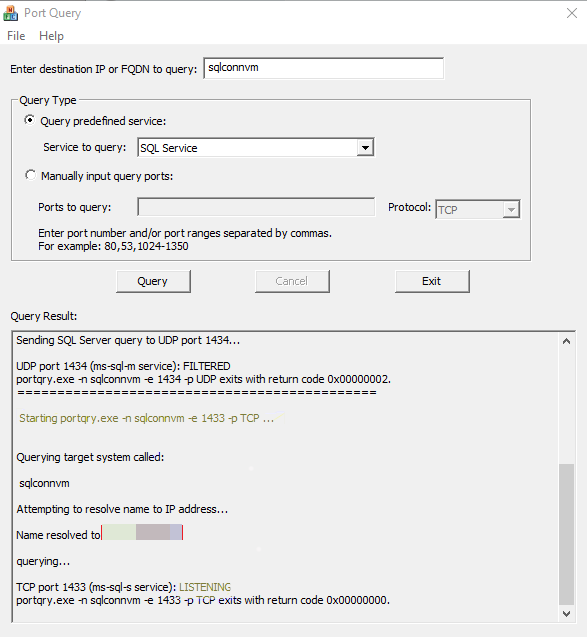  

- Default instance on default port: Non-working scenario

    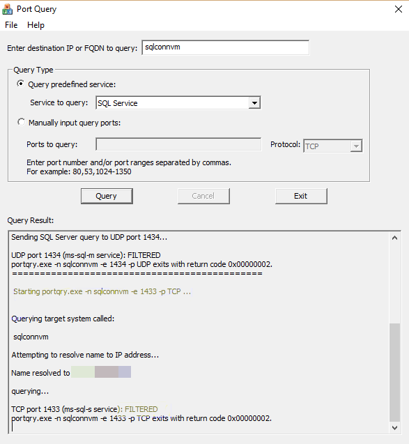  

- Named instance: Working scenario: (Instance name: SQL 2014, hostname: SQLCONNVM)

    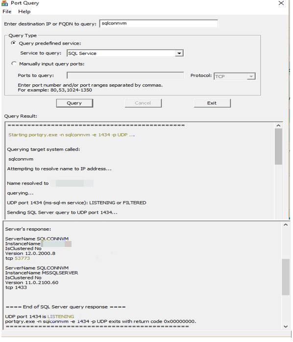  

- Named instance: Non - Working scenario: (Instance name: SQL 2014, hostname: SQLCONNVM)

    

For more information, move to [Configuring firewalls](#configuring-firewalls) section.

If this does not resolve your issue, move to [Still having problems](#still-having-problems) section.

### Tell if SQL is listening on Dynamic vs Static ports

1. In SQL Server Configuration Manager, in the console pane, expand **SQL Server Network Configuration**, expand **Protocols for <instance name>**, and then double-click **TCP/IP**.

2. In the **TCP/IP Properties** dialog box, on the **IP Addresses** tab, several IP addresses appear in the format **IP1**, **IP2**, up to **IPAll**. One of these is for the IP address of the loopback adapter, 127.0.0.1. Additional IP addresses appear for each IP Address on the computer. (You will probably see both IP version 4 and IP version 6 addresses.) Right-click each address, and then click **Properties** to identify the IP address that you want to configure.

3. If the **TCP Dynamic Ports** dialog box contains **0**, it indicates that the Database Engine is listening on dynamic ports. If it contains a specific number, it means the database instance is listening on a static port.

    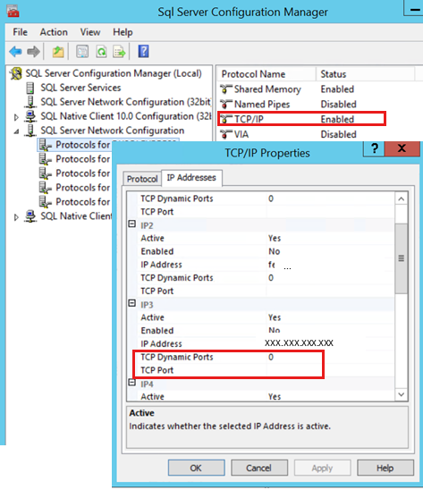  

For more information, see [Configure a Server to Listen on a Specific TCP Port](/sql/database-engine/configure-windows/configure-a-server-to-listen-on-a-specific-tcp-port).

If this does not resolve your issue, move to [Still having problems](#still-having-problems) section.

## No connection could be made because the target machine actively refused it

For more information about the no connection error, move to [The full error message](#the-full-error-message) section.

### The full error message

You may get an error that is similar to the following:

```console
[Microsoft][SQL Server Native Client 11.0]TCP Provider: No connection could be made because the target machine actively refused it.
[Microsoft][SQL Server Native Client 11.0]Login timeout expired.
[Microsoft][SQL Server Native Client 11.0]A network-related or instance-specific error has occurred while establishing a connection to SQL Server. Server is not found or not accessible. Check if instance name is correct and if SQL Server is configured to allow remote connections. For more information see SQL Server Books Online.
```

You can start troubleshooting from this section: [Common causes of various connection issues](#common-causes-of-various-connection-issues).

## SQL Server does not exist or access denied

You can start troubleshooting from this section: [Common causes of various connection issues](#common-causes-of-various-connection-issues).

## PivotTable Operation Failed: We cannot locate a server to load the workbook Data Model

You can start troubleshooting from this section: [Common causes of various connection issues](#common-causes-of-various-connection-issues).

## Cannot Generate SSPI context error message

Security Support Provider Interface (SSPI) is a set of Windows APIs that allows for delegation and mutual authentication over any generic data transport layer, such as TCP/IP sockets. Therefore, SSPI allows for a computer that is running a Windows operating system to securely delegate a user security token from one computer to another over any transport layer that can transmit raw bytes of data.  
**The Cannot generate SSPI context** error is generated when SSPI uses **Kerberos authentication** to delegate over TCP/IP and Kerberos authentication cannot complete the necessary operations to successfully delegate the user security token to the destination computer that is running SQL Server.

For additional information as to why the Kerberos operations cannot be completed, move to [Troubleshooting authentication failures due to Kerberos issues](#troubleshooting-authentication-failures-due-to-kerberos-issues) section to review and implement the steps.

### Troubleshooting authentication failures due to Kerberos issues

Kerberos authentication failures can happen due to a variety of reasons. The major causes and corresponding resolutions are highlighted below:

| Issue type| Suggested resolutions|
|---|---|
| SPN Issues:<br/><ul><li> Missing SPNs: SPN is not registered in the Active directory.</li> <li>Incorrect SPN entries: SPN exists, but the port number is incorrect or it exists on a different account other than the SQL Service account.</li><li>Duplicate SPNs: The same SPN exists on multiple accounts in the active directory.</li></ul> |Check [Using Kerberos Configuration manager to diagnose and fix SPN and delegation issues](#using-kerberos-configuration-manager-to-diagnose-and-fix-spn-and-delegation-issues) section to diagnose and resolve SPN issues.<br/><br/>**Note** For in-depth understanding of SPNs, Kerberos, and other related concepts review the information in the following KB article:<br/> [How to troubleshoot the "Cannot generate SSPI context" error message](https://support.microsoft.com/help/811889) |
| SQL Service accounts not trusted for delegation. If you are using Local System account, the middle server should be trusted for delegation in the active directory.|UseKerberos configuration manager 's delegation tab to confirm and work with your Active directory administrator to enable delegation for the account. Check [Using Kerberos Configuration manager to diagnose and fix SPN and delegation issues](#using-kerberos-configuration-manager-to-diagnose-and-fix-spn-and-delegation-issues) for details in the following paragraph. |
|Incorrect name resolution: Your server name may be resolving to a different IP address than that is registered by your network's DNS server.| **ping -a <your_target_machine>** (use -4 and -6 for IPv4 and IPv6 specifically)<br/> **ping -a <Your_remote_IPAddress> nslookup** (type your local and remote machine name and IP address multiple times)<br/><br/>Look for any discrepancies and mismatches on the returned results. The correctness of DNS configuration on the network is vital to SQL connection. Wrong DNS entry could cause of all sorts of connectivity issue later.|
|Firewalls or other network devices preventing connections from the client to the domain controller: SPNs are stored in active directory and if the clients are unable to communicate with the AD, the connection cannot proceed further.| Check the following links for additional information:<br/><ul><li> [Active Directory and Active Directory Domain Services Port Requirements](/previous-versions/windows/it-pro/windows-server-2008-R2-and-2008/dd772723(v=ws.10)) </li><li> [Kerberos Authentication Tools and Settings](/previous-versions/windows/it-pro/windows-server-2003/cc738673(v=ws.10))</li></ul> |
|||

> [!NOTE]
>
> 1. When an instance of the SQL Server Database Engine starts, SQL Server tries to register the SPN for the SQL Server service. When the instance is stopped, SQL Server tries to unregister the SPN. For this to happen, the SQL service account needs **ReadServicePrincipalName** and **WriteServicePrincipalName** rights in the active directory. But, if the service account does not have these rights the automatic SPN registration does not happen and you need to work with your Active Directory administrator to register these for the SQL instances to enable Kerberos authentication. In this scenario, if you are using a named instance, it will be more convenient to use a static port for that instance. If you use dynamic ports, the port number can change each time the service is restarted and the manually registered SPN for the instance is no longer valid. For more information, see [Register a Service Principal Name for Kerberos Connections](/sql/database-engine/configure-windows/register-a-service-principal-name-for-kerberos-connections).
>
> 2. In environments where SQL is clustered automatic registration of SPNs is not recommended because it may take more time to unregister the SPN and r-register the SPN in Active directory than the time it takes for SQL to come online. If the SPN registration does not happen in time, it may prevent SQL from coming online because the cluster administrator is not able to connect to SQL server.

#### Using Kerberos Configuration manager to diagnose and fix SPN and delegation issues

1. Download [Microsoft® Kerberos Configuration Manager for SQL Server®](https://www.microsoft.com/download/details.aspx?id=39046) and install it on a client machine.

2. Launch the tool using a domain account preferably with an account that has sufficient privileges to create SPNs in your active directory. See the below picture:

    

3. Connect to SQL Server you would like to collect the Kerberos error-related information:

    

4. Once connected, you can see different tabs as shown below:

    - **System**: Has the basic System information.

      

    - **SPN:** Gives the SPN information about the instances of each of the SQL instances found on the target server and provides various options as noted below. Use this tab to find the missing or misconfigured SPNs and the **Generate** or **Fix** buttons to fix these issues.

        

        - **Generate** option will let you create the SPN Generation script. Clicking on the **Generate** button kicks off the following dialog:

              

            This option creates cmd file, which can be executed from the command prompt to generate the SPN.

            The content of the generateSPNs, will be similar to the following:

            ```console
            :: This script is generated by the Microsoft(c) SQL Server(c) Kerberos Configuration Manager tool.
            :: The script may update the system information, SPN settings and Delegation configurations of a given server.
            :: SPN and Delegation configuration updates require Windows Domain Administrator permission to execute.
            :: A Domain Admin should review the configurations recommended by this tool and take appropriate actions to enable Kerberos authentication.
            :: Please contact Microsoft Support if Kerberos connection problem persists.
            :: The file is intended to be run in domain "<DomainName>.com"
            :: Corrections for MSSQLSvc/<HostName>.<DomainName>.com **SetSPN -s MSSQLSvc/<HostName>.<DomainName>.com UserName**
            ```

            It simply uses the **SetSPN** option to create an SPN under the service account for SQL Server.

        - **Fix** option will add the SPN as long as you have the right to add the SPN and shows the following tool tip:   

            > [!NOTE]
            > The tool only provides **Fix** and **Generate** options for default instances and named instances with static ports. For named instances using dynamic port, the recommendation is to switch from dynamic to static ports or give necessary permissions for the service account to register and unregister the SPN each time the service is started. Otherwise you have to manually unregister and re-register the corresponding SPNs each time the SQL Service is started.

        - **Delegation tab**: The tab identifies any issues with the service account's configuration for delegation. This is especially useful in troubleshooting linked server issues. For example, if the SPNs check out fine but if you still run into issues with linked server queries it could be an indication that the service account is not configured to delegate credentials. For additional information review the Books online topic at [Configuring Linked Servers for Delegation](/previous-versions/sql/sql-server-2008-r2/ms189580(v=sql.105)).

              

5. Once you fix the SPNs, rerun the Kerberos Configuration Manager tool, and ensure the SPN and Delegation tabs no longer report any error messages and retry the connection from your application.

For additional information review the following links:

- [SQL Server Kerberos and SPN Quick Reference](/archive/blogs/sqlupdates/sql-server-kerberos-and-spn-quick-reference)

- [Kerberos Configuration Manager for SQL Server is available](https://support.microsoft.com/help/2985455)

- [Kerberos Technical Supplement for Windows](/previous-versions/msp-n-p/ff649429(v=pandp.10))

- [How to get up and running with Oracle and Linked Servers](/archive/blogs/psssql/how-to-get-up-and-running-with-oracle-and-linked-servers)

If this does not resolve your issue, move to [Still having problems](#still-having-problems) section.

## Login failed for user

There could be a more specific error. Select the exact error you receive:

- [Login failed for user 'NT AUTHORITY\ANONYMOUS LOGON'](#login-failed-for-user-nt-authorityanonymous-logon)

- [Login failed for user '(null)'](#login-failed-for-user-null-message)

- [Login failed for user is empty](#login-failed-for-user-is-empty)

- [Login failed for user '\<username>'](#login-failed-for-user-username-or-login-failed-for-user-domainusername)

- [Login failed for user '\<domain>\\\<username>'](#login-failed-for-user-username-or-login-failed-for-user-domainusername)

- [Login failed for user '<domainname>\<computername$>'](#login-failed-for-user-domaincomputername)

### Login failed for user 'NT AUTHORITY\ANONYMOUS LOGON'

There are at least three scenarios for this issue. Use the following table to go through each applicable scenario and take the appropriate resolution steps.

| Potential cause| Suggested resolutions|
|---|---|
| Double hop scenarios on the same machine - You are trying to do a double hop, but NTLM credentials are being used instead of Kerberos.| For double hop scenarios on the same machine, add DisableLoopbackCheck or BackConnectionHostNames registry entries as per the following:<ul><li>  [DisableLoopbackCheck. Lets do it the right way](/archive/blogs/sharepoint_foxhole/disableloopbackcheck-lets-do-it-the-right-way)</li></ul> |
| Double hop scenarios across multiple machines - the error could happen when Kerberos connections are failing due to SPN issues.|Move to section: [Troubleshooting authentication failures due to Kerberos issues](#troubleshooting-authentication-failures-due-to-kerberos-issues) at the bottom to see details.|
| No double hop involved.| If no double-hop is involved, then it could also mean that there are Duplicate SPNs and the client is running as LocalSystem or other machine account that gets NTLM credentials instead of Kerberos credentials.<br/><br/>Move to section: [Troubleshooting authentication failures due to Kerberos issues](#troubleshooting-authentication-failures-due-to-kerberos-issues) to diagnose and resolve SPN issues.|
| Windows local security policy may have been configured to prevent the use of machine account for local accounts going off the box.|On Windows 2008 R2/Windows 7 and later, the Local Security Policy. | Security Options | Network Security can be configured not to use the machine account for local accounts going off-box; it would use Anonymous credentials instead.|
|||

If this does not resolve your issue, move to [Still having problems](#still-having-problems) section.

### Login failed for user '(null)' message

This means that LSASS was not able to decrypt the security token using the SQL Server service account credentials. The main reason for this is that the SPN is associated with the wrong account.

To diagnose and resolve these SPN issues, move to [Troubleshooting authentication failures due to Kerberos issues](#troubleshooting-authentication-failures-due-to-kerberos-issues) section.

### Login failed for user is empty

For example, you may see an error that is similar to the following:

```console
Source: NETLOGON
Date: 8/12/2012 8:22:16 PM
Event ID: 5719
Task Category: None
Level: Error
Keywords: Classic
User: N/A
Computer: <computer name>
Description:This computer was not able to set up a secure session with a domain controller in domain due to the following: The remote procedure call was cancelled. This may lead to authentication problems. Make sure that this computer is connected to the network. If the problem persists, please contact your domain administrator.
Empty string means that SQL tried to hand-off the credentials to LSASS but there was some problem. Either LSASS was not available or the domain controller could not be contacted.
Check the event logs on the client and the server machines to see if there are any network or Active Directory related messages around the time of failure and if you do, work with your domain administrator to fix the issues.
```

If this does not resolve your issue, move to [Still having problems](#still-having-problems) section.

### Login failed for user '\<username>' or login failed for user '\<domain>\\\<username>'

If the domain name is not specified, then it is a failing SQL login. If it is specified, then it is a failing Windows-Integrated login. Review the following table for causes and potential resolutions.

| Cause| Resolution steps|
|---|---|
|The database requested is off-line or otherwise not available.|Check permissions and database availability in SQL Server Management Studio.|
|The user does not have permissions to the requested database.|Try connecting as another user that has sysadmin rights.|
|||

For additional tips, review [Troubleshooting: Login Failed for User 'x'](/previous-versions/sql/sql-server-2008-r2/ms366351(v=sql.105)).

If this does not resolve your issue, move to [Still having problems](#still-having-problems) section.

### Login failed for user '<domain\computername$>'

You can also see this with IIS applications that use Anonymous login or Form's login where the user account is not impersonated. The IIS anonymous (IUSR) account or the app pool account are impersonated instead. The IUSR account is a local account and the App Pool account could also be a local account.

This error typically happens if the user is logged in with a local account rather than a domain account. If connecting to services off-box, then the machine credentials may be passed. In some cases, you can add this account as a login on the back-end server. In other cases, you may want to login with a domain account and provision appropriate permissions to that account to access the remote service.

If this does not resolve your issue, move to [Still having problems](#still-having-problems) section.

## Verify timeout expired errors

The Timeout expired error represents one or more of the following error messages:

 ```console
    Timeout expired. The timeout period elapsed prior to completion of the operation or the server is not responding.
  ```

 ```console
    System.Data.SqlClient.SqlException (0x80131904): Connection Timeout Expired.
    The timeout period elapsed while attempting to consume the pre-login handshake acknowledgment.
    This could be because the pre-login handshake failed or the server was unable to respond back in time.
    The duration spent while attempting to connect to this server was [Pre-Login] initialization=23; handshake=14979; ---> System.ComponentModel.Win32Exception (0x80004005): The wait operation timed out.
  ```

 ```console
    System.Data.SqlClient.SqlException (0x80131904): Timeout expired.
    The timeout period elapsed prior to completion of the operation or the server is not responding.
    System.ComponentModel.Win32Exception (0x80004005): The wait operation timed out.
  ```

 ```console
    Connection Timeout Expired.
    The timeout period elapsed while attempting to consume the pre-login handshake acknowledgment.
    This could be because the pre-login handshake failed or the server was unable to respond back in time.
    The duration spent while attempting to connect to this server was [Pre-Login] initialization=21036; handshake=0; (Microsoft SQL Server, Error: -2).
  ```

> [!NOTE]
> The second and third error messages occurs when .Net Framework 4.5 or higher is installed.

You can start troubleshooting from the following section: [Troubleshooting Timeout expired messages](#troubleshooting-timeout-expired-messages).

### Troubleshooting Timeout expired messages

A timeout is when something takes longer than it is allowed. We are basically aborting what we were trying to do as to not wait indefinitely and possibly block other things and hang an application. From a connectivity perspective, at its basic form, we can see this in two ways. One is a connectivity timeout, the other is a query timeout. So, you should first review the complete call stack of the error message to determine if it is a connection timeout or command timeout.

> [!NOTE]
> The default values for these parameters which can be set through code, connection string and other methods is as follows:
>
> - Connection Timeout - 15 seconds
> - Query or Command Timeout - 30 seconds  

- A connection timeout call stack looks similar to this:

    ```console
    System.Data.SqlClient.SqlException: Timeout expired. The timeout period elapsed prior to completion of the operation or the server is not responding.
     at System.Data.SqlClient.SqlInternalConnection.OnError(SqlException exception, Boolean breakConnection)
     at System.Data.SqlClient.TdsParser.ThrowExceptionAndWarning(TdsParserStateObject stateObj)
     at System.Data.SqlClient.TdsParserStateObject.ReadSniError(TdsParserStateObject stateObj, UInt32 error)
     at System.Data.SqlClient.TdsParserStateObject.ReadSni(DbAsyncResult asyncResult, TdsParserStateObject stateObj)
     at System.Data.SqlClient.TdsParserStateObject.ReadNetworkPacket()
     at System.Data.SqlClient.TdsParser.ConsumePreLoginHandshake(Boolean encrypt,Boolean trustServerCert, Boolean& marsCapable)
     at System.Data.SqlClient.TdsParser.Connect(ServerInfo serverInfo, SqlInternalConnectionTds connHandler, Boolean ignoreSniOpenTimeout, Int64 timerExpire, Boolean encrypt, Boolean trustServerCert, Boolean integratedSecurity, SqlConnectionowningObject)
     at System.Data.SqlClient.SqlInternalConnectionTds.AttemptOneLogin(ServerInfoserverInfo, String newPassword, Boolean ignoreSniOpenTimeout, Int64 timerExpire, SqlConnection owningObject)
     at System.Data.SqlClient.SqlInternalConnectionTds.LoginNoFailover(String host, String newPassword, Boolean redirectedUserInstance, SqlConnection owningObject, SqlConnectionString connectionOptions, Int64 timerStart)
     at System.Data.SqlClient.SqlInternalConnectionTds.OpenLoginEnlist(SqlConnection owningObject, SqlConnectionString connectionOptions, String newPassword, Boolean redirectedUserInstance)
     at System.Data.SqlClient.SqlInternalConnectionTds..ctor(DbConnectionPoolIdentity identity, SqlConnectionString connectionOptions, Object providerInfo, String newPassword, SqlConnection owningObject, Boolean redirectedUserInstance)
     at System.Data.SqlClient.SqlConnectionFactory.CreateConnection(DbConnectionOptions options, Object poolGroupProviderInfo, DbConnectionPool pool, DbConnection owningConnection)
     at System.Data.ProviderBase.DbConnectionFactory.CreatePooledConnection(DbConnection owningConnection, DbConnectionPool pool, DbConnectionOptions options)  
    at System.Data.ProviderBase.DbConnectionPool.CreateObject(DbConnection owningObject) at System.Data.ProviderBase.DbConnectionPool.UserCreateRequest(DbConnection owningObject)
     at System.Data.ProviderBase.DbConnectionPool.GetConnection(DbConnection owningObject)
     at System.Data.ProviderBase.DbConnectionFactory.GetConnection(DbConnection owningConnection)
     at System.Data.ProviderBase.DbConnectionClosed.OpenConnection(DbConnection outerConnection, DbConnectionFactory connectionFactory)
     at System.Data.SqlClient.SqlConnection.Open() <-- SqlConnection along with Open tells us that we are trying to open a connection. So, this is not related to a query.  
    ```

- A command timeout in .NET 2.0 Framework looks similar to this:

    ```console
    System.Data.SqlClient.SqlException: Timeout expired. The timeout period elapsed prior to completion of the operation or the server is not responding.
     at System.Data.SqlClient.SqlConnection.OnError(SqlException exception, Boolean breakConnection)
     at System.Data.SqlClient.TdsParser.ThrowExceptionAndWarning(TdsParserStateObject stateObj)
     at System.Data.SqlClient.TdsParser.Run(RunBehavior runBehavior, SqlCommand cmdHandler, SqlDataReader dataStream, BulkCopySimpleResultSet bulkCopyHandler, TdsParserStateObject stateObj)
     at System.Data.SqlClient.SqlDataReader.ConsumeMetaData()
     at System.Data.SqlClient.SqlDataReader.get_MetaData()
     at System.Data.SqlClient.SqlCommand.FinishExecuteReader(SqlDataReader ds, RunBehavior runBehavior, String resetOptionsString) at System.Data.SqlClient.SqlCommand.RunExecuteReaderTds(CommandBehavior cmdBehavior, RunBehavior runBehavior, Boolean returnStream, Boolean async)
     at System.Data.SqlClient.SqlCommand.RunExecuteReader(CommandBehavior cmdBehavior, RunBehavior runBehavior, Boolean returnStream, String method, DbAsyncResult result)
     at System.Data.SqlClient.SqlCommand.RunExecuteReader(CommandBehavior cmdBehavior, RunBehavior runBehavior, Boolean returnStream, String method)
     at System.Data.SqlClient.SqlCommand.ExecuteScalar() <-- SqlCommand is used to work with a query, not a connection. ExecuteScalar is used to actually execute a query. You could also see other items like an ExecuteReader or ExecuteNonQuery for example.
    ```

**Resolution steps**:
Both these issues could be environment or SQL Server related. For example, it could be that you have a slow network or there is query performance issue. There are no hard and fast rules as what could be done here and more investigations may be necessary as to be what could be causing the issue. Increasing the Query Timeout is much more common than increasing the Connection Timeout. This is because when trying to connect to a data source, the connection typically happens quickly (usually within a span of few milliseconds).  

| Type| Things to try|
|---|---|
|Connection Timeout|<br/>1. Increase ConnectionTimout in your application.<br/>2. Check if the port used by SQL is blocked on the network using a tool like **[Portqry](https://www.microsoft.com/download/details.aspx?id=24009)**. Move to [Using PortqryUI tool with SQL Server](#using-portqryui-tool-with-sql-server) section for instructions on how to use it. |
|Command Timeout|<br/> Increase the CommandTimeout value in your application and also fine-tune the queries that are getting executed on the backend. |
||

For more tips and suggestions check: [Troubleshooting: Timeout Expired](/previous-versions/sql/sql-server-2008-r2/ms190181(v=sql.105)).

If this does not resolve your issue, move to [Still having problems](#still-having-problems) section.

## The timeout period elapsed prior to obtaining a connection from the pool

It is typically caused if connections are not being closed properly and the complete error may look as follows:

> System.InvalidOperationException: Timeout expired. The timeout period elapsed prior to obtaining a connection from the pool.

This may have occurred because all pooled connections were in use and max pool size was reached.
This can typically be avoided by [Timeout expired. The timeout period elapsed prior to obtaining a connection from the pool](/archive/blogs/spike/timeout-expired-the-timeout-period-elapsed-prior-to-obtaining-a-connection-from-the-pool).

If this does not resolve your issue, move to [Still having problems](#still-having-problems) section.

## Connect to SQL server by using a UDL file

For more information about how to test connections to SQL Server by using a Universal Data Link file, see the following [Test connections to SQL Server by using a Universal Data Link file](#test-connections-to-sql-server-by-using-a-universal-data-link-file) section.

### Test connections to SQL Server by using a Universal Data Link file

UDL files provide an easy and effective way to test connections to your SQL server from your clients or other systems.

1. Enable the option to show file extensions in your Windows explorer. To do this:

   1. On Windows 8 and later systems: Either go to **File Explorer** **Options** in **Control Panel** or just type *Hide* in Windows search and in the **View** tab, uncheck **Hide Extensions for known file types**.
   2. Windows 7 and earlier versions:

      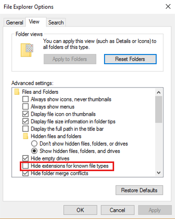  

2. Navigate to the folder where you want to create the Universal Data Link (.udl) file (for example *c:\temp*)
3. Create a new text file (sqlconn.txt) and rename the extension from .txt to .udl. (click **Yes** to the warning message about changing the file name extension)
4. Double-click the .udl file from step 3 and do the following:

   1. In the **Provider** tab, select the provider that you are using in your application (for example SQL Server Native Client)
   2. In the **Connection** tab, select or enter your SQL Server and the rest of the parameters as pertinent to your application

5. Then click **Test Connection**.

For more information and screenshots, see the following blog post on MSDN:  
[Basics first : "UDL Test"](/archive/blogs/farukcelik/basics-first-udl-test)

If this does not resolve your issue, move to [Still having problems](#still-having-problems) section.

## Still having problems

We are sorry that this guide didn't solve your problem. We recommend that you go the [Microsoft SQL Community](https://social.technet.microsoft.com/Forums) for help. Here are some additional resources that you may find useful:

- [Steps to troubleshoot SQL connectivity issues](/archive/blogs/sql_protocols/steps-to-troubleshoot-sql-connectivity-issues)

- [Troubleshooting Server and Database Connection Problems](/previous-versions/sql/sql-server-2008-r2/ms156468(v=sql.105))

- [Troubleshoot Connecting to the SQL Server Database Engine](/sql/database-engine/configure-windows/troubleshoot-connecting-to-the-sql-server-database-engine)
