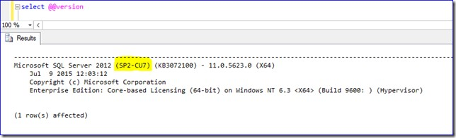
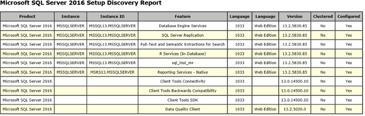

# Determine the version, edition, and update level of SQL Server and its components

This article lists various builds or updates that are available for different versions of  SQL Server and describe the procedures to determine the version of SQL Server that is running on a given system.

_Original product version:_ &nbsp; SQL Server  
_Original KB number:_ &nbsp; 321185

## Summary

- A downloadable version of an Excel workbook that contains all the build versions together with their current support lifecycle stage for 2005 through the current version is available. **[Click to download this Excel file now](https://aka.ms/SQLServerbuilds)**. (File name: *SQL Server Builds V3.xlsx*)

- To learn what a specific version number of SQL Server maps to, or to find the KB article information for a specific cumulative update package or a service pack, search for the version number in the [SQL Server Complete Version](https://support.microsoft.com/help/321185/#completeversion) list tables.

- To find the edition of your SQL Server instance, you can use one of the procedures in Method 2 through Method 5 in the [Determine which version and edition of SQL Server Database Engine is running](#determine-which-version-and-edition-of-sql-server-database-engine-is-running) section.

  > [!NOTE]
  > The version information and edition information are in the same output string.

  Latest updates available for currently supported versions of SQL Server

  > [!NOTE]
  > For information about SQL Server Support lifecycle, check the [Microsoft SQL Server support lifecycle page](https://support.microsoft.com/lifecycle?c2=1044).

## Latest updates available for currently supported versions of SQL Server

Each of the following links provides information for all of the applicable products and technologies.

  |Version|Latest Service Pack|Latest GDR|Latest cumulative update|Complete version information|General Guidance|
  |---|---|---|---|---|---|
  |SQL Server 2019|None|[GDR](https://support.microsoft.com/help/4583458) (15.0.2080.9 - January, 2021)|[CU10 for 2019](https://support.microsoft.com/help/5001090) (15.0.4123.1 - April 2021)</br>[CU8 + GDR](https://support.microsoft.com/help/4583459) (15.0.4083.2 - January 2021)|[SQL Server 2019 builds](https://support.microsoft.com/help/4518398)|[SQL Server 2019 Installation](/sql/database-engine/install-windows/install-sql-server?view=sql-server-ver15&preserve-view=true)|
  |SQL Server 2017|None|[GDR](https://support.microsoft.com/help/4583456) (14.0.2037.2 - January, 2021)|[CU24](https://support.microsoft.com/help/5001228) (14.0.3391.2 - May 2021)</br>[CU22 + GDR](https://support.microsoft.com/help/4583457) (14.0.3370.1 - January 2021)|[SQL Server 2017 builds](https://support.microsoft.com/help/4047329)|[SQL Server 2017 Installation](/sql/database-engine/install-windows/install-sql-server?view=sql-server-ver15&preserve-view=true)|
  |SQL Server 2016|[SP2](https://support.microsoft.com/help/4052908) (13.0.5026.0 - April 2018)</br>[SP1](https://support.microsoft.com/help/3182545) (13.0.4001.0 - November 2016)|[GDR for SP2](https://support.microsoft.com/help/4583460) (13.0.5103.6 - January, 2021)</br>[GDR for SP1](https://support.microsoft.com/help/4505219) (13.0.4259.0 - July, 2019)</br>[GDR for RTM](https://support.microsoft.com/help/4058560) (13.0.1745.2 - January, 2018)|[CU17 for 2016 SP2](https://support.microsoft.com/help/5001092) (13.0.5888.11 - March 2021)</br>[CU15 + GDR for SP2](https://support.microsoft.com/help/4583461) (13.0.5865.1 - January 2021)</br>[CU15 + GDR for SP1](https://support.microsoft.com/help/4505221) (13.0.4604.0 - July 2019)</br>[CU15 for SP1](https://support.microsoft.com/help/4495257) (13.0.4574.0 - May 2019)</br>[CU14 for SP2](https://support.microsoft.com/help/4564903) (13.0.5830.85- August 2020)</br>[CU9 for RTM](https://support.microsoft.com/help/4037357) (13.0.2216.0 - November 2017)|[SQL Server 2016 builds](https://support.microsoft.com/help/3177312)|[SQL Server 2016 Installation](/sql/database-engine/install-windows/install-sql-server?view=sql-server-ver15&preserve-view=true)|
  |SQL Server 2014|[SP3](https://support.microsoft.com/help/4022619) (12.0.6024.0 - October 2018)</br>[SP2](https://support.microsoft.com/help/3171021) (12.0.5000.0 - July 2016)</br>[SP1](https://support.microsoft.com/help/3058865) (12.0.4100.1 - May 2015)|[GDR for SP3](https://support.microsoft.com/help/4583463) (12.0.6164.21 - January, 2021)</br>[GDR for SP2](https://support.microsoft.com/help/4505217) (12.0.5223.6 - January, 2019)</br>[GDR for SP1](https://support.microsoft.com/help/4032542) (August, 2017)</br>[MS 15-058](/security-updates/SecurityBulletins/2015/ms15-058) (July, 2015)|[CU4 + GDR for SP3](https://support.microsoft.com/help/4583462) (12.0.6433.1 - January 2021)</br>[CU4 for SP3](https://support.microsoft.com/help/4500181) (12.0.6329.1 - July 2019)</br>[CU18 for SP2](https://support.microsoft.com/help/4500180) (12.0.5687.1 - July 2019)</br>[CU13 for SP1](https://support.microsoft.com/help/4019099) (12.0.4522.0 - August 2017)|[SQL Server 2014 builds](https://support.microsoft.com/help/321185/#sql-server-2014)|[SQL Server 2014 Installation](https://www.microsoft.com/download/details.aspx?id=42299)|
  |SQL Server 2012| [SP4](https://support.microsoft.com/help/4018073) (11.0.7001.0 - September 2017)</br>[SP3](https://support.microsoft.com/help/3072779) (11.0.6020.0 - November 2015)</br>[SP2](https://support.microsoft.com/help/2958429) (11.0.5058.0 - June 2014)</br>[SP1](https://support.microsoft.com/help/2674319) (11.0.3000.00 - November 2012|[GDR for SP4](https://support.microsoft.com/help/4583465) (11.0.7507.2 - January, 2021)</br>[GDR for SP3](https://support.microsoft.com/help/4057115) (January, 2018)</br>[MS 16-136](/security-updates/SecurityBulletins/2016/ms16-136) (November, 2016)</br>[MS 15-058](/security-updates/SecurityBulletins/2015/ms15-058) (December, 2015)|[CU10 for SP3](https://support.microsoft.com/help/4025925) (11.0.6607.3 - August 2017)</br>[CU16 for SP2](https://support.microsoft.com/help/3205054) (11.0.5678.0 - January 2017)</br>[CU16 for SP1](https://support.microsoft.com/help/3052476) (11.0.3487.0 - May 2015)| [SQL Server 2012 builds](https://support.microsoft.com/help/321185/#sql-server-2012)|[SQL Server 2012 Installation](/previous-versions/sql/sql-server-2012/cc281837(v=sql.110))|
  |SQL Server 2008 R2|[SP3](https://support.microsoft.com/help/2979597) (10.50.6000.34 - September 2014)</br>[SP2](https://support.microsoft.com/help/2630458) (10.50.4000.0 - July 2012)|[GDR for SP3](https://support.microsoft.com/help/4057113) (January, 2018)</br>[MS 15-058](/security-updates/SecurityBulletins/2015/ms15-058) (July, 2015)|None|[SQL Server 2008 R2 builds](https://support.microsoft.com/help/321185/#sql-server-2008-r2)|[SQL Server 2008 R2 SP3 Installation](https://www.microsoft.com/download/details.aspx?id=44271)|
  |SQL Server 2008|[SP4](https://support.microsoft.com/help/2979596) (10.0.6000.29 - September 2014)</br>[SP3](https://support.microsoft.com/help/2546951) (10.00.5500.00 - October, 2011)|[GDR for SP4](https://support.microsoft.com/help/4057114) (January, 2018)</br>[MS 15-058](/security-updates/SecurityBulletins/2015/ms15-058) (July, 2015)|None|[SQL Server 2008 builds](https://support.microsoft.com/help/321185/#sql-server-2008)|[SQL Server 2008 Servicing](/previous-versions/sql/sql-server-2008/dd638062(v=sql.100))|

  > [!NOTE]
  > "Latest" = During the past 12 months

Learn how to test updates: [Testing and Developing Supportability Roadmaps for ISV Applications (PDF)](https://msdnshared.blob.core.windows.net/media/TNBlogsFS/prod.evol.blogs.technet.com/CommunityServer.Blogs.Components.WeblogFiles/00/00/00/85/48/Files/0827.Testing%20And%20Developing%20Supportability%20Roadmaps%20for%20ISV%20Applications.pdf)

## Determine which version and edition of SQL Server Database Engine is running

To determine the version of SQL Server, you can use any of the following methods.

- **Method 1:** Connect to the server by using Object Explorer in SQL Server Management Studio. After Object Explorer is connected, it will show the version information in parentheses, together with the user name that is used to connect to the specific instance of SQL Server.

- **Method 2:** Look at the first few lines of the Errorlog file for that instance. By default, the error log is located at `Program Files\Microsoft SQL Server\MSSQL.n\MSSQL\LOG\ERRORLOG` and *ERRORLOG.n* files. The entries may resemble the following:

  ```output
  2011-03-27 22:31:33.50 Server Microsoft SQL Server 2008 (SP1) - 10.0.2531.0 (X64)  
  March 29 2009 10:11:52  
  Copyright (c) 1988-2008 Microsoft Corporation  
  Express Edition (64-bit)  
  on Windows NT 6.1 <X64> (Build 7600: )
  ```

  This entry provides all the necessary information about the product, such as version, product level, 64-bit versus 32-bit, the edition of SQL Server, and the OS version on which SQL Server is running.

  > [!NOTE]
  > The output of this query has been enhanced to show additional information, as documented in the blog post article, [What build of SQL Server are you using?](https://techcommunity.microsoft.com/t5/sql-server-support/what-build-of-sql-server-are-you-using/ba-p/318613), for the following versions:
  >
  > - SQL Server 2014 RTM CU10 and later versions
  > - SQL Server 2014 Service Pack 1 CU3 and later versions
  > - SQL Server 2012 Service Pack 2 CU7 and later versions

- **Method 3:** Connect to the instance of SQL Server, and then run the following query:

  ```sql
  Select @@version
  ```

  An example of the output of this query is the following:

  ```output
  Microsoft SQL Server 2008 (SP1) - 10.0.2531.0 (X64)  
  March 29 2009 10:11:52
  Copyright (c) 1988-2008 Microsoft Corporation Express Edition (64-bit)  
  on Windows NT 6.1 <X64> (Build 7600: )
  ```

  > [!NOTE]
  > The output of this query has been enhanced to show additional information. This is documented in the blog post article, [What build of SQL Server are you using?](https://techcommunity.microsoft.com/t5/sql-server-support/what-build-of-sql-server-are-you-using/ba-p/318613), for the following versions:
  >
  > - SQL Server 2014 RTM CU10 and later versions
  > - SQL Server 2014 Service Pack 1 CU3 and later versions
  > - SQL Server 2012 Service Pack 2 CU7 and later versions
  >
  >   

- **Method 4:** Connect to the instance of SQL Server, and then run the following query in SQL Server Management Studio (SSMS):

  ```sql
  SELECT SERVERPROPERTY('productversion'), SERVERPROPERTY ('productlevel'), SERVERPROPERTY ('edition')
  ```

  > [!NOTE]
  > This query works for any instance of SQL Server 2000 or a later version.

  The following results are returned:

  - The product version (for example, 10.0.1600.22)
  - The product level (for example, RTM)
  - The edition (for example, Enterprise)

  For example, the results resemble the following.

  | 14.0.2027.2|RTM| Developer Edition (64-bit) |
  |---|---|---|
  ||||  

  > [!NOTE]
  >
  > - The SERVERPROPERTY function returns individual properties that relate to the version information, although the @@VERSION function combines the output into one string. If your application requires individual property strings, you can use the SERVERPROPERTY function to return them instead of parsing the @@VERSION results.
  >
  > - This method also works for SQL Azure Database instances. For more information, see the following topic in SQL Server Books Online [SERVERPROPERTY (Transact-SQL)](/sql/t-sql/functions/serverproperty-transact-sql).
  >
  > - Starting with [SQL Server 2014 RTM Cumulative Update 10](https://support.microsoft.com/help/3094220) and [SQL Server 2014 Service Pack 1 Cumulative Update 3](https://support.microsoft.com/help/3094221), additional properties have been added to ServerProperty statement. For a complete list review [SERVERPROPERTY (Transact-SQL)](/sql/t-sql/functions/serverproperty-transact-sql).

- **Method 5:** Starting in SQL Server 2008, you can also use the Installed SQL Server Features Discovery report. This report can be found by locating the **Tools**  page of SQL Server Installation Center. This tool gives information about all the instances of SQL Server that are installed on the system. These include client tools such as SQL Server Management Studio. The only thing to be aware of is that this tool can be run locally only on the system where SQL server is installed. It cannot be used to obtain information about remote servers. For more information, see [Validate a SQL Server Installation](/sql/database-engine/install-windows/validate-a-sql-server-installation).

  A snapshot of a sample report is as follows:

    

## Determine the version of SQL Server Client tools

- **SQL Server Management Studio (SSMS)**

  To determine which versions of the client tools are installed on your system, start Management Studio, and then click **About** on the **Help** menu. (See the following screenshot.)

  

  Starting with SQL Server 2016, SQL Server management studio is offered as a separate download. For additional information about various versions of the tool, review [Release notes for SQL Server Management Studio (SSMS)](/sql/ssms/release-notes-ssms).

  SQL Server Data Tools  

  For additional information about SQL Server Data Tools, review [Download SQL Server Data Tools (SSDT) for Visual Studio](/sql/ssdt/download-sql-server-data-tools-ssdt).

## SQL Server Reporting Services

The version of SQL Server Reporting Services (SSRS) is displayed on the Reporting Services Web Service URL, for example: `http://servername/reportserver`. The version is also displayed in the Reporting Services Configuration tool.

## SQL Server Integration Services

The version of SQL Server Integration Services aligns with the version of SQL server that you had installed.

## SQL Server Analysis Services

To determine the version of SQL Server Analysis Services, use one of the following methods:

- **Method 1:** Connect to the server by using Object Explorer in SQL Server Management Studio. After Object Explorer is connected, it will show the version information in parentheses, together with the user name that is used to connect to the specific instance of Analysis Services.

- **Method 2:** Check the version of the Msmdsrv.exe file in the Analysis Services bin folder. The default locations are shown in the following table.

  |Analysis Services version|Location|
  |---|---|
  |2019 |`%ProgramFiles%\Microsoft SQL Server\MSAS15.InstanceName\OLAP\Bin\MSMDSrv.exe`|
  |2017 |`%ProgramFiles%\Microsoft SQL Server\MSAS14.InstanceName\OLAP\Bin\MSMDSrv.exe`|
  |2016| `%ProgramFiles%\Microsoft SQL Server\MSAS13.InstanceName\OLAP\Bin\MSMDSrv.exe`|
  |2014| `%ProgramFiles%\Microsoft SQL Server\MSAS12.InstanceName\OLAP\Bin\MSMDSrv.exe`|
  |2012|`%ProgramFiles%\Microsoft SQL Server\MSAS11.InstanceName\OLAP\Bin\MSMDSrv.exe` |
  |||

- **Method 3:** Use the registry subkeys that are listed in the following table.

  |Analysis Services version|Location|
  |---|---|
  |2019|`HKEY_LOCAL_MACHINE\SOFTWARE\Microsoft\Microsoft SQL Server\MSAS15.InstanceName\MSSQLServer\CurrentVersion Key: CurrentVersion`</br></br>`HKEY_LOCAL_MACHINE\SOFTWARE\Microsoft\Microsoft SQL Server\MSAS15.InstanceName \Setup Keys: PatchLevel , Version, Key Edition`|
  |2017|`HKEY_LOCAL_MACHINE\SOFTWARE\Microsoft\Microsoft SQL Server\MSAS14.InstanceName\MSSQLServer\CurrentVersion Key: CurrentVersion`</br></br>`HKEY_LOCAL_MACHINE\SOFTWARE\Microsoft\Microsoft SQL Server\MSAS14.InstanceName \Setup Keys: PatchLevel , Version, Key Edition`|
  |2016|`HKEY_LOCAL_MACHINE\SOFTWARE\Microsoft\Microsoft SQL Server\MSAS13.InstanceName\MSSQLServer\CurrentVersion Key: CurrentVersion`</br></br>`HKEY_LOCAL_MACHINE\SOFTWARE\Microsoft\Microsoft SQL Server\MSAS13.InstanceName \Setup Keys: PatchLevel , Version, Key Edition`|
  |2014|`HKEY_LOCAL_MACHINE\SOFTWARE\Microsoft\Microsoft SQL Server\MSAS12.InstanceName\MSSQLServer\CurrentVersion Key: CurrentVersion`</br></br>`HKEY_LOCAL_MACHINE\SOFTWARE\Microsoft\Microsoft SQL Server\MSAS12.InstanceName \MSSQLServer\CurrentVersion Key: CurrentVersion`|
  |2012|`HKEY_LOCAL_MACHINE\SOFTWARE\Microsoft\Microsoft SQL Server\MSAS11.InstanceName\MSSQLServer\CurrentVersion Key: CurrentVersion`</br></br>`HKEY_LOCAL_MACHINE\SOFTWARE\Microsoft\Microsoft SQL Server\MSAS11.InstanceName \Setup Keys: PatchLevel , Version, Key Edition` |
  |||

  For more information about verifying Analysis Services build versions review [Verify Analysis Services cumulative update build version](/analysis-services/instances/analysis-services-component-version).

## SQL Server replication

Because replication agents may be installed on several different computers, it is important to check the installed versions on all affected computers.

For example, the Distribution Agent in Transactional or Peer-to-Peer replication may exist on computers that differ from the publisher instance of SQL Server and may exist on the various subscriber instances of SQL Server in a pull subscription.

If you use Web Synchronization for Merge Replication, the IIS web server may not be the same computer as the computer that is running SQL Server. Therefore, you have replication agent files that are installed on the IIS web server. And you may have to check the version of those .dll files in the IIS virtual directory and update them explicitly to obtain the latest service packs, cumulative updates, and hotfixes for your web agents.

For more information, see [Upgrade or patch replicated databases](/sql/database-engine/install-windows/upgrade-replicated-databases).  

## Full-text search

Full-text search components include the following:

- Sqlserver.exe
- Sql_fulltext_keyfile.dll
- Iftsph.dll
- Fd.dll
- Fdhost.exe
- Fdlauncher.exe

Except for Sqlservr.exe, these components may not be updated with each cumulative update or service pack for the respective SQL Server product. The versions of these files will change only when there is a fix to the respective component. Generally, you can check the file version of each of these .dll files. The highest version in the list is the version of the full-text search component that is installed on the system.

You can use one of the following methods to determine the version of the full-text search component that is installed on your system.

> [!NOTE]
> Each of these methods may indicate that the version of the full-text search component is either RTM or a version that is earlier than the current version of the database component. We acknowledge that this is a problem and are working on fixing it in a future update.

- **Method 1:** Check the version of SQL Server Full-Text Key (Sql_fulltext_keyfile.dll) in the SQL Server 2008 R2 or SQL Server 2008 installation folder. Typically, for SQL Server 2008 R2, this file is located in the following folder:

  `%ProgramFiles%\Microsoft SQL Server\MSQL10_50.\<Instance Name>\MSSQL`

  For SQL Server 2008, this file typically is located in the following folder:

  `%ProgramFiles%\Microsoft SQL Server\MSQL10.\<Instance Name>\MSSQL`

- **Method 2:** Check the following registry subkey:  

  `HKEY_LOCAL_MACHINE\Software\Microsoft\Microsoft sql server\Mssql10_50.instname\Setup\SQL_FULLTEXT_ADV`

  An example entry at this registry subkey is the following:

  ```console
  featurelist: SQL_FullText_Adv=3 SQL_FullText_CNI=3
  ProductCode: {9DFA5914-C275-42E0-810E-C88E46A7F9EA}
  Patchlevel: 10.50.1765.0
  Version: 10.50.1600.1
  ```

  In this example entry, the third line (Patchlevel) indicates the current build of full-text search component that is installed, and the fourth line (Version) usually shows the original version of full-text search that is installed. In this case, it is SQL Server 2008 R2.

- **Method 3:** Use the *Summary.txt* file that is created during setup. For SQL Server 2008 R2 and later versions, this file is located in the following folder:

  `%ProgramFiles%\Microsoft SQL Server\<nnn>\Setup Bootstrap\LOG\Summary.txt`

  For values of \<nnn> that correlate to your version review [File Locations for Default and Named Instances of SQL Server](/sql/sql-server/install/file-locations-for-default-and-named-instances-of-sql-server).

  For SQL Server 2008, this file is located in the following folder:

  `%ProgramFiles%\Microsoft SQL Server\100\Setup Bootstrap\LOG\Summary.txt`

## SQL Server Master Data Services (MDS)

The MDS Configuration Manager does not show the currently installed version number directly.

Be aware that MDS has a unique versioning scenario in which the SQL Server database engine installation does not necessarily match the MDS version. The version may vary when you compare the SQL Server installation to the binaries deployed in the MDS website and the MDS catalog schema version. Manual steps that use the MDS Configuration Manager tool are required to update and to upgrade the MDS websites and database schemas. You can refer to the following blog post on hotfix and service pack update methodology for MDS: [Downloading and Installing SQL Server 2008 R2 Master Data Services (MDS) Cumulative Updates](http://sqlblog.com/login.aspx)

The following registry subkey shows the binary versions that are installed on the SQL Server. However, this version does not necessarily match the website and database schema version until the MDS upgrade process is complete.

`HKEY_LOCAL_MACHINE\SOFTWARE\Microsoft\Microsoft SQL Server\Master Data Services 10.5\CurrentVersion`

You can check the installed product version and schema version by using the following query in the MDS catalog:

```sql
select * from mds.mdm.tblSystem
```  

## SQL Server Native Client

> [!NOTE]
> The major SQL Server version of latest SQL Server Native Client is SQL Server 2012. It's compatible with SQL Server 2014 and SQL Server 2016. For additional information review [Installing SQL Server Native Client](/sql/relational-databases/native-client/applications/installing-sql-server-native-client).

To determine the version of SQL Server Native Client, use one of the following methods:

- **Method 1:** On the system where you want to find the version of Native Client, start the ODBC Administrator (odbcad32.exe), and then check the **Version** column under the **Drivers** tab.

- **Method 2:** Check the following PatchLevel or Version keys at the following registry locations.

  |SQL version /</br>SQL Server Native Client version|Registry subkeys|
  |---|---|
  |SQL Server 2012, SQL Server 2014 and SQL Server 2016/ SQL Server Native Client 11.0 |HKEY_LOCAL_MACHINE\SOFTWARE\Microsoft\Microsoft SQL Server\SQLNCLI10\CurrentVersion|
  |SQL Server 2008 & SQL Server 2008 R2/</br> SQL Server Native Client 10 |HKEY_LOCAL_MACHINE\SOFTWARE\Microsoft\Microsoft SQL Server\SQLNCLI10\CurrentVersion|
  |SQL Server 2005/</br>SQL Server Native Client 9|HKEY_LOCAL_MACHINE\SOFTWARE\Microsoft\Microsoft SQL Native Client\CurrentVersion|
  |||

## SQL Server Browser

The browser version should match the highest version of the SQL Server Database Engine and of the instances of Analysis Services that are installed on the computer.  

## SQL Server Writer

To determine the version of SQL Server Writer, check the following registry subkey value:

`HKEY_LOCAL_MACHINE\SOFTWARE\Microsoft\Microsoft SQL Server\SqlWriter\CurrentVersion Keys: PatchLevel or Version`

## Microsoft .NET Framework

To determine the version of .NET Framework on your system, see [Determine which versions and service pack levels of .NET Framework are installed](/troubleshoot/dotnet/framework/determine-dotnet-versions-service-pack-levels).

For more information, see [Understanding the .NET Framework requirements for various versions of SQL Server](https://support.microsoft.com/help/2027770).

## SQL Azure

To find the version of your instance of SQL Azure and related information, see the following topic in Books Online: [SERVERPROPERTY (Transact-SQL)](/sql/t-sql/functions/serverproperty-transact-sql).

## SQL Server CE

To find the version of your instance of SQL Server CE and related information, see [SQL Server CE previous versions documentation](/previous-versions/sql/compact/).

## PolyBase

### PolyBase for SQL Server on Windows

To find the version of PolyBase and its related features in Windows, try the following methods:

- If the PolyBase service is running, run the following PowerShell script:

```powershell
Get-Process mpdwsvc -FileVersionInfo | Format-Table -AutoSize
```

- If the PolyBase service is not running or can't be started, run the following PowerShell script:

```powershell
cd 'C:\Program Files\Microsoft SQL Server'
ls mpdwsvc.exe -r -ea silentlycontinue | % versioninfo | Format-Table -AutoSize
```  

### PolyBase for SQL Server on Linux

To find the version of PolyBase installed and its related features in Ubuntu, try the following methods:

```console
apt list mssql-server-polybase
apt list mssql-server-polybase-hadoop
```

To find the version of PolyBase installed and its related features in RHEL, try the following methods:

```console
yum info mssql-server-polybase
yum info mssql-server-polybase-hadoop
```
```console
yum list installed *polybase*
```

### Windows or Linux

Alternatively, try the SQL Server Setup steps in this next section. To find the version of PolyBase and its related features, refer to a fresh discovery report that runs within the SQL Server Setup tools.

In Windows or Linux, find the installation folder \Setup Bootstrap\Log\. The Summary.txt file shows a discovery report of all features and versions. However, if the most recent setup action was to add PolyBase to an existing SQL Server instance, the Summary.txt file will not contain the PolyBase feature. This is because the discovery report will have run before the PolyBase feature was added.

We recommend that you refresh the Summary.txt report by running the features discovery report from SQL Server Setup. For more information, see [Validate a SQL Server Installation](/sql/database-engine/install-windows/validate-a-sql-server-installation).  

## Machine Learning services

 For Windows servers, refer to the CAB file versions which change with SQL Server cumulative updates. Refer to the Rlauncher.config or PythonLauncher.config files in the `Program Files\Microsoft SQL Server\MSSQL.nn\MSSQL\Binn` directory to find the RHOME or PYTHONHOME folder locations of the CAB files. For the CAB versions that are included with SQL Server CU versions, see [CAB downloads for offline installation of cumulative updates for SQL Server Machine Learning Services](/sql/machine-learning/install/sql-ml-cab-downloads).

 For Linux servers, the following command returns a list of all mssql-specific installed packages, together with their version numbers:

```console
apt-get list --installed | --grep mssql
```

 The version number of the mssql-server-extensibility package version is the SQL Server version of the Machine Learning Services feature.

 The version number of the mssql-mlservices-packages-r or mssql-mlservices-packages-py refers to each language package file. For more information, see [Install SQL Server Machine Learning Services on Linux (Offline installation)](/sql/linux/sql-server-linux-setup-machine-learning#offline-installation).

## Frequently asked questions

**Q1: How do you determine the version of SQL Server when SQL Server is not running?**

**A1:** You can determine the version of SQL Server by using either Method 2 or Method 5 (for SQL Server 2008 and later versions) in the [Determine which version and edition of SQL Server Database Engine is running](#determine-which-version-and-edition-of-sql-server-database-engine-is-running)] section of this article.

**Q2: How do I map the product versions to product names?**  

**A2:** You can use the following table as a reference.

|Version pattern|SQL Product|
|---|---|
|15.0.x.x|SQL Server 2019|
|14.0.x.x|SQL Server 2017|
|13.0.x.x|SQL Server 2016|
|12.0.x.x|SQL Server 2014|
|11.0.x.x|SQL Server 2012|
|10.50.x.x|SQL Server 2008 R2|
|10.00.x.x|SQL Server 2008|
|9.00.x.x|SQL Server 2005|
|8.00.x.x|SQL Server 2000|
|||  

## Frequently used terms and acronyms  

**Cumulative update (CU):** A roll-up update that contains all previous critical on-demand hotfixes to date. Additionally, a CU contains fixes for issues that meet the hotfix acceptance criteria. These criteria may include the availability of a workaround, the effect on the customer, the reproducibility of the problem, the complexity of the code that must be changed, and other topics.

**Hotfix:** A single, cumulative package that includes one or more files that are used to address a problem in a product and are cumulative at the binary and file level. A hotfix addresses a specific customer situation and may not be distributed outside the customer's organization.

**RTM:** Usually means "release to manufacturing". In the context of a product such as SQL Server, it indicates that no service packs or hotfixes were applied to the product.

**RTW:** Usually means "release to web". It indicates a package that was released to the web and made available to customers for downloading.

**Service pack:** A tested, cumulative set of all hotfixes, security updates, critical updates, and updates. Service packs may also contain additional fixes for problems that are found internally since the release of the product and a limited number of customer-requested design changes or features.

For more information, go to the following websites:

- [Announcing the Modern Servicing Model for SQL Server](https://techcommunity.microsoft.com/t5/sql-server/announcing-the-modern-servicing-model-for-sql-server/ba-p/385594)

- [Naming schema and Fix area descriptions for SQL Server software update packages](https://support.microsoft.com/help/822499)

- [Description of the standard terminology that is used to describe Microsoft software updates](https://support.microsoft.com/help/824684)

- [Description of the standard terminology that is used to describe Microsoft software updates](/troubleshoot/windows-client/deployment/standard-terminology-software-updates)

- [An Incremental Servicing Model is available from the SQL Server team to deliver hotfixes for reported problems](https://support.microsoft.com/help/935897)

- [Software release life cycle](http://wikipedia.org/wiki/software_release_life_cycle)

- [SQL Server documentation](/sql/sql-server/?view=sql-server-ver15&preserve-view=true)

- [SQL Server product information center](https://www.microsoft.com/sqlserver/default.aspx)

- [SQL Server release blogs](https://aka.ms/sqlreleases)

## SQL Server complete version list tables  

> [!NOTE]
> These tables use the following format and are ordered by the build number.

### SQL Server 2019

|Build number or version|Service pack|Update|KB article|Release date|
|---|---|---|---|---|
|15.0.4123.1|None|CU10| [5001090](https://support.microsoft.com/help/5001090)|April 06, 2021|
|15.0.4102.2|None|CU9| [5000642](https://support.microsoft.com/help/5000642)|February 11, 2021|
|15.0.4083.2|None|CU8 + GDR| [4583459](https://support.microsoft.com/help/4583459)|January 12, 2021|
|15.0.4073.23|None|CU8| [4577194](https://support.microsoft.com/help/4577194)|September 30, 2020|
|15.0.4063.15|None|CU7| [4570012](https://support.microsoft.com/help/4570012)|September 02, 2020|
|15.0.4053.23|None|CU6| [4563110](https://support.microsoft.com/help/4563110)|August 04, 2020|
|15.0.4043.16|None|CU5| [4552255](https://support.microsoft.com/help/4552255)|June 22, 2020|
|15.0.4033.1|None|CU4| [4548597](https://support.microsoft.com/help/4548597)|March 31, 2020|
|15.0.4023.6|None| CU3| [4538853](https://support.microsoft.com/help/4538853)|March 12, 2020|
|15.0.4013.40|None| CU2| [4536075](https://support.microsoft.com/help/4536075)|February 13, 2020|
|15.0.4003.23|None| CU1| [4527376](https://support.microsoft.com/help/4527376)|January 07, 2020|
|15.0.2070.41|None| GDR1| [4517790](https://support.microsoft.com/help/4517790)|November 04, 2019|
|15.0.2000.5|None| RTM|NA|November 04  2019|
||||||

### SQL Server 2017

|Build number or version|Service pack|Update|KB article|Release date|
|---|---|---|---|---|
|14.0.3391.2|None| CU24| [5001228](https://support.microsoft.com/help/5001228)|May 10, 2021|
|14.0.3381.3|None| CU23| [5000685](https://support.microsoft.com/help/5000685)|February 24, 2021|
|14.0.3370.1|None| CU22 + GDR| [4583457](https://support.microsoft.com/help/4583457)|January 12, 2021|
|14.0.3356.20|None| CU22| [4577467](https://support.microsoft.com/help/4577467)|September 10, 2020|
|14.0.3335.7|None| CU21| [4557397](https://support.microsoft.com/help/4557397)|July 01, 2020|
|14.0.3294.2| None| CU20| [4541283](https://support.microsoft.com/help/4541283)|April 07, 2020|
| 14.0.3281.6| None| CU19| [4535007](https://support.microsoft.com/help/4535007)|February 05, 2020|
|14.0.3257.3|None| CU18| [4527377](https://support.microsoft.com/help/4527377)|December 09, 2019|
|14.0.3238.1|None| CU17| [4515579](https://support.microsoft.com/help/4515579)|October 08, 2019|
| 14.0.3223.3|None| CU16| [4508218](https://support.microsoft.com/help/4508218)|August 01, 2019|
|14.0.3192.2|None| CU15 + GDR| [4505225](https://support.microsoft.com/help/4505225)|July 09, 2019|
|14.0.3162.1|None| CU15| [4498951](https://support.microsoft.com/help/4498951)|May 23, 2019|
|14.0.3103.1|None| CU14 + GDR| [4494352](https://support.microsoft.com/help/4494352)|May 14, 2019|
|14.0.3076.1|None| CU14| [4484710](https://support.microsoft.com/help/4484710)|March 25, 2019|
|14.0.3048.4|None| CU13| [4466404](https://support.microsoft.com/help/4466404)|December 18, 2018|
|14.0.3045.24|None| CU12| [4464082](https://support.microsoft.com/help/4464082)|October 24, 2018|
|14.0.3038.14|None| CU11| [4462262](https://support.microsoft.com/help/4462262)|September 20, 2018|
|14.0.3037.1|None| CU10| [4342123](https://support.microsoft.com/help/4342123)|August 27, 2018|
|14.0.3035.2|None| CU9 + GDR| [4293805](https://support.microsoft.com/help/4293805)|August 14, 2018|
|14.0.3030.27|None| CU9| [4341265](https://support.microsoft.com/help/4341265)|July 18, 2018|
|14.0.3029.16|None| CU8| [4338363](https://support.microsoft.com/help/4338363)|June 21, 2018|
|14.0.3026.27|None| CU7| [4229789](https://support.microsoft.com/help/4229789)|May 23, 2018|
|14.0.3025.34|None| CU6| [4101464](https://support.microsoft.com/help/4101464)|April 17, 2018|
|14.0.3023.8|None| CU5| [4092643](https://support.microsoft.com/help/4092643)|March 20, 2018|
|14.0.3022.28|None| CU4| [4056498](https://support.microsoft.com/help/4056498)|February 20, 2018|
|14.0.3015.40|None| CU3| [4052987](https://support.microsoft.com/help/4052987)|January 04, 2018|
|14.0.3008.27|None| CU2| [4052574](https://support.microsoft.com/help/4052574)|November 28, 2017|
|14.0.3006.16|None| CU1| [4038634](https://support.microsoft.com/help/4038634)|October 24, 2017|
||||||

### SQL Server 2016

|Build number or version|Service pack|Update|KB article|Release date|
|---|---|---|---|---|
|13.0.5888.11|SP2|CU17|[5001092](https://support.microsoft.com/help/5001092)|March 29, 2021|
|13.0.5882.1|SP2|CU16| [5000645](https://support.microsoft.com/help/5000645)|February 11, 2021|
|13.0.5865.1|SP2|CU15 + GDR| [4583461](https://support.microsoft.com/help/4583461)|January 12, 2021|
|13.0.5850.14|SP2|CU15| [4577775](https://support.microsoft.com/help/4577775)|September 28, 2020|
|13.0.5830.85|SP2|CU14| [4564903](https://support.microsoft.com/help/4564903)|August 06, 2020|
|13.0.5820.21|SP2|CU13| [4549825](https://support.microsoft.com/help/4549825)|May 28, 2020|
|13.0.5698.0|SP2|CU12| [4536648](https://support.microsoft.com/help/4536648)|February 24, 2020|
|13.0.5598.27|SP2|CU11| [4527378](https://support.microsoft.com/help/4527378)|December 09, 2019|
|13.0.5492.2| SP2|CU10| [4524334](https://support.microsoft.com/help/4524334)|October 08, 2019|
| 13.0.5426.0|SP2|CU8| [4505830](https://support.microsoft.com/help/4505830)|July 31, 2019|
|13.0.5366.0|SP2| CU7 + GDR| [4505222](https://support.microsoft.com/help/4505222)|July 9, 2019|
|13.0.5337.0|SP2|CU7| [4495256](https://support.microsoft.com/help/4495256)|May 22, 2019|
|13.0.5292.0|SP2| CU6| [4488536](https://support.microsoft.com/help/4488536)|March 19, 2019|
|13.0.5264.1|SP2| CU5| [4475776](https://support.microsoft.com/help/4475776)|January 23, 2019|
|13.0.5233.0|SP2| CU4| [4464106](https://support.microsoft.com/help/4464106)|November 13, 2018|
|13.0.5216.0|SP2| CU3| [4458871](https://support.microsoft.com/help/4458871)|September 20, 2018|
|13.0.5201.2|SP2| CU2 + Security Update| [4458621](https://support.microsoft.com/help/4458621)| August 21  2018|
|13.0.5153.0|SP2| CU2| [4340355](https://support.microsoft.com/help/4340355)| July 16  2018|
|13.0.5149.0|SP2| CU1| [4135048](https://support.microsoft.com/help/4135048)|May 30, 2018|
|13.0.5026.0|SP2| RTW/PCU2| [4052908](https://support.microsoft.com/help/4052908)|April 24, 2018|
|13.0.4604.0|SP1| CU15 + GDR| [4505221](https://support.microsoft.com/help/4505221)|July 9, 2019|
|13.0.4574.0|SP1|CU15| [4495257](https://support.microsoft.com/help/4495257)|May 16, 2019|
|13.0.4560.0|SP1| CU14| [4488535](https://support.microsoft.com/help/4488535)|March 19, 2019|
|13.0.4550.1|SP1| CU13| [4475775](https://support.microsoft.com/help/4475775)|January 23, 2019|
|13.0.4541.0|SP1| CU12| [4464343](https://support.microsoft.com/help/4464343)|November 13, 2018|
|13.0.4528.0|SP1| CU11| [4459676](https://support.microsoft.com/help/4459676)|September 17, 2018|
|13.0.4224.16|SP1| CU10 + Security Update| [4458842](https://support.microsoft.com/help/4458842)|August 22, 2018|
|13.0.4514.0|SP1| CU10| [4341569](https://support.microsoft.com/help/4341569)|July 16, 2018|
|13.0.4502.0|SP1| CU9| [4100997](https://support.microsoft.com/help/4100997)|May 30, 2018|
|13.0.4474.0|SP1| CU8| [4077064](https://support.microsoft.com/help/4077064)|March 19, 2018|
|13.0.4466.4|SP1| CU7| [4057119](https://support.microsoft.com/help/4057119)|January 04, 2018|
|13.0.4457.0|SP1| CU6| [4037354](https://support.microsoft.com/help/4037354)|November 20, 2017|
|13.0.4451.0|SP1| CU5| [4040714](https://support.microsoft.com/help/4040714)|September 18, 2017|
|13.0.4446.0|SP1| CU4| [4024305](https://support.microsoft.com/help/4024305)|August 8, 2017|
|13.0.4435.0|SP1| CU3| [4019916](https://support.microsoft.com/help/4019916)|May 15, 2017|
|13.0.4422.0|SP1| CU2| [4013106](https://support.microsoft.com/help/4013106)|March 20, 2017|
|13.0.4411.0|SP1| CU1| [3208177](https://support.microsoft.com/help/3208177)|January 17, 2017|
|13.0.4001.0|SP1| RTW/PCU1| [3182545](https://support.microsoft.com/help/3182545)|November 16, 2016|
|13.0.2216.0|RTM| CU9| [4037357](https://support.microsoft.com/help/4037357)|November 20, 2017|
|13.0.2213.0|RTM| CU8| [4040713](https://support.microsoft.com/help/4040713)|September 18, 2017|
|13.0.2210.0|RTM| CU7| [4024304](https://support.microsoft.com/help/4024304)|August 8, 2017|
|13.0.2204.0|RTM| CU6| [4019914](https://support.microsoft.com/help/4019914)|May 15, 2017|
|13.0.2197.0|RTM| CU5| [4013105](https://support.microsoft.com/help/4013105)|March 20, 2017|
|13.0.2193.0|RTM| CU4| [3205052](https://support.microsoft.com/help/3205052)|January 17, 2017|
|13.0.2186.6|RTM| CU3| [3205413](https://support.microsoft.com/help/3205413)|November 16, 2016|
|13.0.2164.0|RTM| CU2| [3182270](https://support.microsoft.com/help/3182270)|September 22, 2016|
|13.0.2149.0|RTM| CU1| [3164674](https://support.microsoft.com/help/3164674)|July 25, 2016|
||||||

### SQL Server 2014

|Build number or version|Service pack|Update|KB article|Release date|
|---|---|---|---|---|
|12.0.6329.1|SP3|CU4| [4500181](https://support.microsoft.com/help/4500181)|July 29, 2019|
|12.0.6293.0|SP3|CU3 + GDR| [4505422](https://support.microsoft.com/help/4505422)|July 9, 2019|
|12.0.6259.0|SP3|CU3| [4491539](https://support.microsoft.com/help/4491539)|April 16, 2019|
|12.0.6214.1|SP3|CU2| [4482960](https://support.microsoft.com/help/4482960)|February 19, 2019|
|12.0.6205.1|SP3|CU1| [4470220](https://support.microsoft.com/help/4470220)|December 12, 2018|
|12.0.6024.0|SP3| RTW/PCU3| [4022619](https://support.microsoft.com/help/4022619)|October 30, 2018|
|12.0.5687.1|SP2|CU18| [4500180](https://support.microsoft.com/help/4500180)|July 29, 2019|
|12.0.5659.1|SP2|CU17 + GDR| [4505419](https://support.microsoft.com/help/4505419)|July 9, 2019|
|12.0.5632.1|SP2|CU17| [4491540](https://support.microsoft.com/help/4491540)|April 16, 2019|
|12.0.5626.1|SP2|CU16| [4482967](https://support.microsoft.com/help/4482967)|February 19, 2019|
|12.0.5605.1|SP2|CU15| [4469137](https://support.microsoft.com/help/4469137)|December 12, 2018|
|12.0.5600.1|SP2|CU14| [4459860](https://support.microsoft.com/help/4459860)|October 15, 2018|
|12.0.5590.1|SP2|CU13| [4456287](https://support.microsoft.com/help/4456287)|August 27, 2018|
|12.0.5589.7|SP2|CU12| [4130489](https://support.microsoft.com/help/4130489)|June 18, 2018|
|12.0.5579.0|SP2|CU11| [4077063](https://support.microsoft.com/help/4077063)|March 19, 2018|
|12.0.5571.0|SP2|CU10| [4052725](https://support.microsoft.com/help/4052725)|January 16, 2018|
|12.0.5563.0|SP2|CU9| [4055557](https://support.microsoft.com/help/4055557)|December 18, 2017|
|12.0.5557.0|SP2|CU8| [4037356](https://support.microsoft.com/help/4037356)|October 16, 2017|
|12.0.5556.0|SP2|CU7| [4032541](https://support.microsoft.com/help/4032541)|August 28, 2017|
|12.0.5553.0|SP2|CU6| [4019094](https://support.microsoft.com/help/4019094)|August 8, 2017 |
|12.0.5546.0|SP2|CU5| [4013098](https://support.microsoft.com/help/4013098)|April 17, 2017 |
|12.0.5540.0|SP2|CU4| [4010394](https://support.microsoft.com/help/4010394)|February 21, 2017 |
|12.0.5538.0|SP2|CU3| [3204388](https://support.microsoft.com/help/3204388)|December 19, 2016 |
|12.0.5522.0|SP2|CU2| [3188778](https://support.microsoft.com/help/3188778)|October 17, 2016|
|12.0.5511.0|SP2|CU1| [3178925](https://support.microsoft.com/help/3178925)|August 25, 2016|
|12.0.5000.0|SP2| RTW/PCU2| [3171021](https://support.microsoft.com/help/3171021)|July 11, 2016|
|12.0.4522.0|SP1|CU13| [4019099](https://support.microsoft.com/help/4019099)|August 8, 2017 |
|12.0.4511.0|SP1|CU12| [4017793](https://support.microsoft.com/help/4017793)|April 17, 2017 |
|12.0.4502.0|SP1|CU11| [4010392](https://support.microsoft.com/help/4010392)|February 21, 2017 |
|12.0.4491.0|SP1|CU10| [3204399](https://support.microsoft.com/help/3204399)|December 19, 2016 |
|12.0.4474.0|SP1|CU9| [3186964](https://support.microsoft.com/help/3186964)|October 17, 2016|
|12.0.4468.0|SP1|CU8| [3174038](https://support.microsoft.com/help/3174038)|August 15, 2016|
|12.0.4459.0|SP1|CU7| [3162659](https://support.microsoft.com/help/3162659)|June 20, 2016|
|12.0.4457.0|SP1|CU6| [3167392](https://support.microsoft.com/help/3167392)|May 30,2016|
|12.0.4449.0|SP1|CU6| [3144524](https://support.microsoft.com/help/3144524)|April 18, 2016|
|12.0.4438.0|SP1|CU5| [3130926](https://support.microsoft.com/help/3130926)|February 22, 2016|
|12.0.4436.0|SP1|CU4| [3106660](https://support.microsoft.com/help/3106660)|December 21, 2015|
|12.0.4427.24|SP1|CU3| [3094221](https://support.microsoft.com/help/3094221)|October 19, 2015|
|12.0.4422.0|SP1|CU2| [3075950](https://support.microsoft.com/help/3075950)|August 17, 2015|
|12.0.4416.0|SP1|CU1| [3067839](https://support.microsoft.com/help/3067839)|June 19, 2015|
|12.0.4213.0|SP1| MS15-058: GDR Security Update| [3070446](https://support.microsoft.com/help/3070446)|July 14, 2015|
|12.0.4100.1|SP1| RTW/PCU1| [3058865](https://support.microsoft.com/help/3058865)|May 04, 2015|
|12.0.2569.0|RTM|CU14| [3158271](https://support.microsoft.com/help/3158271)|June 20, 2016|
|12.0.2568.0|RTM|CU13| [3144517](https://support.microsoft.com/help/3144517)|April 18, 2016|
|12.0.2564.0|RTM|CU12| [3130923](https://support.microsoft.com/help/3130923)|February 22, 2016|
|12.0.2560.0|RTM|CU11| [3106659](https://support.microsoft.com/help/3106659)|December 21, 2015|
|12.0.2556.4|RTM|CU10| [3094220](https://support.microsoft.com/help/3094220)|October 19, 2015|
|12.0.2553.0|RTM|CU9| [3075949](https://support.microsoft.com/help/3075949)|August 17, 2015|
|12.0.2548.0|RTM| MS15-058: QFE Security Update| [3045323](https://support.microsoft.com/help/3045323)|July 14, 2015|
|12.0.2546.0|RTM|CU8| [3067836](https://support.microsoft.com/help/3067836)|June 19, 2015|
|12.0.2495.0|RTM|CU7| [3046038](https://support.microsoft.com/help/3046038)|April 20, 2015|
|12.0.2480.0|RTM|CU6| [3031047](https://support.microsoft.com/help/3031047)|February 16, 2015|
|12.0.2456.0|RTM|CU5| [3011055](https://support.microsoft.com/help/3011055)|December 17, 2014|
|12.0.2430.0|RTM|CU4| [2999197](https://support.microsoft.com/help/2999197)|October 21, 2014|
|12.0.2402.0|RTM|CU3| [2984923](https://support.microsoft.com/help/2984923)|August 18, 2014|
|12.0.2381.0|RTM| MS14-044: QFE Security Update| [2977316](https://support.microsoft.com/help/2977316)|August 12, 2014|
|12.0.2370.0|RTM|CU2| [2967546](https://support.microsoft.com/help/2967546)|Friday, June 27, 2014|
|12.0.2342.0|RTM|CU1| [2931693](https://support.microsoft.com/help/2931693)|April 21, 2014|
|12.0.2269.0|RTM| MS15-058: GDR Security Update| [3045324](https://support.microsoft.com/help/3045324)|July 14, 2015|
|12.0.2254.0|RTM| MS14-044: GDR Security Update| [2977315](https://support.microsoft.com/help/2977315)|August 12, 2014|
|12.0.2000.8|RTM|||April 01, 2014|
||||||

### SQL Server 2012

|Build number or version|Service pack|Update|KB article|Release date|
|---|---|---|---|---|
|11.0.7001.0|SP4| RTW/PCU4| [4018073](https://support.microsoft.com/help/4018073)|October 2, 2017|
|11.0.6607.3|SP3|CU10| [4025925](https://support.microsoft.com/help/4025925)|August 8, 2017|
|11.0.6598.0|SP3|CU9| [4016762](https://support.microsoft.com/help/4016762)|May 15, 2017|
|11.0.6594.0|SP3|CU8| [4013104](https://support.microsoft.com/help/4013104)|March 20, 2017|
|11.0.6579.0|SP3|CU7| [3205051](https://support.microsoft.com/help/3205051)|January 17, 2017|
|11.0.6567.0|SP3|CU6| [3194992](https://support.microsoft.com/help/3194992)|November 17, 2016|
|11.0.6248.0|SP3|MS16-136 GDR Security Update| [3194721](https://support.microsoft.com/help/3194721)|November 8, 2016|
|11.0.6544.0|SP3|CU5| [3180915](https://support.microsoft.com/help/3180915)|September 19, 2016|
|11.0.6540.0|SP3|CU4| [3165264](https://support.microsoft.com/help/3165264)|July 18, 2016|
|11.0.6537.0|SP3|CU3| [3152635](https://support.microsoft.com/help/3152635)|May 16, 2016|
|11.0.6523.0|SP3|CU2| [3137746](https://support.microsoft.com/help/3137746)|March 21,2016|
|11.0.6518.0|SP3|CU1| [3123299](https://support.microsoft.com/help/3123299)|January 19, 2016|
|11.0.6020.0|SP3| RTW/PCU3| [3072779](https://support.microsoft.com/help/3072779)|November 20, 2015|
|11.0.5678.0|SP2|CU16| [3205054](https://support.microsoft.com/help/3205054)|November 17, 2016|
|11.0.5676.0|SP2|CU15| [3205416](https://support.microsoft.com/help/3205416)|November 17, 2016|
|11.0.5657.0|SP2|CU14| [3180914](https://support.microsoft.com/help/3180914)|September 19, 2016|
|11.0.5655.0|SP2|CU13| [3165266](https://support.microsoft.com/help/3165266)|July 18, 2016|
|11.0.5649.0|SP2|CU12| [3152637](https://support.microsoft.com/help/3152637)|May 16, 2016|
|11.0.5646.0|SP2|CU11| [3137745](https://support.microsoft.com/help/3137745)|March 21,2016|
|11.0.5644.2|SP2|CU10| [3120313](https://support.microsoft.com/help/3120313)|January 19, 2016|
|11.0.5641.0|SP2|CU9| [3098512](https://support.microsoft.com/help/3098512)|November 16, 2015|
|11.0.5634.1|SP2|CU8| [3082561](https://support.microsoft.com/help/3082561)|September 21, 2015|
|11.0.5623.0|SP2|CU7| [3072100](https://support.microsoft.com/help/3072100)|July 20, 2015|
|11.0.5613.0|SP2| MS15-058: QFE Security Update| [3045319](https://support.microsoft.com/help/3045319)|July 14, 2015|
|11.0.5592.0|SP2|CU6| [3052468](https://support.microsoft.com/help/3052468)|May 18, 2015|
|11.0.5582.0|SP2|CU5| [3037255](https://support.microsoft.com/help/3037255)|March 16, 2015|
|11.0.5569.0|SP2|CU4| [3007556](https://support.microsoft.com/help/3007556)|January 19, 2015|
|11.0.5556.0|SP2|CU3| [3002049](https://support.microsoft.com/help/3002049)|November 17, 2014|
|11.0.5548.0|SP2|CU2| [2983175](https://support.microsoft.com/help/2983175)|September 15, 2014|
|11.0.5532.0|SP2|CU1| [2976982](https://support.microsoft.com/help/2976982)|July 23, 2014|
|11.0.5343.0|SP2| MS15-058: GDR Security Update| [3045321](https://support.microsoft.com/help/3045321)|July 14, 2015|
|11.0.5058.0|SP2| RTW/PCU2| [2958429](https://support.microsoft.com/help/2958429)|June 10, 2014|
|11.0.3513.0|SP1| MS15-058: QFE Security Update| [3045317](https://support.microsoft.com/help/3045317)|July 14, 2015|
|11.0.3482.00|SP1|CU13| [3002044](https://support.microsoft.com/help/3002044)|November 17, 2014|
|11.0.3470.00|SP1|CU12| [2991533](https://support.microsoft.com/help/2991533)|September 15, 2014|
|11.0.3460.0|SP1| MS14-044: QFE Security Update| [2977325](https://support.microsoft.com/help/2977325)|August 12, 2014|
|11.0.3449.00|SP1|CU11| [2975396](https://support.microsoft.com/help/2975396)|July 21, 2014|
|11.0.3431.00|SP1|CU10| [2954099](https://support.microsoft.com/help/2954099)|May 19, 2014|
|11.0.3412.00|SP1|CU9| [2931078](https://support.microsoft.com/help/2931078)|March 17, 2014|
|11.0.3401.00|SP1|CU8| [2917531](https://support.microsoft.com/help/2917531)|January 20, 2014|
|11.0.3393.00|SP1|CU7| [2894115](https://support.microsoft.com/help/2894115)|November 18, 2013|
|11.0.3381.00|SP1|CU6| [2874879](https://support.microsoft.com/help/2874879)|September 16, 2013|
|11.0.3373.00|SP1|CU5| [2861107](https://support.microsoft.com/help/2861107)|July 15, 2013|
|11.0.3368.00|SP1|CU4| [2833645](https://support.microsoft.com/help/2833645)|May 30, 2013|
|11.0.3349.00|SP1|CU3| [2812412](https://support.microsoft.com/help/2812412)|March 18, 2013|
|11.0.3339.00|SP1|CU2| [2790947](https://support.microsoft.com/help/2790947)|January 21, 2013|
|11.0.3321.00|SP1|CU1| [2765331](https://support.microsoft.com/help/2765331)|November 20, 2012|
|11.0.3156.00|SP1| MS15-058: GDR Security Update| [3045318](https://support.microsoft.com/help/3045318)|July 14, 2015|
|11.0.3153.00|SP1| MS14-044: GDR Security Update| [2977326](https://support.microsoft.com/help/2977326)|August 12, 2014|
|11.0.3000.00|SP1| RTW/PCU1| [2674319](https://support.microsoft.com/help/2674319)|November 7, 2012|
|11.0.2424.00|RTM|CU11| [2908007](https://support.microsoft.com/help/2908007)|December 16, 2013|
|11.0.2420.00|RTM|CU10| [2891666](https://support.microsoft.com/help/2891666)|October 21, 2013|
|11.0.2401.00|RTM|CU6| [2728897](https://support.microsoft.com/help/2728897)|February 18, 2013|
|11.0.2395.00|RTM|CU5| [2777772](https://support.microsoft.com/help/2777772)|December 17, 2012|
|11.0.2383.00|RTM|CU4| [2758687](https://support.microsoft.com/help/2758687)|October 15, 2012|
|11.0.2376.00|RTM| MS12-070: QFE Security Update| [2716441](https://support.microsoft.com/help/2716441)|October 9, 2012|
|11.0.2332.00|RTM|CU3| [2723749](https://support.microsoft.com/help/2723749)|August 31, 2012|
|11.0.2325.00|RTM|CU2| [2703275](https://support.microsoft.com/help/2703275)|June 18, 2012|
|11.0.2316.00|RTM|CU1| [2679368](https://support.microsoft.com/help/2679368)|April 12, 2012|
|11.0.2218.00|RTM| MS12-070: GDR Security Update| [2716442](https://support.microsoft.com/help/2716442)|October 9, 2012|
|11.0.2100.60|RTM|||March 6, 2012|
||||||

### SQL Server 2008 R2

|Build number or version|Service pack|Update|KB article|Release date|
|---|---|---|---|---|
|10.50.6529.00|SP3| MS15-058: QFE Security Update| [3045314](https://support.microsoft.com/help/3045314)|July 14, 2015|
|10.50.6220.00|SP3| MS15-058: QFE Security Update| [3045316](https://support.microsoft.com/help/3045316)|July 14, 2015|
|10.50.6000.34|SP3| RTW/PCU3| [2979597](https://support.microsoft.com/help/2979597)|September 26, 2014|
|10.50.4339.00|SP2| MS15-058: QFE Security Update| [3045312](https://support.microsoft.com/help/3045312)|July 14, 2015|
|10.50.4321.00|SP2| MS14-044: QFE Security Update| [2977319](https://support.microsoft.com/help/2977319)|August 14, 2014|
|10.50.4319.00|SP2|CU13| [2967540](https://support.microsoft.com/help/2967540)|June 30, 2014|
|10.50.4305.00|SP2|CU12| [2938478](https://support.microsoft.com/help/2938478)|April 21, 2014|
|10.50.4302.00|SP2|CU11| [2926028](https://support.microsoft.com/help/2926028)|February 18, 2014|
|10.50.4297.00|SP2|CU10| [2908087](https://support.microsoft.com/help/2908087)|December 17, 2013|
|10.50.4295.00|SP2|CU9| [2887606](https://support.microsoft.com/help/2887606)|October 28, 2013|
|10.50.4285.00|SP2|CU7| [2844090](https://support.microsoft.com/help/2844090)|June 17, 2013|
|10.50.4279.00|SP2|CU6| [2830140](https://support.microsoft.com/help/2830140)|April 15, 2013|
|10.50.4276.00|SP2|CU5| [2797460](https://support.microsoft.com/help/2797460)|February 18, 2013|
|10.50.4270.00|SP2|CU4| [2777358](https://support.microsoft.com/help/2777358)|December 17, 2012|
|10.50.4266.00|SP2|CU3| [2754552](https://support.microsoft.com/help/2754552)|October 15, 2012|
|10.50.4263.00|SP2|CU2| [2740411](https://support.microsoft.com/help/2740411)|August 31, 2012|
|10.50.4260.00|SP2|CU1| [2720425](https://support.microsoft.com/help/2720425)|July 24, 2012|
|10.50.4042.00|SP2| MS15-058: GDR Security Update| [3045313](https://support.microsoft.com/help/3045313)|July 14, 2015|
|10.50.4033.00|SP2| MS14-044: GDR Security Update| [2977320](https://support.microsoft.com/help/2977320)|August 12, 2014|
|10.50.4000.0|SP2| RTW/PCU2| [2630458](https://support.microsoft.com/help/2630458)|July 26, 2012|
|10.50.2881.00|SP1|CU14| [2868244](https://support.microsoft.com/help/2868244)|August 8, 2013|
|10.50.2876.00|SP1|CU13| [2855792](https://support.microsoft.com/help/2855792)|June 17, 2013|
|10.50.2874.00|SP1|CU12| [2828727](https://support.microsoft.com/help/2828727)|April 15, 2013|
|10.50.2869.00|SP1|CU11| [2812683](https://support.microsoft.com/help/2812683)|February 18, 2013|
|10.50.2866.00|SP1|CU9| [2756574](https://support.microsoft.com/help/2756574)|October 15, 2012|
|10.50.2861.00|SP1| MS12-070: QFE Security Update| [2716439](https://support.microsoft.com/help/2716439)|October 9, 2012|
|10.50.2822.00|SP1|CU8| [2723743](https://support.microsoft.com/help/2723743)|August 31, 2012|
|10.50.2817.00|SP1|CU7| [2703282](https://support.microsoft.com/help/2703282)|June 18, 2012|
|10.50.2811.00|SP1|CU6| [2679367](https://support.microsoft.com/help/2679367)|April 16, 2012|
|10.50.2806.00|SP1|CU5| [2659694](https://support.microsoft.com/help/2659694)|February 22, 2012|
|10.50.2796.00|SP1|CU4| [2633146](https://support.microsoft.com/help/2633146)|December 19, 2011|
|10.50.2789.00|SP1|CU3| [2591748](https://support.microsoft.com/help/2591748)|October 17, 2011|
|10.50.2772.00|SP1|CU2| [2567714](https://support.microsoft.com/help/2567714)|August 15, 2011|
|10.50.2769.00|SP1|CU1| [2544793](https://support.microsoft.com/help/2544793)|July 18, 2011|
|10.50.2550.00|SP1| MS12-070: GDR Security Update| [2754849](https://support.microsoft.com/help/2754849)|October 9, 2012|
|10.50.2500.0|SP1| RTW/PCU1| [2528583](https://support.microsoft.com/help/2528583)|July 12, 2011|
|10.50.1815.00|RTM|CU13| [2679366](https://support.microsoft.com/help/2679366)|April 16, 2012|
|10.50.1810.00|RTM|CU12| [2659692](https://support.microsoft.com/help/2659692)|February 21, 2012|
|10.50.1807.00|RTM|CU10| [2591746](https://support.microsoft.com/help/2591746)|October 17, 2011|
|10.50.1804.00|RTM|CU9| [2567713](https://support.microsoft.com/help/2567713)|August 15, 2011|
|10.50.1790.00|RTM| MS11-049: QFE Security Update| [2494086](https://support.microsoft.com/help/2494086)|June 14, 2011|
|10.50.1777.00|RTM|CU7| [2507770](https://support.microsoft.com/help/2507770)|April 18, 2011|
|10.50.1765.00|RTM|CU6| [2489376](https://support.microsoft.com/help/2489376)|February 21, 2011|
|10.50.1753.00|RTM|CU5| [2438347](https://support.microsoft.com/help/2438347)|December 20, 2010|
|10.50.1746.00|RTM|CU4| [2345451](https://support.microsoft.com/help/2345451)|October 18, 2010|
|10.50.1734.00|RTM|CU3| [2261464](https://support.microsoft.com/help/2261464)|August 16, 2010|
|10.50.1720.00|RTM|CU2| [2072493](https://support.microsoft.com/help/2072493)|June 21, 2010|
|10.50.1702.00|RTM|CU1| [981355](https://support.microsoft.com/help/981355)|May 18, 2010|
|10.50.1617.00|RTM| MS11-049: GDR Security Update| [2494088](https://support.microsoft.com/help/2494088)|June 14, 2011|
|10.50.1600.1|RTM|||May 10, 2010|
||||||

### SQL Server 2008

|Build number or version|Service pack|Update|KB article|Release date|
|---|---|---|---|---|
|10.00.6535.00|SP3| MS15-058: QFE Security Update| [3045308](https://support.microsoft.com/help/3045308)|July 14, 2015|
|10.00.6241.00|SP3| MS15-058: GDR Security Update| [3045311](https://support.microsoft.com/help/3045311)|July 14, 2015|
|10.00.5890.00|SP3| MS15-058: QFE Security Update| [3045303](https://support.microsoft.com/help/3045303)|July 14, 2015|
|10.00.5869.00|SP3| MS14-044: QFE Security Update| [2984340](https://support.microsoft.com/help/2984340), [2977322](https://support.microsoft.com/help/2977322)|August 12, 2014|
|10.00.5867.00|(on-demand update package)|| [2877204](https://support.microsoft.com/help/2877204)| |
|10.00.5861.00|SP3|CU17| [2958696](https://support.microsoft.com/help/2958696)|May 19, 2014|
|10.00.5852.00|SP3|CU16| [2936421](https://support.microsoft.com/help/2936421)|March 17, 2014|
|10.00.5850.00|SP3|CU15| [2923520](https://support.microsoft.com/help/2923520)|January 20, 2014|
|10.00.5848.00|SP3|CU14| [2893410](https://support.microsoft.com/help/2893410)|November 18, 2013|
|10.00.5846.00|SP3|CU13| [2880350](https://support.microsoft.com/help/2880350)|September 16, 2013|
|10.00.5844.00|SP3|CU12| [2863205](https://support.microsoft.com/help/2863205)|July 15, 2013|
|10.00.5840.00|SP3|CU11| [2834048](https://support.microsoft.com/help/2834048)|May 20, 2013|
|10.00.5835.00|SP3|CU10| [2814783](https://support.microsoft.com/help/2814783)|March 18, 2013|
|10.00.5829.00|SP3|CU9| [2799883](https://support.microsoft.com/help/2799883)|January 21, 2013|
|10.00.5828.00|SP3|CU8| [2771833](https://support.microsoft.com/help/2771833)|November 19, 2012|
|10.00.5826.00|SP3| MS12-070: QFE Security Update| [2716435](https://support.microsoft.com/help/2716435)|October 9, 2012|
|10.00.5794.00|SP3|CU7| [2738350](https://support.microsoft.com/help/2738350)|September 17, 2012|
|10.00.5788.00|SP3|CU6| [2715953](https://support.microsoft.com/help/2715953)|July 16, 2012|
|10.00.5785.00|SP3|CU5| [2696626](https://support.microsoft.com/help/2696626)|May 21, 2012|
|10.00.5768.00|SP3|CU2| [2633143](https://support.microsoft.com/help/2633143)|November 21, 2011|
|10.00.5766.00|SP3|CU1| [2617146](https://support.microsoft.com/help/2617146)|October 17, 2011|
|10.00.5538.00|SP3| MS15-058: GDR Security Update| [3045305](https://support.microsoft.com/help/3045305)|July 14, 2015|
|10.00.5520.00|SP3| MS14-044: GDR Security Update| [2977321](https://support.microsoft.com/help/2977321)|August 12, 2014|
|10.00.5512.00|SP3| MS12-070: GDR Security Update| [2716436](https://support.microsoft.com/help/2716436)|October 9, 2012|
|10.00.5500.00| SP3| RTW / PCU 3| [2546951](https://support.microsoft.com/help/2546951)|October 6, 2011|
|10.00.4371.00|SP2| MS12-070: QFE Security Update| [2716433](https://support.microsoft.com/help/2716433)|October 9, 2012|
|10.00.4332.00|SP2|CU10| [2696625](https://support.microsoft.com/help/2696625)|May 21, 2012|
|10.00.4330.00|SP2|CU9| [2673382](https://support.microsoft.com/help/2673382)|March 19, 2012|
|10.00.4326.00|SP2|CU8| [2648096](https://support.microsoft.com/help/2648096)|January 16, 2012|
|10.00.4323.00|SP2|CU7| [2617148](https://support.microsoft.com/help/2617148)|November 21, 2011|
|10.00.4321.00|SP2|CU6| [2582285](https://support.microsoft.com/help/2582285)|September 19, 2011|
|10.00.4316.00|SP2|CU5| [2555408](https://support.microsoft.com/help/2555408)|July 18, 2011|
|10.00.4311.00|SP2| MS11-049: QFE Security Update| [2494094](https://support.microsoft.com/help/2494094)|June 14, 2011|
|10.00.4285.00|SP2|CU4| [2527180](https://support.microsoft.com/help/2527180)|May 16, 2011|
|10.00.4279.00|SP2|CU3| [2498535](https://support.microsoft.com/help/2498535)|March 17, 2011|
|10.00.4266.00|SP2|CU1| [2289254](https://support.microsoft.com/help/2289254)|November 15, 2010|
|10.00.4067.00|SP2| MS12-070: GDR Security Update| [2716434](https://support.microsoft.com/help/2716434)|October 9, 2012|
|10.00.4064.00|SP2| MS11-049: GDR Security Update| [2494089](https://support.microsoft.com/help/2494089)|June 14, 2011|
|10.00.4000.00| SP2| RTW / PCU 2| [2285068](https://support.microsoft.com/help/2285068)|September 29, 2010|
|10.00.2850.0|SP1|CU16| [2582282](https://support.microsoft.com/help/2582282)|September 19, 2011|
|10.00.2847.0|SP1|CU15| [2555406](https://support.microsoft.com/help/2555406)|July 18, 2011|
|10.00.2841.0|SP1| MS11-049: QFE Security Update| [2494100](https://support.microsoft.com/help/2494100)|June 14, 2011|
|10.00.2821.00|SP1|CU14| [2527187](https://support.microsoft.com/help/2527187)|May 16, 2011|
|10.00.2816.00|SP1|CU13| [2497673](https://support.microsoft.com/help/2497673)|March 17, 2011|
|10.00.2804.00|SP1|CU11| [2413738](https://support.microsoft.com/help/2413738)|November 15, 2010|
|10.00.2775.00|SP1|CU8| [981702](https://support.microsoft.com/help/981702)|May 17, 2010|
|10.00.2746.00|SP1|CU5| [975977](https://support.microsoft.com/help/975977)|November 16, 2009|
|10.00.2734.00|SP1|CU4| [973602](https://support.microsoft.com/help/973602)|September 21, 2009|
|10.00.2723.00|SP1|CU3| [971491](https://support.microsoft.com/help/971491)|July 20, 2009|
|10.00.2714.00|SP1|CU2| [970315](https://support.microsoft.com/help/970315)|May 18, 2009|
|10.00.2710.00|SP1|CU1| [969099](https://support.microsoft.com/help/969099)|April 16, 2009|
|10.00.2573.00|SP1| MS11-049: GDR Security update| [2494096](https://support.microsoft.com/help/2494096)|June 14, 2011|
|10.00.2531.00| SP1| RTW / PCU 1||April  2009|
|10.00.1835.00|RTM|CU10| [979064](https://support.microsoft.com/help/979064)|March 15, 2010|
|10.00.1823.00|RTM|CU8| [975976](https://support.microsoft.com/help/975976)|November 16, 2009|
|10.00.1787.00|RTM|CU3| [960484](https://support.microsoft.com/help/960484)|January 19, 2009|
|10.00.1779.00|RTM|CU2| [958186](https://support.microsoft.com/help/958186)|November 19, 2008|
|10.00.1763.00|RTM|CU1| [956717](https://support.microsoft.com/help/956717)|September 22, 2008|
|10.00.1600.22|RTM|||August 6, 2008|
||||||

### SQL Server 2005

|Build number or version|Service pack|Update|KB article|Release date|
|---|---|---|---|---|
|9.00.5324|SP4| MS12-070: QFE Security update| [2716427](https://support.microsoft.com/help/2716427)|October 9, 2012|
|9.00.5292|SP4| MS11-049: QFE Security update| [2494123](https://support.microsoft.com/help/2494123)|June 14, 2011|
|9.00.5069|SP4| MS12-070: GDR Security update| [2716429](https://support.microsoft.com/help/2716429)|October 9, 2012|
|9.00.5057|SP4| MS11-049: GDR Security update| [2494120](https://support.microsoft.com/help/2494120)|June 14, 2011|
|9.00.5000| SP4| RTW / PCU4||December 16, 2010|
|9.00.4309|SP3|CU11| [2258854](https://support.microsoft.com/help/2258854)|August 16, 2010|
|9.00.4305|SP3|CU10| [983329](https://support.microsoft.com/help/983329)|June 21, 2010|
|9.00.4285|SP3|CU8| [978915](https://support.microsoft.com/help/978915)|February 16, 2010|
|9.00.4230|SP3|CU5| [972511](https://support.microsoft.com/help/972511)|August 17, 2009|
|9.00.4226|SP3|CU4| [970279](https://support.microsoft.com/help/970279)|June 15, 2009|
|9.00.4211|SP3|CU2| [961930](https://support.microsoft.com/help/961930)|February 16, 2009|
|9.00.4060|SP3| MS11-049: GDR Security update| [2494113](https://support.microsoft.com/help/2494113)|June 14, 2011|
|9.00.4035|SP3| RTW| [955706](https://support.microsoft.com/help/955706)|December 15, 2008|
|9.00.3325|SP2|CU13| [967908](https://support.microsoft.com/help/967908)|April 20, 2009|
|9.00.3282|SP2|CU9| [953752](https://support.microsoft.com/help/953752)|August 18, 2008|
|9.00.3257|SP2|CU8| [951217](https://support.microsoft.com/help/951217)|June 16, 2008|
|9.00.3239|SP2|CU7| [949095](https://support.microsoft.com/help/949095)|April 14, 2008|
|9.00.3077|SP4| MS09-004: GDR Security update| [960089](https://support.microsoft.com/help/960089)|February 10, 2009|
|9.00.3042| SP2|| [937137](https://support.microsoft.com/help/937137)| |
|9.00.2047| SP1||| |
|9.00.1399| RTM||| |
||||||

### SQL Server 2000

|Build number or version|Version description, (KB number for that update), release date|
|---|---|
|8.00.2283|Post-SP4 hotfix for MS09-004 (971524)|
|8.00.2282|MS09-004: KB959420 October 29,2008|
|8.00.2273|MS08-040 - KB 948111 July 8, 2008|
|8.00.2040|Post-SP4 AWE fix (899761)|
|8.00.2039| SQL Server 2000 SP4 |
|8.00.1007|Update.exe Hotfix Installer Baseline 2 (891640)|
|8.00.977|Update.exe Hotfix Installer Baseline 1 (884856)|
|8.00.818|(821277)|
|8.00.765|Post SP3 hotfix rollup|
|8.00.760| SQL Server 2000 SP3 or SP3a (8.00.766 ssnetlib.dll)|
|8.00.701|Hotfix Installer v.1 released|
|8.00.534| SQL Server 2000 SP2 |
|8.00.384| SQL Server 2000 SP1 |
|8.00.194| SQL Server 2000 RTM or MSDE 2.0 |
|||

Older versions of SQL Server

### SQL Server 7.0

Use the version number in the following table to identify the product or service pack level.

|Version number|Service pack|
|---|---|
|7.00.1063|SQL Server 7.0 Service Pack 4|
|7.00.961|SQL Server 7.0 Service Pack 3|
|7.00.842|SQL Server 7.0 Service Pack 2|
|7.00.699|SQL Server 7.0 Service Pack 1|
|7.00.623|SQL Server 7.0 RTM|
|||

### SQL Server 6.5

Use the version number in the following table to identify the product or service pack level.

|Version number|Service pack|
|---|---|
|6.50.479|SQL Server 6.5 Service Pack 5a Update|
|6.50.416|SQL Server 6.5 Service Pack 5a|
|6.50.415|SQL Server 6.5 Service Pack 5|
|6.50.281|SQL Server 6.5 Service Pack 4|
|6.50.258|SQL Server 6.5 Service Pack 3|
|6.50.240|SQL Server 6.5 Service Pack 2|
|6.50.213|SQL Server 6.5 Service Pack 1|
|6.50.201|SQL Server 6.5 RTM|
|||
