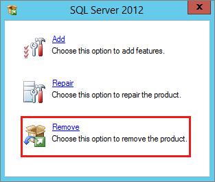
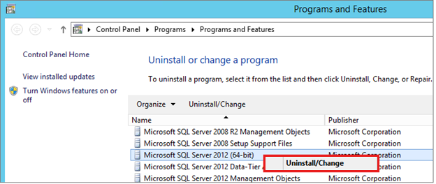

# Uninstall SQL Server Management Studio

This article describes how to uninstall the Microsoft SQL Server Management Studio that is included with SQL Server 2014 and earlier versions of the product.

_Original product version:_ &nbsp; SQL Server  
_Original KB number:_ &nbsp; 909953

## Introduction

This step-by-step article describes how to uninstall the SQL Server Management Studio that is included with SQL Server 2014 and earlier versions of the product. You may have to uninstall these tools if you receive the following error message:

> Setup has detected a version of SQL Server Management Studio on this machine. SQL Server Management Studio and SQL Server Management Studio Express cannot be installed on the same machine. To install SQL Server Management Studio Express, you must first uninstall SQL Server Management Studio, and then, rerun SQL Server Management Studio Express Edition Setup. For more information, see article 909953 in the Microsoft Knowledge Base.

The steps below are only applicable to SSMS that is installed with SQL Server 2014 and earlier versions. As such, you can use any of the processes documented in [Uninstall or remove apps and programs in Windows 10](https://support.microsoft.com/windows/uninstall-or-remove-apps-and-programs-in-windows-10-4b55f974-2cc6-2d2b-d092-5905080eaf98). However, starting with SQL Server 2016, SQL Server Management Studio is offered as a separate download. Therefore these steps don’t work with SSMS 16 and later.

## Windows 10 / 2016 +

To uninstall SQL Server Management Studio from Windows 10, Windows Server 2016, Windows Server 2019, and greater, follow these steps:

1. To begin the removal process, navigate to Settings from the **Start** menu and then **choose Apps**.

1. Search for sql in the search box.

1. SQL Server (Version) (Bit). For example, SQL Server 2012 (64-bit).

1. Select **Uninstall/Change**.

1. Select **Remove** on the SQL Server dialog pop-up to launch the SQL Server installation wizard.

   

1. On the **Select Instance** page, use the drop-down box to specify an instance of SQL Server to remove, or specify the option to remove only the SQL Server shared features and management tools. To continue, select **Next**.

1. On the **Select Features** page, specify the features to remove select Management Tools – Basic from the specified instance of SQL Server.

1. On the **Ready to Remove** page, review the list of components and features that will be uninstalled. Select **Remove** to begin uninstalling.

## Windows 2008 - 2012 R2

To uninstall SQL Server from Windows Server 2008, Windows Server 2012 and Windows 2012 R2, follow these steps:

1. To begin the removal process, navigate to the **Control Panel** and then select **Programs and Features**.

1. Right-click **Microsoft SQL Server (Version) (Bit)** and **select Uninstall**. For example, SQL Server 2012 (64-bit).

   

1. Select **Remove** on the SQL Server dialog pop-up to launch the SQL Server installation wizard.

   

1. On the **Select Instance** page, use the drop-down box to specify an instance of SQL Server to remove, or specify the option to remove only the SQL Server shared features and management tools. To continue, select **Next**.

1. On the **Select Features** page, specify the features to remove from the specified instance of SQL Server.

1. On the **Ready to Remove** page, review the list of components and features that will be uninstalled. Select **Remove** to begin uninstalling.

1. Refresh the **Programs and Features** window to verify the SQL Server instance has been removed successfully, and determine which, if any, SQL Server components still exist. Remove these components from this window as well, if you choose.

## References

[Download SQL Server Management Studio (SSMS)](/sql/ssms/download-sql-server-management-studio-ssms)
[Shared components that remain installed after you uninstall SSMS](sql/ssms/download-sql-server-management-studio-ssms)
