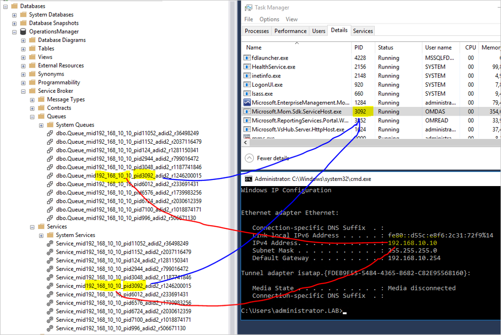
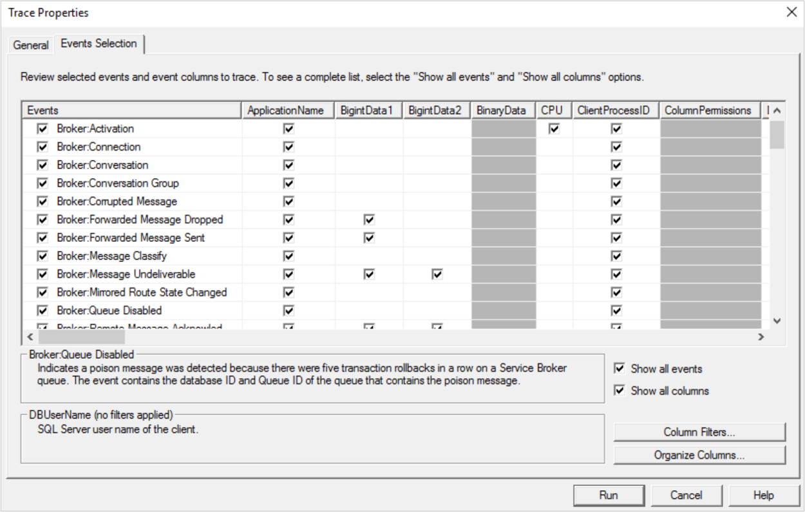
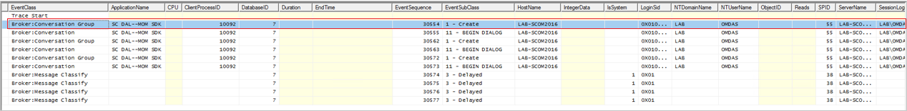
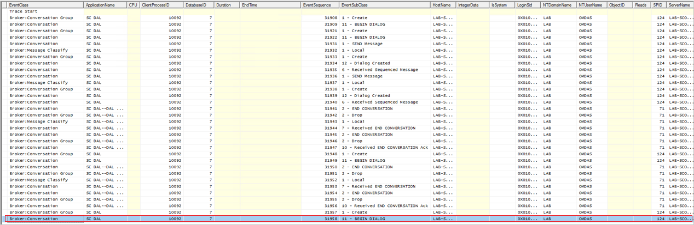
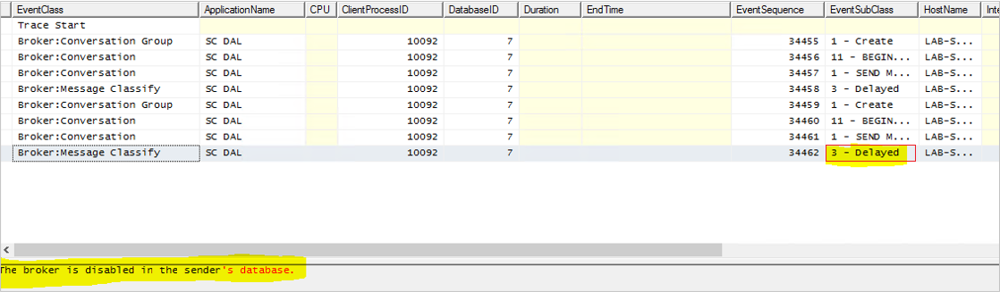

# Troubleshoot SQL Server Service Broker issues

This article details the troubleshooting steps for SQL Server Service Broker issues.


## Symptoms

1. Discovery Wizard running forever (not crashing or hanging), even though the task in the background completes (**Monitoring** > **Task Status**)
2. Resetting the health of any monitor never completes, even though the task in the background completes (**Monitoring** > **Task Status**)

## Basic Troubleshooting

1. Ensure that SQL Server Service Broker is enabled by running the following query:

    ```SQL
    SELECT is_broker_enabled FROM sys.databases WHERE name='OperationsManager'
    ```

2. Skip this step if the value that is displayed in the `is_broker_enabled` field is **1** (one). Otherwise, run the following SQL queries:

   ```SQL
   ALTER DATABASE OperationsManager SET SINGLE_USER WITH ROLLBACK IMMEDIATE
   ALTER DATABASE OperationsManager SET ENABLE_BROKER
   ALTER DATABASE OperationsManager SET MULTI_USER
   ```

3. After the broker is enabled make sure to restart the SDK Service and verify that under **Operations Manager** >**Service Broker** >**Queues/Services** , there is a Queue and service with the corresponding values as below:
   - Contains the IP address of the Management Server.
   - Contains the Process ID of the SDK service running on that MS now.
   - For each MS there is a separate Queue and Service.

     

4. If there is no queue/service, restart the SDK service and check if a queue/service is generated.

5. If no queue/service is generated, then the current Service Broker is corrupted and needs to be re-created.

6. Run all of these queries in order. Make sure that the OpsDB name is the default of " **OperationsManager**" => if not, adjust this in **the last 2 queries below** :

   ```SQL
   declare @i int
   set @i=0
   DECLARE @handle UNIQUEIDENTIFIER
   declare @service_id int
   declare @service_name nvarchar (100)
   declare @far_service nvarchar (70)
   DECLARE conv_cur CURSOR FAST_FORWARD FOR
   SELECT CONVERSATION_HANDLE, service_id, far_service
   FROM SYS.CONVERSATION_ENDPOINTS
   OPEN conv_cur;
   FETCH NEXT FROM conv_cur INTO @handle, @service_id, @far_service;
   while (@@FETCH_STATUS = 0 and (@i<500000))
   BEGIN
   select top 1 @service_name=name from sys.services where service_id=@service_id
   begin
   END CONVERSATION @handle WITH CLEANUP
   end
   FETCH NEXT FROM conv_cur INTO @handle, @service_id, @far_service;
   set @i=@i+1
   END
   CLOSE conv_cur
   DEALLOCATE conv_cur
   go

   declare @servicename sysname
   declare @queuename sysname
   declare @cmd nvarchar(200)
   declare @serverqid nvarchar(25)
   set @serverqid='%Queue_mid%'
   while ((select count(*) from sys.service_queues WHERE name like @serverqid )>1)
   begin
   set @servicename= (select top 1 s.name from sys.service_queues as q join sys.services as s on q.object_id=s.service_queue_id WHERE q.name like @serverqid order by q.create_date asc)
   set @cmd= 'DROP SERVICE '+@servicename
   exec sp_sqlexec @cmd
   set @queuename= (select top 1 Object_name(object_id) from sys.service_queues WHERE name like @serverqid order by create_date asc)
   set @cmd= 'DROP QUEUE '+@queuename
   exec sp_sqlexec @cmd
   end   
   go

   ALTER DATABASE OperationsManager SET SINGLE_USER WITH ROLLBACK IMMEDIATE
   ALTER DATABASE OperationsManager SET NEW_BROKER WITH ROLLBACK IMMEDIATE
   ALTER DATABASE OperationsManager SET MULTI_USER
   go

   ALTER DATABASE OperationsManager SET SINGLE_USER WITH ROLLBACK IMMEDIATE
   ALTER DATABASE OperationsManager SET ENABLE_BROKER
   ALTER DATABASE OperationsManager SET MULTI_USER
   go

   ```

7. Restart the **Data Access Service** on the **MS** (s) to recreate the broker and the Queue/Service. (It might require two restarts as in my case, first restart recreated the SQL Broker, second restart recreated the Service Queue).
8. After restarting the SDK services, verify that the Broker is still enabled, as in my case it was disabled again after the SQL Broker was recreated. If it was disabled repeat step 2.
9. Verify that the Queue/Service is generated as per step 3.

## Advanced Troubleshooting

If the above steps does not help, here are few tips on how to proceed:

1. Collect SQL Profiler Trace with [Broker Events](https://www.sqlteam.com/articles/how-to-troubleshoot-service-broker-problems).

   

2. Restarting the Service should trigger something similar to the below output while creating the Service/Queue.

   

3. Resetting the health of a monitor should contain a similar output as shown below:

   

4. If the broker is disabled, you will get a similar output as shown below:

   

5. If all that fails, attached is an SQL Diagnostic Script, you can run it on the Database and send it to Shaun Beasley (ShaunBe) he might be able to assist you as he helped me.

How it works behind the scenes:

Here is an example of how the **MS/Agent Task** (so **Task executed by HealthService** , not Console) system together with the SQL Broker Service work together with an example of a **Monitor Reset Task** :

- The **Console** sends a call to the **SDK** that it needs to execute a task and then remains waiting for the **SDK** to signal the **Event** that the task is finished (and report the task status / success, fail, etc).

- The **SDK** then sends this information to the **HealthService** through the **HS Root Connector** (or if it is a **remote HealthService**, it gets sent via **HS Connector by the local HS**).

- The **HealthService** that needs to run this task will execute the Task (seen and done by in **ExecutionManager** component) which will report the **Task** status via **DataItem** to the caller – ending as a **DataItem** being written in the OpsDB that will set the correct information in the **TaskStatus** table that the task is done (and further info – success, fail, etc).

- The **SQL Service Broker** will issue a message to the listening thread in the **SDK** that is responsible for handling these messages (of any kind – with specialized callback depending on the type) – **QueryNotificationManager.HandleNotifications(…)**.

- Depending on the message, this **SDK** thread (**QueryNotificationManager.HandleNotifications(…)**) will end up in one of the callbacks for the message => in the example of a **Task** , it will end up in **QueryNotificationManager.ProcessNotificationResult(…)** (in a different thread) which will perform the actual callback function call (callback.Invoke(result);).

- In this example here (of a **Task** being executed), this callback call will end up calling **TaskStatusNotifications.TaskStatus\_OnChanged(…)** which will end up doing the actual work inside of **TaskStatusNotifications.InitializeAndProcessJobStatusNotification(…)** which will perform a SQL Query to get the actual status from **JobStatus** table.

- Once the **SDK** (**TaskStatusNotifications.InitializeAndProcessJobStatusNotification(…)**) has the actual status of the **Task** with success/failure and output (if any) and with this, it will call to functions:

  - **TaskStatusNotifications.ProcessTaskResults(…)** which will perform some internal processing based on the **Task** results (Outstanding / finished / etc.).
  
  - **TaskStatusNotifications.NotifyTaskStatus(…)** which will **signal the Event** to all " **Clients**" (here the **Console** , but it can be anything connected to the SDK – PowerShell, SCOrch, etc.) that the **Task** has finished by calling **TaskStatusNotifications.Notify(…)** which sends the **Task** data object and signals the **Event** via **ClientInterface.TaskStatusChangeNotification(…)** by queuing a new work(er) thread in the worker threadpool of type **EnterpriseManagementGroupInternal.TaskStatusNotification(…)** which is already on the " **Client**" side of the **SDK** which here means that it has reached the **Console** process and this thread should already be in the **Console** => **EnterpriseManagementGroupInternal.TaskStatusNotification(…)**.

## Additional Resources

- [SQL Service Broker Troubleshooting ](https://www.sqlteam.com/articles/how-to-troubleshoot-service-broker-problems)

- [Removing Orphaned Service Broker Queues in SCOM DB](https://blogs.technet.microsoft.com/omx/2018/04/14/orphaned-service-broker-queues-in-the-scom-database/)
