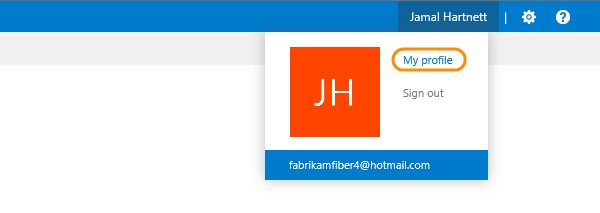
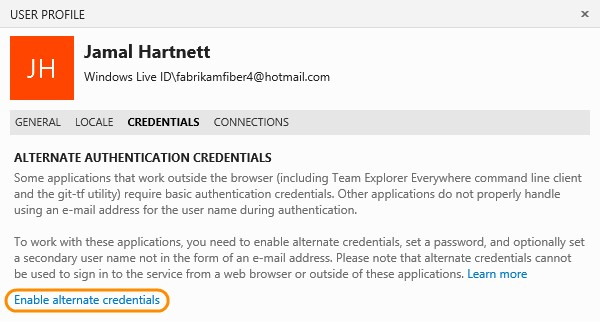
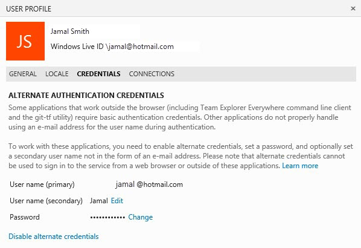

# Alternate credentials stop working for existing Visual Studio Online account users

This article solves the issue that alternate credentials do not work for existing Visual Studio Online account users that are connected to an Azure Active Directory (AAD).

_Original product version:_ &nbsp; Azure DevOps Services Premium  
_Original KB number:_ &nbsp; 2991274

## Symptoms

Assume that you have applications or tools that work outside the browser (including Team Explorer Everywhere command-line client and the git-tf utility) that require basic authentication credentials to connect to your Visual Studio Online accounts. When an existing Visual Studio Online account is connected to an AAD, alternate credentials stop working for that account.

For Microsoft Accounts, the same alternate credentials can be used to access all your Visual Studio Online accounts.

For Organizational Accounts, alternate credentials are scoped to an AAD. And alternate credentials can be used to access Visual Studio Online accounts that are connected to that directory.

## Workaround

To work around the issue, reset your alternate credentials for that account to resume access for your applications or tools. Follow these steps:

1. By using a web browser; sign in to the Visual Studio Online account that was connected to an AAD directory, or the account for which your alternate credentials stop working by typing its address:  
    *https://\<youraccountname>.visualstudio.com*

2. Open your profile.

    

3. Enable alternate credentials for this account.

    

4. Set a password and optionally a secondary user name that is not an email account if @ is not supported by your application.

    

> [!NOTE]
> If you are member of multiple Visual Studio Online accounts, you will have one set of alternate credentials that can be used to access all your Visual Studio Online accounts associated with your Microsoft Account, and another set for all the accounts connected to each AAD directory.

## References

For more information, see [Visual Studio Online](https://www.visualstudio.com/).
