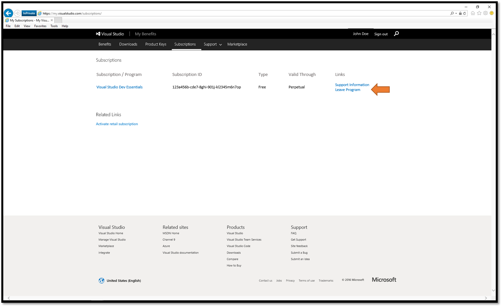

# Opt out of Visual Studio Dev Essentials

This article describes how to opt out of Visual Studio Dev Essentials.

_Original product version:_ &nbsp; Visual Studio Dev Essentials  
_Original KB number:_ &nbsp; 4013962

If you wish to opt out of Visual Studio Dev Essentials, please follow these steps:

1. Open an 'In Private' Internet Explorer browser session.

   > [!NOTE]
   > Not required, but helps ensure a clean log-in.

2. Go to [https://my.visualstudio.com/subscriptions](https://my.visualstudio.com/subscriptions)
3. Enter the email address associated with the Visual Studio Dev Essentials program and click **Continue**.
4. Depending on the email address you may get:

   - Redirected to the "Microsoft Account" (MSA) password page
   - Redirected to your companies "Work or School" password page

5. Enter your password, or complete sign in requirements.
6. Upon successful sign in, a list of current subscriptions will be displayed.
7. On the row associated with Visual Studio Dev Essentials, click **Leave Program**.
8. A Pop-up window will be displayed, select **Confirm**.

   > [!NOTE]
   > Coming back to the Visual Studio Dev Essentials program is easy.  Simply follow steps 1 - 6, and select the box for 'Join Visual Studio Dev Essentials'.

For More Information About Visual Studio Dev Essentials click [Visual Studio Dev Essentials](https://visualstudio.microsoft.com/dev-essentials/).

