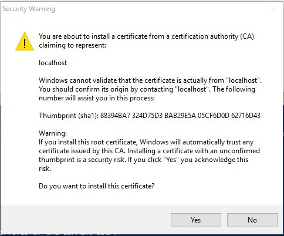
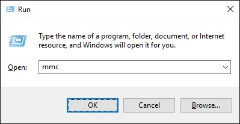
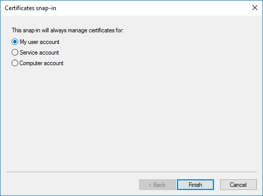

# Warnings about an untrusted certificate after you install Visual Studio 2015 Update 3

This article provides a resolution to solve the warnings that occur for an untrusted certificate after you install Microsoft Visual Studio 2015 Update 3.

_Original product version:_ &nbsp; Visual Studio 2015  
_Original KB number:_ &nbsp; 3180222

## Symptoms

You have developed web applications through Hypertext Transfer Protocol Secure (HTTPS) by using the release version of Visual Studio 2015, Update 1 or Update 2. However, after you install Visual Studio 2015 Update 3, you start receiving warnings about an untrusted certificate.

## Cause

During the initial installation of Visual Studio, Internet Information Services (IIS) Express installs a self-signed certificate into the `Certificates (Local Computer)\Personal\Certificates` folder if a certificate doesn't already exist. The first time that you debug a web application that uses Secure Sockets Layer (SSL), you are prompted to install this certificate into the `Certificates - Current User\Trusted Root Certification Authorities\Certificates` folder.

During the upgrade to Visual Studio 2015 Update 3, IIS Express installs a new SHA256 self-signed certificate into the `Certificates (Local Computer)\Personal\Certificates` folder. However, because there is already a certificate installed in the `Certificates - Current User\Trusted Root Certification Authorities\Certificates` folder, Visual Studio fails to prompt you to install the new SHA256 certificate into the `Certificates - Current User\Trusted Root Certification Authorities\Certificates` folder.

## Method 1: Use PowerShell script

> [!NOTE]
> This is the preferred method.

1. Run the following script in the Windows PowerShell Integrated Scripting Environment (ISE):

    ```ps
    ipmo PKI
    $name = [GUID]::NewGuid()
    $cerFile = "$env:TEMP\$name.cer"
    $certs = Get-ChildItem Cert:\LocalMachine\My -DnsName localhost -SSLServerAuthentication |
    ? {($_.FriendlyName -eq 'IIS Express Development Certificate') -and
    ($_.SignatureAlgorithm.FriendlyName -ieq 'sha256RSA') -and
    ($_.EnhancedKeyUsageList.Count -eq 1)}
    if ($certs.Count -eq 0)
    {
        Write-Error 'Cannot find any SHA256 certificate generated by IIS Express.
        Please make sure that the latest version of IIS Express is installed.'
    }
    else
    {
        foreach ($cert in $certs)
        {
            Export-Certificate -Cert $cert.PSPath -FilePath $cerFile -Type CERT | Out-Null
            Import-Certificate -FilePath $cerFile -CertStoreLocation Cert:\CurrentUser\Root | Out-Null
            Remove-Item $cerFile -Force
        }
        Write-Host 'Successfully installed the certificate to
        Trusted Root Certification Authorities of the current user.'
    }
    ```

2. Click **Yes** when you receive the following warning:

    

3. After the script finishes running, you should see the following message in the PowerShell ISE command window:

    > Successfully installed the certificate to Trusted Root Certification Authorities of the current user.

## Method 2: Configure computers to trust IIS Express certificate

1. Open the Microsoft Management Console by clicking **Start**, typing *Run*, and then pressing Enter. In the **Run** dialog box, type *mmc*, and then click **OK**.

    

2. Add a snap-in to manage certificates for the local computer. To do this, follow these steps:
   1. On the **File** menu, click **Add/Remove Snap-in**.

      

   2. In the **Add or Remove Snap-ins** dialog box, select **Certificates**, and then click **Add**.

      

   3. In the **Certificates snap-in** dialog box, select **Computer account**, and then click **Next**.

      

   4. In the **Select Computer** dialog box, select **Local Computer**, and then click **Finish**.

       

   5. In the **Add or Remove Snap-ins** dialog box, select **Certificates** again, and this time select **My user account** in the **Certificates snap-in** dialog box.

      

3. Export the SHA256 IIS Express certificate from `Certificates (Local Computer)\Personal\Certificates`, as follows:
   1. Open the IIS Express Development Certificate, verify that you have selected the SHA256 certificate. and then click **Copy to File**.

      

   2. In the Certificate Export Wizard, select **No, do not export the private key**, and then click **Next**.

      

   3. On the next page of the wizard, select **DER encoded binary X.509 (.CER)**, and then click **Next**.

      

   4. On the next page of the wizard, select a location on disk, and follow the remaining steps until you have successfully exported the certificate.

4. Import the exported certificate to the following location:  
    `Certificates - Current User\Trusted Root Certification Authorities\Certificates`

    To do this, follow these steps:

    1. Navigate to the `Certificates - Current User\Trusted Root Certification Authorities\Certificates` folder, and then click **Action**, point to **All Tasks**, and then click **Import**.

    2. In the Certificate Import Wizard, browse to the certificate that you exported (Trusted Root Certification Authority), and then select **Place all certificates in the following store**.

       

    3. Click **Next**, verify that you selected the correct certificate, and then click **Finish**.

After you have successfully imported the self-signed IIS certificate, you will no longer receive warnings about an untrusted certificate during development.
