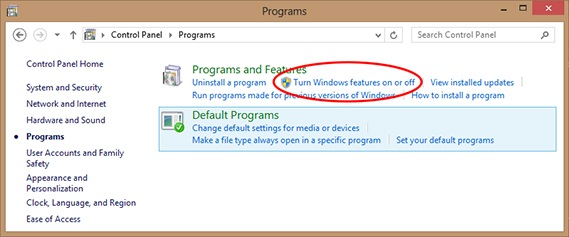
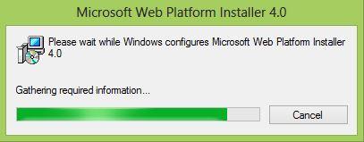
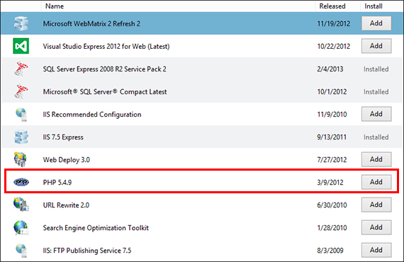
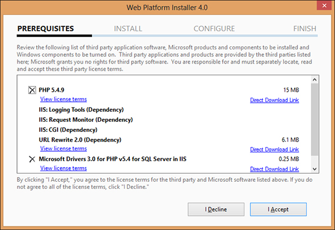
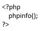
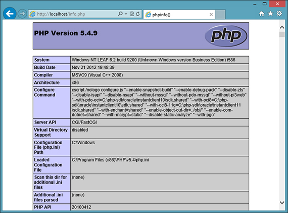

# How to install and configure PHP on IIS 8 in Windows 8

This article provides information about installing and configuring PHP on Internet Information Services(IIS) 8.0 in Windows 8.

_Original product version:_ &nbsp; Internet Information Services 8.0, Windows 8  
_Original KB number:_ &nbsp; 2819022

This article is provided by [Reza Faisal](https://mvp.microsoft.com/mvp/reza%20faisal-4020676). Microsoft is thankful that MVPs who proactively share their professional experience with other users.

## Problems

If you want to run web application base on PHP platform, we must ensure our computer has IIS 8 as web server and PHP engine. By default, Windows 8 does not have one of them. But user can easily to activate IIS 8 feature and install PHP engine in Windows 8.

## Solutions

you can activate IIS 8 in Windows 8 by using **Turn Windows features on or off** in Control Panel. And there are two ways to install and configure PHP in Windows 8:

- Install and configure PHP manually.
- Install and configure PHP automatically by using Microsoft Web Platform Installer.

There are three tasks that you will do:

1. IIS 8 installation.
2. Microsoft Web Platform Installer installation.
3. PHP installation and configuration with Microsoft Web Platform Installer.

## IIS 8 Installation

These are steps to activate IIS 8 in Windows 8:

1. Run **Turn Windows features on or off** with choosing Settings from the charms bar, then choose **Control Panel**.
2. In **Control Panel** window, choose **Programs**.
3. In **Programs and Features**, choose **Turn Windows features on or off**.

    

4. Check **Internet Information Service** and click **OK**.

    

After the installation process is complete, we can check whether IIS 8 is installed correctly by running Internet Explorer. In the address bar, type *http://localhost*. If successful, we see the web page like this picture below.

## Microsoft Web Platform Installer Installation  

Microsoft Web Platform Installer is a simple, free tool that automates the installation of Microsoft's entire Web Platform including PHP. We can download it from [Web Platform Installer](https://www.microsoft.com/web/downloads/platform.aspx). The name of installer is wpilauncher.exe.

Run wpilauncher.exe and we will see installation status like this picture below.

After installation is completed, we can see Web Platform Installer 4.0 window like this picture below.

## PHP installation and configuration  

These are step to install and configure PHP with Web Platform Installer:

1. In **Web Platform Installer 4.0** window, choose **Products** tab and search PHP version that we will install.
2. Click **Add** button as we can see in picture below.

    

3. After clicking **Add** button, we can see there are two items that will be installed. By clicking **Items to be installed** link, we can see list of those items.

    

4. Click **Install** tab.

5. Click **I Accept** button.

    

6. The installation starts.

    

7. After the installation process is complete, click **Finish**.

## Testing

To check whether the installation and configuration are success, we can test it by follow these steps:

1. Create *info.php* file and type this code below as content.

    

2. Copy *info.php* file to IIS's root folder in `C:\inetpub\wwwroot`.
3. Run Internet Explorer, and type http://localhost/infor.php in address bar.
4. We will see a web page like the picture below if the installation and configuration is successful.

    
