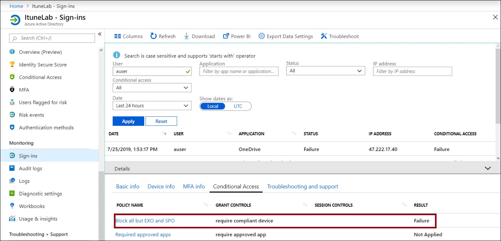

# Support tip - Devices enrolled in Intune Application Management policy are prompted to enroll in Intune

## Situation

Using **All Apps** as part of a Conditional Access (CA) policy may not be the best approach.

### Setup

For example, Contoso requires some users to use managed apps when they access **SharePoint Online** and **Exchange Online** resources, so that users can apply Application Management policy (MAM-WE) to these apps and not enroll their device in Intune. Contoso also has a CA policy that requires enrollment for all apps except SharePoint Online and Exchange Online.  

### Result

When these users try to access one of the managed applications, such as **OneDrive**, they're prompted to enroll the device.

> [!NOTE]
> This example uses **Android**.

When you log in to the Outlook app for Android, you can successfully sign in. Because you have a CA policy that requires an approved app, you're prompted to install the Intune Company portal app. Then, you're asked to register, as shown in the following screenshots.

  
When you switch over to the OneDrive app, you'll see a different behavior.

Checking the sign-in logs, you can see the conditional access policy (enforced).

 

 

Now, when you review the **Block all but EXO and SPO** CA policy, you see the following.

The term *All cloud apps* applies to [apps that are listed, and services that aren't listed](https://docs.microsoft.com/azure/active-directory/conditional-access/concept-conditional-access-cloud-apps).

For more information about best practices and what you should avoid, see [Best practices for Conditional Access in Azure Active Directory](https://docs.microsoft.com/azure/active-directory/conditional-access/best-practices#what-you-should-avoid-doing).
