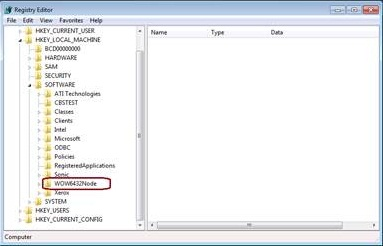

# Registry key WOW6432Node may be listed in system registry on 32 bit (x86) version of Windows 7

This article fixes an issue in which a registry subkey labeled "Wow6432Node" is listed in system registry on x86 machines.

_Original product version:_ &nbsp;Windows 7 Service Pack 1  
_Original KB number:_ &nbsp;2582176

## Symptoms

Consider the following scenario:
- A computer running 32 Bit (x86) Platform of Windows 7.
- Install Windows 7 with SP1 or install Windows 7 RTM Upgraded to SP1.
- Click the Start button, type "regedit" in the search box to open the Registry Editor. 
- Expand the following registry key.HKEY_LOCAL_MACHINE\SOFTWARE

In this scenario, you may notice a registry subkey labeled "Wow6432Node" and feel that the system may have been incorrectly installed or upgraded.

## Cause

This registry key is typically used for 32-bit applications on 64-bit machines. If they're present on x86 machines, they don't cause any issues as they aren't used.

## Resolution

You can safely ignore the registry value.

## More information

Registry Keys Affected by WOW64
 [https://msdn.microsoft.com/library/aa384253(VS.85).aspx](https://msdn.microsoft.com/library/aa384253%28vs.85%29.aspx) 

Registry Redirector
 [https://msdn.microsoft.com/library/aa384232%28VS.85%29.aspx](https://msdn.microsoft.com/library/aa384232%28vs.85%29.aspx) 

32-bit and 64-bit Application Data in the Registry
 [https://msdn.microsoft.com/library/ms724072%28v=VS.85%29.aspx](https://msdn.microsoft.com/library/ms724072%28v=vs.85%29.aspx) 

How to Determine Windows 7 Platform:  

There are a number of tools that you can use to identify which platform is installed on the system. Below are two ways that you can use to help identify the platform

Option 1:
Using The System Information Tool to view Processor Architecture:

a. Click on the Start button

b. In the Search box, type the command "MSINFO32" without the quotes

c. In the left-hand pane click on System Summary

d. In the right-hand pane, view the entry labeled "System Type"

If the entry states "x86-Based PC" this is 32 Bit Platform

If the entry states "x64-Based PC" this is 64 Bit Platform

Option 2:
Using the Set Command to Display Processor Architecture:

a. Open an Administrative command prompt

b. Type the following command:

set processor_architecture

If the result is "PROCESSOR_ARCHITECTURE=x86" this is 32 Bit Platform

If the result is "PROCESSOR_ARCHITECTURE=AMD64" this is 64 Bit Platform
