# e2e: Event IDs for Volsnap

This article provides some information about Event IDs for Volsnap.

_Original product version:_ &nbsp; Windows 10 - all editions  
_Original KB number:_ &nbsp; 3081408

## Summary

In Windows 10, Volsnap has ETW tracing and flexible event logging. These features may be useful in the following scenarios:
- Recording statistics about mounting. For example, when you encounter an issue in which bringing a volume online takes a long time, Volsnap frequently is implicated in the delay. Decent diagnostic information will be helpful in troubleshooting.
- Debugging or diagnosis of snapshot failures, especially in scenarios in which it is difficult to use the debugger. 

## More information

The features that are mentioned in the "Summary" section also play into a larger effort to provide diagnosability in the storage stack for complex operations such as cluster online/offline and for end-to-end diagnostics of storage stack failures.

The new diagnostics consist of a set of new Event Tracing for Windows (ETW) events that are logged to the Operational channel. The operational channel receives low-volume events that describe important events during infrequent large operations, such as volume online, volume offline, and so on.

In Windows 10, Volsnap also changes the way it logs to the System log. The legacy IoWriteErrorLogEntry API is no longer used. Instead, Volsnap imports the System log as an ETW channel and redefines its current complement of System events to provide richer information, as required.

Finally, Volsnap supports the acquisition and transfer of activity IDs.

For the Operational channel, the following are all the possible events:  
Event IDs 

##### 500 Completing a failed upper-level read request.

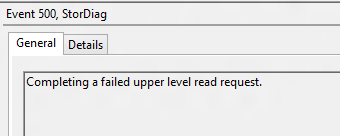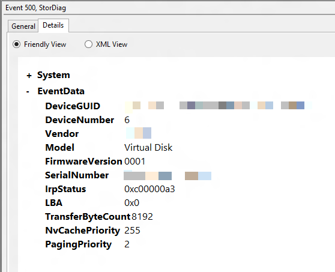

##### 501 Completing a failed upper-level write request.

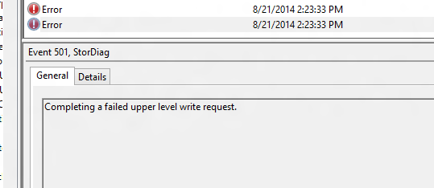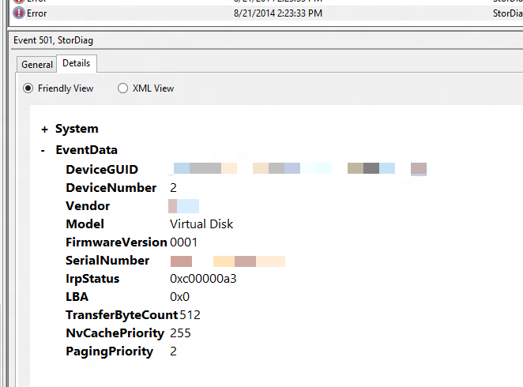

##### 503 Completing a failed upper-level paging write request.

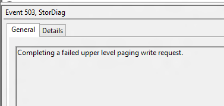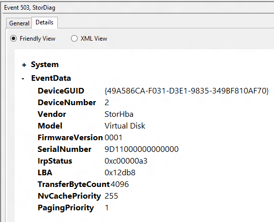

##### 504 Completing a failed IOCTL request.

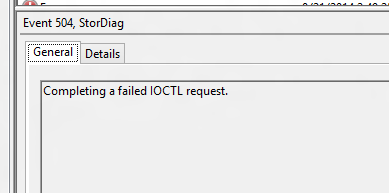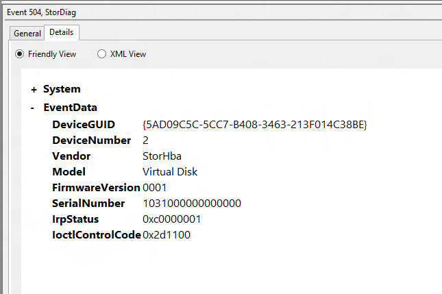

##### 505 Completing a failed Read SCSI SRB request

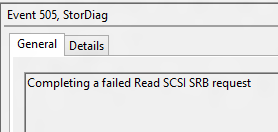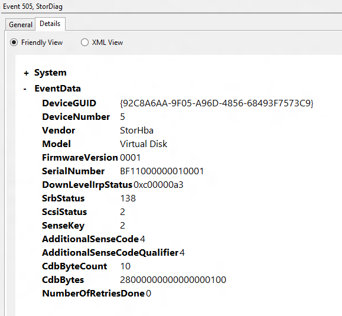

##### 506 Completing a failed Write SCSI SRB request

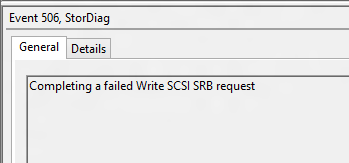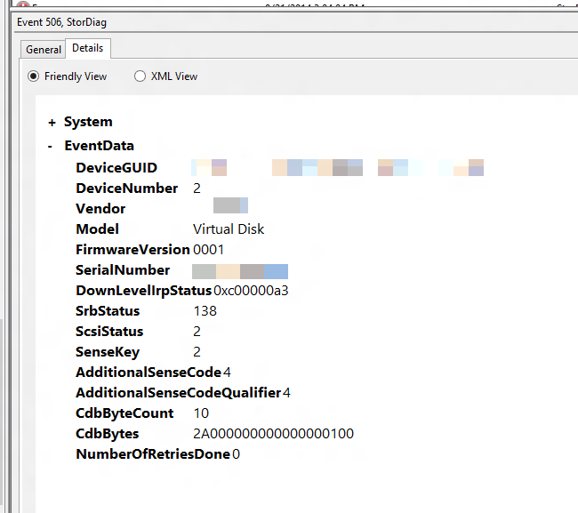

##### 507 Completing a failed non-ReadWrite SCSI SRB request

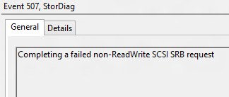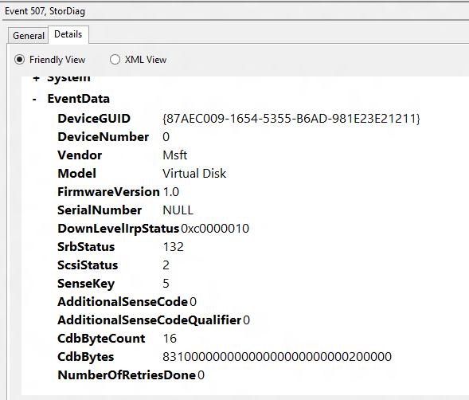

##### 508 Completing a failed non-SCSI SRB request

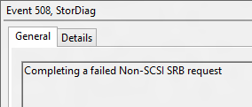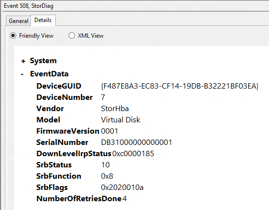

##### 509 Completing a failed PNP request

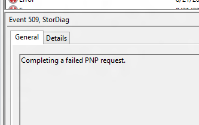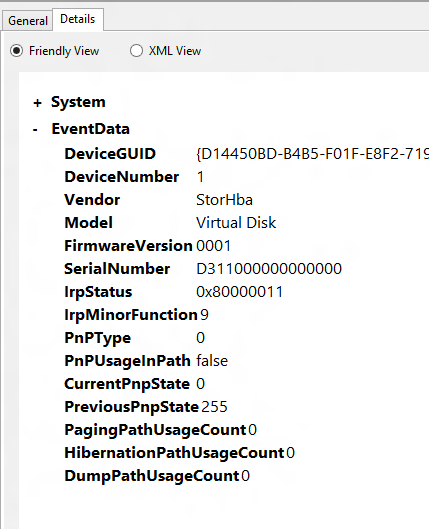

##### 510 Completing a failed Power request

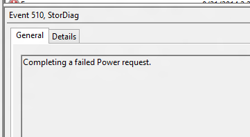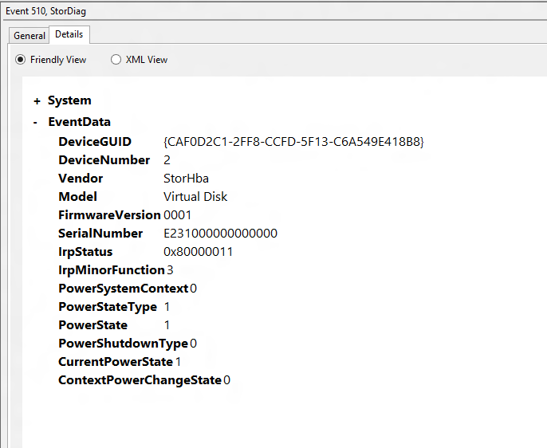

##### 511 Completing a failed WMI request  

## In earlier versions of Windows

In earlier versions of Windows, Volsnap had limited diagnostic features. Although it can log 42 different event messages, the routines that produce them are limited to providing up to two strings that represent volume names. The messages were logged by using the older API IoWriteErrorLogEntry. There was also a custom logging facility that was shared between Volsnap and various other components of VSS. In this custom logging, diagnostic data was written to the registry under HKLM\SYSTEM\CCS\Services\vss\Diag.

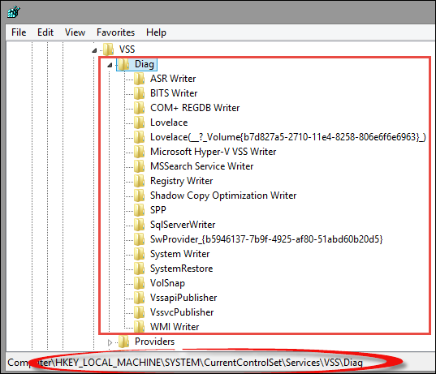

This mechanism was specific to the Volume Shadow Copy Service (VSS). Therefore, it required custom tools, such as VSS Reports, to extract the information. Also, it retained only the most recent instance of any given diagnostic message.

> [!NOTE]
> The legacy method of VSS logging is still used in Windows 10 because the ETW addition does not provide a complete replacement.
