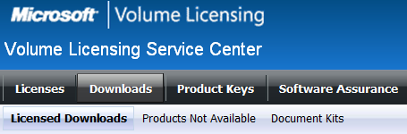

# Download and burn an ISO file on the volume licensing site (VLSC)

This article describes how to download and burn an ISO file from the Microsoft Volume Licensing Service Center (VLSC).

_Original product version:_ &nbsp; General  
_Original KB number:_ &nbsp; 2472143

## Summary

From the VLSC, you can download software included in your contract. On the section **Downloads** you can find two types, EXE & ISO files. An ISO file should be saved into a CD or DVD through a burning software.

## Download and burn an ISO file

These are the steps to download the ISO file:

1. Access the Volume License Service Center ([VLSC](https://www.microsoft.com/Licensing/servicecenter/default.aspx)).
2. Enter your Windows Live ID E-mail address and password; then click on the **Sign-In** button.
3. Click on **Downloads** > **Licensed Downloads** and search for your product.

    

4. Choose the Download Settings from the drop-down box. You need to specify the **Language** and **Connection Speed**. **Operating System Type** may be required for certain products.

    

5. Click on the **Continue Download** button.
6. You may choose either **Download Manager** or the **Web Browser**.

    1. Download Manager is a program to pause and resume the download at anytime by clicking the **Pause** button. You can cancel the download if required by clicking the **Cancel** button.

        :::image type="content" source="./media/iso-file-on-vlsc/download-manager.png" alt-text="Screenshot of Download Manager.":::

    2. Choose the location on your computer and click the **Save** button.

        > [!NOTE]
        > You will be prompted to install the Download Manager on your first download.
    3. The Download Manager opens and the download begins.
    4. You can cancel the download if required by clicking the **Cancel** button.

        :::image type="content" source="./media/iso-file-on-vlsc/cancel-download.png" alt-text="Screenshot of cancelling the download.":::

7. The ISO file should be saved on the hard disk on your computer.
8. When the download is completed, copy the ISO file to a CD or DVD using a software burning program.
9. This CD or DVD can then be used to install the ISO software.

## References

- [Create installation media for Windows](https://support.microsoft.com/help/15088/windows-10-create-installation-media)

- [Volume Licensing Service Center](/licensing/#74)
