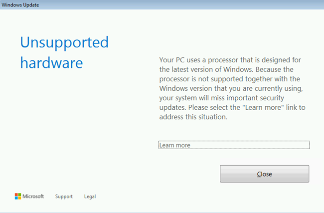

# "The processor is not supported together with the Windows version that you are currently using" error when you scan or download Windows updates

This article discusses an issue in which you receive "The processor is not supported together with the Windows version that you are currently using" error when you scan or download Windows updates.

_Original product version:_ &nbsp; Windows Server 2012 R2, Windows 10 - all editions  
_Original KB number:_ &nbsp; 4012982

## Symptoms

When you try to scan or download updates through Windows Update, you receive the following error message:
> Unsupported hardware  
> Your PC uses a processor that is designed for the latest version of Windows. Because the processor is not supported together with the Windows version that you are currently using, your system will miss important security updates.

  

Additionally, you may see an error message in the Windows Update window that resembles the following:
> Windows could not search for new updates  
An error occurred while checking for new updates for your computer.
Error(s) found:  
Code 80240037 Windows Update encountered an unknown error.  

## Cause

This error occurs when Windows detects an incompatible processor.

## Resolution

To ensure that Windows is compatible with the processor you are using, please refer to the following documentation: ["Windows Processor Requirements"](/windows-hardware/design/minimum/windows-processor-requirements)

## References

[Lifecycle support policy FAQ -Windows Products](/lifecycle/faq/windows#%2Fhelp%2F18581%2Flifecycle-support-policy-faq-windows-products%23b4)  
[Windows 10 Embracing Silicon Innovation](https://blogs.windows.com/windowsexperience/2016/01/15/windows-10-embracing-silicon-innovation)  

## Third-party information disclaimer

The third-party products that this article discusses are manufactured by companies that are independent of Microsoft. Microsoft makes no warranty, implied or otherwise, about the performance or reliability of these products.
