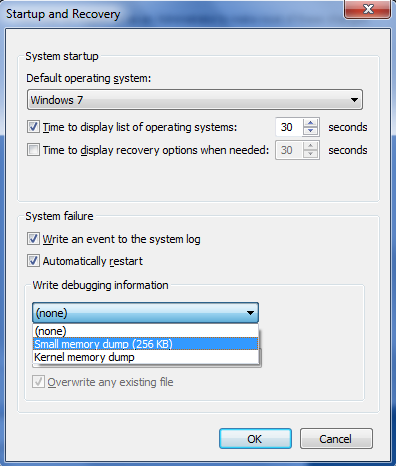

# How to read the small memory dump file that is created by Windows if a crash occurs

This article describes how to examine a small memory dump file. A small memory dump file can help you determine why your computer crashed.

_Original product version:_ &nbsp; Windows 10 - all editions, Windows Server 2012 R2  
_Original KB number:_ &nbsp; 315263

> [!NOTE]
> If you are looking for debug information for Windows 8 or later, please check [Debugging Tools for Windows (WinDbg, KD, CDB, NTSD)](/windows-hardware/drivers/debugger/).
> For more information about small memory dump, please check [Small Memory Dump](/windows-hardware/drivers/debugger/small-memory-dump).

## Small memory dump files

If your computer crashes, how can you find out what happened, fix the issue and it prevent it from happening again? You may find the small memory dump file useful in this situation. The small memory dump file contains the smallest amount of useful information that could help you identify why your computer crashed. The memory dump file contains the following information:

- The Stop message, its parameters, and other data
- A list of loaded drivers
- The processor context (PRCB) for the processor that stopped
- The process information and kernel context (EPROCESS) for the process that stopped
- The process information and kernel context (ETHREAD) for the thread that stopped
- The Kernel-mode call stack for the thread that stopped

To create a memory dump file, Windows requires a paging file on the boot volume that is at least 2 megabytes (MB) in size. On computers that are running Microsoft Windows 2000, or a later version of Windows, a new memory dump file is created each time that a computer crash may occur. A history of these files is stored in a folder. If a second problem occurs and if Windows creates a second small memory dump file, Windows preserves the previous file. Windows gives each file a distinct, date-encoded file name. For example, Mini022900-01.dmp is the first memory dump file that was generated on February 29, 2000. Windows keeps a list of all the small memory dump files in the `%SystemRoot%\Minidump` folder.

The small memory dump file can be useful when hard disk space is limited. However, because of the limited information that is included, errors that were not directly caused by the thread that was running at the time of the problem may not be discovered by an analysis of this file.

## Configure the dump type

To configure startup and recovery options to use the small memory dump file, follow these steps.

> [!NOTE]
> Because there are several versions of Microsoft Windows, the following steps may be different on your computer. If they are, see your product documentation to complete these steps.

1. Click **Start**, and then click **Control Panel**.
2. Double-click **System**, and then click **Advanced system settings**.
3. Click the **Advanced** tab, and then click **Settings** under **Startup and Recovery**.
4. In the **Write debugging information** list, click **Small memory dump (64k)**.

      

To change the folder location for the small memory dump files, type a new path in the **Dump File** box or in the **Small dump directory** box, depending on your version of Windows).

## Tools to read the small memory dump file

Use the Dump Check Utility (Dumpchk.exe) to read a memory dump file or verify that the file has been created correctly.

> [!NOTE]
> The Dump Check Utility does not require access to debugging symbols. Symbol files hold a variety of data which are not actually needed when running the binaries, but which could be very useful in the debugging process.

For more information about how to use Dump Check Utility in Windows NT, Windows 2000, Windows Server 2003 or Windows Server 2008, see Microsoft Knowledge Base article [156280: How to Use Dumpchk.exe to check a memory dump file](https://support.microsoft.com/help/156280).

For more information about how to use Dump Check Utility in Windows XP, Windows Vista or Windows 7, see Microsoft Knowledge Base article [315271: How to use Dumpchk.exe to check a Memory Dump file](https://support.microsoft.com/help/315271).

Or, you can use the Windows Debugger (WinDbg.exe) tool or the Kernel Debugger (KD.exe) tool to read small memory dump files. WinDbg and KD.exe are included with the latest version of the Debugging Tools for Windows package.

To install the debugging tools, see the [Download and Install Debugging Tools for Windows](/windows-hardware/drivers/debugger/debugger-download-tools) webpage. Select the Typical installation. By default, the installer installs the debugging tools in the following folder:

`C:\Program Files\Debugging Tools for Windows`

This Web page also provides access to the downloadable symbol packages for Windows. For more information about Windows symbols, see [Debugging with Symbols](/windows/win32/dxtecharts/debugging-with-symbols), and the [Download Windows Symbol Packages](/windows-hardware/drivers/debugger/debugger-download-symbols) webpage.

For more information about dump file options in Windows, see [Overview of memory dump file options for Windows](/troubleshoot/windows-server/performance/memory-dump-file-options).

## Open the dump file

To open the dump file after the installation is complete, follow these steps:

1. Click **Start**, click **Run**, type `cmd`, and then click **OK**.
2. Change to the Debugging Tools for Windows folder. To do this, type the following at the command prompt, and then press ENTER:

    ```console
    cd c:\program files\debugging tools for windows
    ```

3. To load the dump file into a debugger, type one of the following commands, and then press ENTER:

    ```console
    windbg -y SymbolPath -i ImagePath -z DumpFilePath
    ```

    or

    ```console
    kd -y SymbolPath -i ImagePat -z *DumpFilePath
    ```

The following table explains the use of the placeholders that are used in these commands.

|Placeholder|Explanation|
|---|---|
| **SymbolPath**|Either the local path where the symbol files have been downloaded or the symbol server path, including a cache folder. Because a small memory dump file contains limited information, the actual binary files must be loaded together with the symbols for the dump file to be correctly read.|
| **ImagePath**|The path of these files. The files are contained in the I386 folder on the Windows XP CD-ROM. For example, the path may be `C:\Windows\I386`.|
| **DumpFilePath**|The path and file name for the dump file that you are examining.|
|||

### Sample commands

You can use the following sample commands to open the dump file. These commands assume the following:

- The contents of the I386 folder on the Windows CD-ROM are copied to the `C:\Windows\I386` folder.
- Your dump file is named `C:\Windows\Minidump\Minidump.dmp`.

Sample 1:

```console
kd -y srv*c:\symbols*http://msdl.microsoft.com/download/symbols -i c:\windows\i386 -z c:\windows\minidump\minidump.dmp
```

Sample 2. If you prefer the graphical version of the debugger instead of the command-line version, type the following command instead:

```console
windbg -y srv*c:\symbols*http://msdl.microsoft.com/download/symbols -i c:\windows\i386 -z c:\windows\minidump\minidump.dmp
```

## Examine the dump file

There are several commands that you can use to gather information in the dump file, including the following commands:

- The `!analyze -show` command displays the Stop error code and its parameters. The Stop error code is also known as the bug check code.
- The `!analyze -v` command displays verbose output.
- The `lm N T` command lists the specified loaded modules. The output includes the status and the path of the module.

> [!NOTE]
> The !drivers extension command displays a list of all drivers that are loaded on the destination computer, together with summary information about their memory use. The !drivers extension is obsolete in Windows XP and later. To display information about loaded drivers and other modules, use the `lm` command. The `lm N T` command displays information in a format that is similar to the old !drivers extension.

For help with other commands and for complete command syntax, see the debugging tools Help documentation. The debugging tools Help documentation can be found in the following location:

`C:\Program Files\Debugging Tools for Windows\Debugger.chm`

> [!NOTE]
> If you have symbol-related issues, use the Symchk utility to verify that the correct symbols are loaded correctly. For more information about how to use Symchk, see [Debugging with Symbols](/windows/win32/dxtecharts/debugging-with-symbols).

### Simplify the commands by using a batch file

After you identify the command that you must have to load memory dumps, you can create a batch file to examine a dump file. For example, create a batch file and name it Dump.bat. Save it in the folder where the debugging tools are installed. Type the following text in the batch file:

```console
cd "c:\program files\debugging tools for windows"

kd -y srv*c:\symbols*http://msdl.microsoft.com/download/symbols -i c:\windows\i386 -z %1
```

When you want to examine a dump file, type the following command to pass the dump file path to the batch file:

```console
dump c:\windows\minidump\minidump.dmp
```
