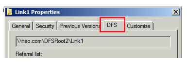
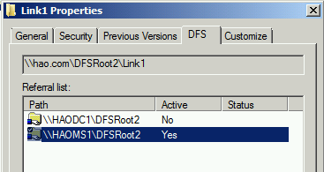
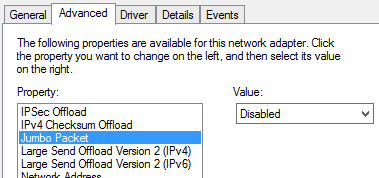

# Troubleshooting slow file copying in Windows

This article helps administrators to diagnose and resolve the issue of slow file copy in your organization.

_Original product version:_ &nbsp; Windows 10 - all editions, Windows Server 2012 R2  
_Original KB number:_ &nbsp; 10118

## Determine the cause of the issue

Slow file copying can be caused by storage issues, client issues, and server issues. 

On the file server that hosts the shared folder, copy the file to its local hard disk. If the file-copying speed is unusually low (that is, obviously slower than average speed), try to update the driver for your storage. If the issue still occurs, contact the driver manufacturer for additional troubleshooting.

If the speed is normal, use another client computer to copy the files from or to the shared folder.
- If the file copy speed is still slow, see [server-side troubleshooting](#server-side-troubleshooting).
- If issue does not occur, see [client-side troubleshooting](#client-side-troubleshooting).

## Client-side troubleshooting

Let's verify the kind of the shared folder. To do this, open the properties of the shared folder. For the DFS shared folder, the **DFS** tab is displayed.  
  

### The share folder is a DFS (Distributed File System) shared folder

Let's determine whether the problem is caused by the DFS path. Try to use the UNC path instead of the DFS path to open the shared folder. Then, you can check whether the issue still occurs. This step can help you determine whether the problem is caused by the DFS path.
How to determine the UNC path of the DFS shared folder:

1. Right-click the shared folder, and then select **Properties**.
2. On the **DFS** tab, you see the UNC path in **Referral list**.  
   

If it is still slow when you use the UNC path, see [slow performance when you copy a single file, a folder or multiple files](#slow-performance-occurs-when-you-copy-a-single-file-a-folder-or-multiple-files).

If the issue does not occur when you use the UNC path, follow these steps to verify the DFS referrals.

#### Verify the DFS referrals

1. Right-click the shared folder, and then select **Properties**. On the **DFS** tab, locate all active referrals.
2. Remove UNC paths that are not active or servers that are not reachable or are removed.
3. Connect these paths one by one, and make sure that all destination paths can be reached directly from the client. By design, if the client can't connect the first referral, it will switch to the second and so on. This will create a delay.

If the issue is still not resolved, see [server side troubleshooting](#server-side-troubleshooting).

### The share folder is not a DFS shared folder

Check when the slow file copying problem occurs.

#### Slow performance occurs only when you copy a folder or multiple files

If you compare the copying time for a folder that contains multiple files with the copying time for a file of the same size, copying the folder will always require more time. This is expected behavior. And the more files that are in the folder, the slower the file-copying process.

#### Slow performance occurs when you copy a single file, a folder or multiple files

To resolve this issue, follow these steps on the client computer that has the problem:
1. [Delete the third-part network provider from client computer](/previous-versions/windows/it-pro/windows-server-2008-R2-and-2008/cc732472(v=ws.10)). The default options are as follows. (Any additional provider can be considered as a third party.)  
     

2. Remove additional values from the following registry keys. To do this, open Registry Editor. Located the following keys. Each key contains a Provider Order value.
   `HKEY_LOCAL_MACHINE\SYSTEM\CurrentControlSet\Control\NetworkProvider\HwOrder`
   `HKEY_LOCAL_MACHINE\SYSTEM\CurrentControlSet\Control\NetworkProvider\Order`  
   Check to make sure that each Provider Order value has only three values: "RDPNP," "LanmanWorkstation," and "webclient."  
     

3. Compare the settings of **Jumbo Frames** and **Large send offload** with the settings on working computers. and adjust the settings of **Jumbo Frames** and **Large send offload** accordingly. (If it is disabled, enable it, and then check whether that helps)  
      
4. Make sure that the workstation service is running.
5. Make sure that **client for Microsoft networking** is selected in the network connection properties.  
     

## Server-side troubleshooting

Install the hotfixes for the file server that hosts the shared folder.

For Windows Server 2008 or Windows 7, install all the hotfixes that are described in [KB 2473205](https://support.microsoft.com/kb/2473205).  
For Windows Server 2012 or Windows 8, install all the hotfixes that are described in [KB 2899011](https://support.microsoft.com/kb/2899011).

If the issue is not resolved, follow these steps to troubleshoot the issue.

1. Check whether the client is connected to a remote/WAN DFS server. (Ideally, it should be connected to the local site DFS server). If it is connected, double-check the **site and subnet** mapping in Active Directory Sites and Services. If subnets are not mapped correctly, DFS will give an incorrect priority to remote DFS servers while it presents referrals.
2. Make sure that the local DFS server is working.
3. [Set theReferral ordering Methodfor DFS namespace root referrals toLowest Cost](/previous-versions/windows/it-pro/windows-server-2008-R2-and-2008/cc732414(v=ws.11)).
4. If IPv6 is enabled in the environment, configure IPv6 subnets in Active Directory Sites and Services. Or, as a workaround, disable IPv6 in the environment.

How to determine the referral DFS server to which the clients are connecting:
1. On a client computer, right-click the shared folder, and then select **Properties**.
2. On the **DFS** tab, check the referral list. The current DFS server is marked as active. In the following example, the client is connecting to the server HAOMS1.  
     

