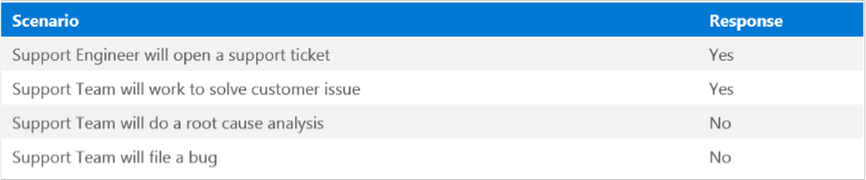

# FAQ about Windows 7 ESU

This article describes the frequently asked questions about the extended security updates for Windows 7.

This article is intended for use by IT professionals. If you're looking for information for home users, see [Windows 7 support ended on January 14, 2020](https://support.microsoft.com/help/4057281/windows-7-support-will-end-on-january-14-2020).

_Original product version:_ &nbsp; Windows 7 Service Pack 1  
_Original KB number:_ &nbsp; 4527878

## General information  

### What do Windows 7 ESU include?

Windows 7 Extended Security Updates (ESU) include security updates for critical and important issues as defined by Microsoft Security Response Center (MSRC) for a maximum of three years after January 14, 2020. After January 14, 2020, if your PC is running Windows 7, and you haven't purchased Extended Security Updates, the computer will no longer receive security updates.

> [!NOTE]
> There won't be an ESU offering or an extension of support for Office 2010.  

### Which editions of Windows 7 are eligible for ESU?

ESU is available for Windows 7 Professional and Windows 7 Enterprise.  

### When will the ESU offer be available?

ESU has been available in the Volume Licensing Service Center (VLSC) since April 1, 2019, and from Cloud Solution Providers (CSPs) since Monday, December 2, 2019.

### Where can I find out more information about purchasing and installing Windows 7 ESU in Year 2?

The process for purchasing and installing ESU in Year 2 is identical to the process for Year 1. For more information, see [Year two of Extended Security Updates for Windows 7 and Windows Server 2008](https://aka.ms/ESU-Year2).

### Do Windows 7 Embedded products qualify for Windows 7 ESU?

To obtain Windows 7 ESU for Windows 7 Embedded products, you have to have an Ecosystem Partner Servicing Offering (EPSO) support contract. You can't purchase Embedded ESU through Volume Licensing. Extended Support end dates for Windows 7 Embedded vary by edition. For more information, go to the following websites:

- [Windows 7 for Embedded System (FES)](https://support.microsoft.com/lifecycle/search?alpha=Windows%207%20professional%20for%20Embedded%20System)  
- [Windows Embedded Standard 7 (WES)](https://support.microsoft.com/lifecycle/search?alpha=Windows%20Embedded%20Standard%207%20Service%20Pack%201)  
- [Windows Embedded POS Ready 7](https://support.microsoft.com/lifecycle/search?alpha=Windows%20Embedded%20POSReady%207)  

Direct requests for ESU for Windows Server 2008 R2 for Embedded Systems and SQL Server 2008 R2 for Embedded Systems to the original manufacturer (OEM) of the device.

## ESU purchasing  

### Is there a deadline for organizations to purchase ESU for Windows 7?

Organizations can purchase ESU at any time during the three years that the offer is available (2020, 2021, and 2022). If an organization waits and purchases ESU for the first time in year two or year three, they'll also have to pay for the preceding years. It is because the security updates that are offered under the ESU program are cumulative.

Although organizations can purchase ESU at any time, they should be aware that without ESU, they won't have received bug fixes or security updates since January 14, 2020. Additionally, Microsoft Support no longer provides any form of support for these customers.

### If an organization waits and purchases ESU for the first time in Year 2 or Year 3, do they have to purchase licenses for the preceding year(s) as well?

Yes. Because the updates are cumulative, organizations do have to pay for the preceding years if they purchase Windows 7 ESU for the first time in year two or year three. That is, customers must have purchased coverage for year 1 of Extended Security Updates in order to buy year 2, and coverage for year 2 in order to buy year 3. Customers may buy coverage for previous years at the same time they buy coverage for a current period. It is not necessary to buy a certain period of coverage within that coverage period.

### How does the ESU purchasing transaction work for CSP Partners?

CSP Partners can find Windows 7 ESU offerings in the Partner Center purchase experience, on the subscription software price list under **Software**. For specific instructions to purchase ESU through Partner Center, see [Purchasing Windows 7 ESU through a Cloud Solution Provider](https://aka.ms/Win7ESUCSP).  

### If a customer purchases Windows 7 ESU 2021 through CSP and changes their mind about the ESU purchase, are there any limitations on returns?

Yes. Windows 7 ESU 2021 returns through CSP can only be processed after the Year 2 coverage period starts on January 13, 2021. After January 13, 2021, CSP partners can request refunds for ESU purchases.  

## How can EDU customers purchase Windows 7 ESU?

Customers who own Windows 7 for Education (EDU) can purchase the commercial ESU offering from CSPs.  

### Who should I contact for more information about pricing and ordering for Windows 7 ESU?

VL customers: Contact your Account Team CE for pricing and ordering information that is tailored to specific customer scenarios.

Customers who are interested in purchasing Windows 7 ESU in CSP should reach out to a CSP partner. You can find a qualified partner [at this site](https://www.microsoft.com/solution-providers/home).  

### What is the SKU called in CSP?

The "Windows 7 Extended Security Updates 2020" SKU is available on the CSP price list.  

### Does Windows 7 ESU renew automatically for year two?

No. Windows 7 ESU will be made available as a separate SKU for each of the years in which it's offered (2020, 2021, and 2022). To continue ESU coverage, customers will have to separately purchase the SKU and activate a new key for each year.  

### What are the coverage dates for the three Windows 7 ESU SKUs?

- Windows 7 Extended Security Updates 2020: January 14, 2020 - January 12, 2021
- Windows 7 Extended Security Updates 2021: January 13, 2021 - January 11, 2022
- Windows 7 Extended Security Updates 2022: January 12, 2022 - January 10, 2023

For more information, see [Lifecycle FAQ-Extended Security Updates](https://support.microsoft.com/help/4497181/lifecycle-faq-extended-security-updates).  

### Is there a minimum purchase requirement for Windows 7 ESU?

No. There are no minimum purchase requirements for Windows 7 ESU.  

### Is Software Assurance (SA) required to take advantage of ESU?

No. However, VL customers who have subscription licenses for Windows Enterprise SA or Windows Enterprise E3 receive advantageous pricing.  
 Are there any plans to release a separate Windows 7 ESU SKU for CSP customers who have active Software Assurance?  

No.  

### How will licensing work for Windows 7 ESU in virtual machine environments?

ESU is licensed per device. Therefore, for traditional on-premises or dedicated Virtual Desktop Infrastructure (VDI), each endpoint that accesses a VM that runs Windows 7 ESU has to have an ESU license. In other words, it's not the VMs that have to be counted, but the terminals. If the customer moves to Windows Virtual Desktop (WVD), ESU is covered for no additional cost for the full three-year coverage period.  

### Will ESU be available through Unified Support?

No. ESU is available to purchase only through VL and CSP.  

### Will ESU be available through the Microsoft Products & Services Agreement (MPSA)?

No. ESU is out-of-scope for MPSA.  

### I purchased Windows 7 ESU and this purchase isn't on the invoice for the same calendar month. Why dose it happen?

If you purchase Windows 7 ESU before the monthly invoice generation date, the purchase will be shown on the previous month's invoice, instead of the current calendar month's invoice.

For example, in March, if CSP purchased ESU before March 6, the purchase would show on February's invoice.

## ESU coverage  

### Does this offer also apply to Windows XP, Windows Vista, or earlier versions?

Windows XP and Windows Vista support has already ended, and no further support is available. Customers are encouraged to move to Windows 10 to take advantage of the latest in security and reliability.  

### Will the Windows 7 ESU include updates for .NET Framework? If so, which version?

Yes. Windows 7 ESU will include support for the .NET Framework 4.5.2-4.8 releases (as of January 2020) and .NET Framework 3.5 Service Pack 1 (SP1).  

### Do Windows 7 Embedded products qualify?

Yes, there is an ESU program specifically for embedded devices. For more information, see [ESU for Windows 7 Embedded](#esu-for-windows-7-embedded).  

### Can Windows 7 Pro OEM customers purchase Windows 7 ESU?

Yes.  

### Windows 7 VMs hosted in Azure receive free ESU. How are updates delivered to these VMs?

ESU for Windows 7 VMs on Azure is delivered by using the same methods as for on-premises clients. For more information, see the [ESU deployment section](#esu-deployment) in this article.  

### Will Microsoft Security Essentials (MSE) continue to protect my computer after end of support?

Microsoft Security Essentials (MSE) will continue to receive signature updates after January 14, 2020. However, the MSE platform will no longer be updated. [Learn more about MSE](https://support.microsoft.com/help/17150/windows-7-what-is-microsoft-security-essentials).  

### Are System Center Endpoint Protection (SCEP) Virus Definition updates for Windows 7 covered by ESU?

SCEP definition and engine updates will continue for Windows 7 regardless of ESU status, according to the respective lifecycle policy for the listed SCEP versions.

- All in-support versions of SCEP offer anti-spyware and anti-virus updates on version 4.10.209.
- SCEP Current Branch will be the only EndPoint Protection product that will offer AV updates (until January 2023) after the 2012 version reaches its end of support in July 2022.  

### Is technical support included?

No. Customers that purchase directly from Microsoft (for example, VL customers or CSP direct Partners) can use an active support contract such as Software Assurance or Premier or Unified Support to request assistance with Windows 7. Partners can also use their Partner Support Plans to request assistance for Windows 7.  

### Can customers get technical support on-premises for Windows 7 after the end-of-support date if they do not purchase ESU?

No. If customers have Windows 7 and don't purchase ESU, those customers can't log support tickets for Windows 7 even if they have support plans.  

### Can an organization that purchases ESU use its Unified or Premier Support agreements to submit support incidents?

Yes. Organizations that use VL to purchase ESU can submit support incidents by using any Microsoft Support offering, including Unified and Premier Support.  

### Can customers use their Premier/Unified contracts to contact support if they have purchased ESU from a CSP Partner?

No. CSP customers should use their partners for technical support or purchase a pay-per-incident plan through Microsoft Professional support.  

### Can partners submit support incidents on behalf of their customers?

Yes. CSP direct Partners can use their existing Partner Support plans to request assistance for Windows 7 ESU if the customer has purchased ESU. Resellers should work together with their CSP indirect Partners to request assistance for Windows 7 questions regarding devices that are covered by ESU.

To locate your Tenant ID, sign in to `admin.microsoft.com` by using your organization administrator account. In the upper-left corner of the portal, select the app-launcher icon, and then select **Admin**. If you don't see the Admin tile, you don't have the correct permissions to access the admin center for your organization. Typically, your organization's network administrator or IT administrator have these permissions.  

### How are ESU customers entitled for support? Can they submit tickets online by using Microsoft Support or Services Hub?

All ESU customers must call Microsoft Support in order to place a request for a technical support incident. Premier and Unified customers can find the correct number to call within Services Hub. Non-Premier and Unified customers can find the correct number to call on the [Global Customer Service phone numbers](https://support.microsoft.com/help/4051701/global-customer-service-phone-numbers)  page.  

### How does a Microsoft Support agent know who has purchased ESU?

We continue to work to fully automate the validation process. If a customer purchased ESU as part of their Enterprise Agreement, an agent can verify the purchase by asking for the customer's Enterprise Agreement number or for the full customer name. To locate their Agreement Number, a customer can sign in to Volume License Service Center, and go to **Licenses** > **License Summary**. Typically, the License Summary displays recently purchased licenses within 24 hours after Microsoft receives a customer order from a Microsoft Partner.  

### What type of response should customers expect if they encounter an issue that requires a new feature?

No new product enhancements will be made for Windows 7. ESU helps keep Windows 7 devices secure for a limited time, and assist customers during the transition to a supported version of Windows. If an investigation into a customer issue determines that a product enhancement that is available in a recent release (such as Windows 10) resolves the issue, Microsoft Support will recommend that the customers upgrade to the most recent release.  

### After customers purchase ESU, will Microsoft help troubleshoot issues that aren't related to an extended security update?

Because Windows 7 support has ended, Microsoft is committed to helping customers upgrade to a supported version of Windows or migrate to the cloud. We'll provide best-effort support to troubleshoot issues for customers who purchase Windows 7 ESU.  

### What type of response should customers expect when they request support for a product that is covered by ESU?

For VL customers and CSP direct partners who have Premier Support plans, the expectations are as follows.

  

### Is Internet Explorer 11 covered under Windows 7 ESU?

Yes. Internet Explorer 11 will receive security updates as necessary through Windows 7 ESU.  

### When will security updates be delivered for customers who have purchased Windows 7 ESU?

Security updates for Windows 7 will be released to ESU customers on the second Tuesday of every month. If there are no Critical or Important updates for Windows 7 in any given month (as prescribed by the Microsoft Security Response Center), there will be no ESU updates in that update cycle. If an off-cycle security update is considered necessary, Windows 7 ESU customers will receive the update outside the regular monthly cadence.  

### Is there any advance notification of security updates for Windows 7 ESU?

No. There's no advance notification of security updates for Windows 7 ESU at this time. However, you can view details of past updates at [Windows 7 SP1 and Windows Server 2008 R2 SP1 update history](https://support.microsoft.com/help/4009469/windows-7-sp1-windows-server-2008-r2-sp1-update-history).  

### Where can I learn more about the specific security updates that have been issued for Windows 7 ESU?

A full list of updates to Windows 7 SP1, including ESU updates, is available at [Windows 7 SP1 and Windows Server 2008 R2 SP1 update history](https://support.microsoft.com/help/4009469/windows-7-sp1-windows-server-2008-r2-sp1-update-history).

## ESU deployment  

### Are there any prerequisites for deploying ESU?

Yes. Before a customer deploys ESU, they should read [Obtaining Extended Security Updates for eligible Windows devices](https://aka.ms/Windows7ESU). That post provides detailed explanations of all prerequisites and detailed instructions for deployment.  

### How can organizations install and activate the Windows 7 ESU MAK key?

For instructions to install and activate the Windows 7 ESU Multiple Activation Key (MAK), and more information about purchasing, see [Obtaining Extended Security Updates for eligible Windows devices](https://aka.ms/Windows7ESU).

For instructions to install and activate Windows 7 ESU MAK keys on multiple devices that are part of an on-premises Active Directory domain, see [Activate Windows 7 ESUs on multiple devices with a MAK](https://techcommunity.microsoft.com/t5/windows-it-pro-blog/activate-windows-7-esus-on-multiple-devices-with-a-mak/ba-p/1167196).

> [!Note]
> Installing MAK keys adds the ability to receive ESU. It doesn't replace the current product activation key (for example, OEM, KMS), nor does it reactivate the system. Organizations will have to install a new MAK key for every year that they deploy ESU.

### Do I need to uninstall the Windows 7 ESU Year 1 MAK key in order to install the Year 2 key?

No. Nothing needs to be done to the Year 1 key in order to install the Year 2 key. The installation process for Year 2 is identical to Year 1 (see previous question, above).

### Can Windows 7 ESU Year 1 updates be applied to a device after January 12, 2021 if the Year 1 key is installed on the device?

Yes, updates can be installed at any time. That allows you to maintain your existing patch rollout process when the Year 1 key is installed and activated on a device. The same applies for Year 2 and Year 3. For more information, see [What are the coverage dates for the three Windows 7 ESU SKUs](#what-are-the-coverage-dates-for-the-three-windows-7-esu-skus).

### Why are the ESU License Preparation Packages necessary?

The Extended Security Updates (ESU) License Preparation Packages ([Extended Security Updates (ESU) Licensing Preparation Package for Windows 7 SP1 and Windows Server 2008 R2 SP1](https://support.microsoft.com/help/4538483/extended-security-updates-esu-licensing-preparation-package) and [Extended Security Updates (ESU) Licensing Preparation Package for Windows Server 2008 SP2](https://support.microsoft.com/help/4538484/extended-security-updates-esu-licensing-preparation-package)) address activation experience requirements that we identified while testing and evaluating by using a large population of preview customers. We introduced the ESU License Preparation Packages on February 11, 2020, to provide a consistent user experience going forward, minimize the number of package installations, and reduce overall customer disruption.  

### How will Microsoft deliver ESU for organizations that purchase through volume licensing (VL)?

An organization that uses volume licensing (VL) to manage on-premises deployments can use VL to deploy ESU to the covered devices. When an organization purchases Windows 7 ESU, Microsoft provides a MAK key in the VLSC. This MAK key is independent of the Windows 7 activation key and won't interfere with the existing Key Management Server (KMS) operating system activation deployment.

Administrators can access the key within VLSC by selecting **Licenses** > **Relationship Summary** > **[Licensing ID]** > **Product Keys**.

> [!NOTE]
>In this path, **[Licensing ID]** refers to the licensing ID of the organization.

The product key list will include the ESU key, which is named **Windows 7 Ext Security Year 1 MAK**.
Organizations can deploy the new MAK key and any prerequisite servicing stack updates to the applicable devices, then continue their typical update and servicing strategy to deploy ESU by using Windows Update, Windows Server Update Services (WSUS), or whatever update management solution the organization prefers. It is also the process that organizations have to follow to update Azure Stack.
For more information about how to use MAK for VL customers, see the VLSC [Product Keys FAQ](https://www.microsoft.com/Licensing/servicecenter/Help/FAQDetails.aspx?id=201).  

### Will organizations have to have a new MAK key for each of the three years that ESU is available?

Yes. Organizations have to purchase, install, and activate new keys for each of the three years. 

### How can I determine when my ESU key will expire?

The yearly ESU MAK keys do not expire. However, they do not enable the device to install updates beyond their designated time frame. For example, a device with only a Year 1 ESU MAK key would continue to be able to install updates made available during Year 1 even after the Year 1 time frame ends, but it would not receive any further updates in Year 2.

### If an organization has to reinstall Windows 7, how will the additional activation of ESU be managed?

- Organizations that purchase ESU through a Partner should go to the Partner to receive additional activations.
- Organizations that purchased ESU through VLSC should [open a VLSC support case](https://www.microsoft.com/Licensing/servicecenter) to make this request.  

### What delivery options are available for Extended Security Updates?

ESU is delivered through all the usual update delivery channels, including Configuration Manager (current branch, version 1910 or later), Windows Update (WU), Windows Server Update Service (WSUS), and Microsoft Update Catalog. The update is programmed to look for the MAK activation on the endpoint, and will install only on those systems together with the MAK key. [Learn more about Extended Security Updates and Configuration Manager](https://techcommunity.microsoft.com/t5/Configuration-Manager-Blog/Extended-Security-Updates-and-Configuration-Manager/ba-p/825618).

> [!Note]
> The ESU License Preparation Packages ([Extended Security Updates (ESU) Licensing Preparation Package for Windows 7 SP1 and Windows Server 2008 R2 SP1](https://support.microsoft.com/help/4538483/extended-security-updates-esu-licensing-preparation-package) and [Extended Security Updates (ESU) Licensing Preparation Package for Windows Server 2008 SP2](https://support.microsoft.com/help/4538484/extended-security-updates-esu-licensing-preparation-package)) are available through all of the previously mentioned channels except Windows Update.  

### Is offline servicing available for operating system images that are covered by ESU?

No. The ESU for Windows 7 and Windows Server 2008 require online servicing (using audit mode to modify images).

ESU updates aren't supported in offline servicing mode. Applying ESU in offline servicing mode generates an error, and updates fail.  

### How can a customer learn how many activations are left on their ESU MAK key?

Customers can determine the remaining activations on an MAK key by using the Volume Activation Management Tool (VAMT):

1. Start the VAMT.
2. In the navigation pane, select the **Product Keys**  node.
3. In the center pane, find the "ESU Add-on MAK" key. The remaining activation count is displayed in the **Remaining Activation Count** column.  

### Can VAMT be run on a virtual client?

Yes.  

### If VAMT is run on a virtual client for Windows 7 ESU deployment, does the VAMT host VM have to remain running after activating all the Windows 7 clients, or can it be decommissioned?

The VAMT host VM can be decommissioned after it activates all the Windows 7 ESU clients.  

### Will the number of activations that are available by using an ESU MAK key be limited?

Yes. The number of activations that are available will depend on the number of licenses that the customer has purchased and also the terms of that customer's specific licensing agreement.  

### The number of activations shown in VLSC is less than the number that our organization purchased. How can I request the correct number?

1. On the VLSC home page, select **Contact Us**.
2. Select your region, and then select **Support Web Form** in the **Contact Info** section.
3. In the form, fill out the required information.  

### If an organization needs additional activations of ESU (for example, if they have to reinstall Windows 7 or reimage a device), how will those additional activations be managed?

Organizations that purchase ESU through volume licensing should request additional activations through the VLSC:

1. On the VLSC home page, select **Contact Us**.
2. Select your region, and then select **Support Web Form**  in the **Contact Info** section.
3. In the form, complete the required information.
Most organizations that purchase ESU through CSP shouldn't have to request additional activations. For exceptional scenarios in which additional activations are required, Partners should use Partner Center to open a support request.  

### Can customers activate Windows 7 ESU through a phone?

Yes. For detailed instructions, see [Obtaining Extended Security Updates for eligible Windows devices](https://aka.ms/Windows7ESU).

## ESU for Windows 7 Embedded

### Do Windows 7 Embedded products qualify for ESU?

Yes, there is an ESU program specifically for embedded devices. This program includes:

- [Windows 7 for Embedded Systems](https://docs.microsoft.com/lifecycle/products/windows-7)
- [Windows Embedded Standard 7](https://docs.microsoft.com/lifecycle/products/windows-embedded-standard-7)
- [Windows Embedded POSReady 7](https://docs.microsoft.com/lifecycle/products/windows-embedded-posready-7)

The ESU for Windows 7 Embedded also includes Windows Server 2008 R2 for Embedded Systems and Microsoft SQL Server 2008 R2 for Embedded Systems. You should direct all embedded ESU requests to the original equipment manufacturer (OEM) of the device.

### Where can I find more information about the embedded ESU program?

Contact your OEM for all Windows 7 Embedded ESU questions.

### Why isn’t ESU for Windows Embedded Standard 7 available via CSP or volume licensing?

Windows Embedded Standard 7 is an embedded-only OS and is exclusively available from OEMs.

### How much does ESU for Windows Embedded Standard 7 cost?

Contact your OEM for ESU pricing.

### Will my customer’s devices running Windows Embedded Standard 7 be unprotected after October 13, 2020?

When security updates are available, Microsoft releases these monthly – on the second Tuesday of each month. If there are no critical or important updates released between October 14, 2020 and November 9, 2020, those devices will have the most current security updates from Microsoft. However, when the November 10, 2020 security updates are released, devices running WES will be unprotected and a security risk. 

### How are "critical" and "important" updates defined?

Visit by the Microsoft Security Response Center (MSRC) for more information on security update ratings: [https://aka.ms/msrc_ratings](https://aka.ms/msrc_ratings).
