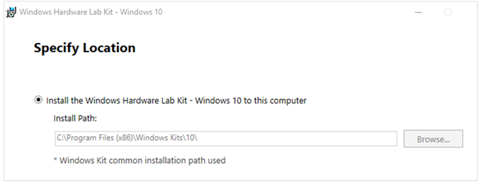
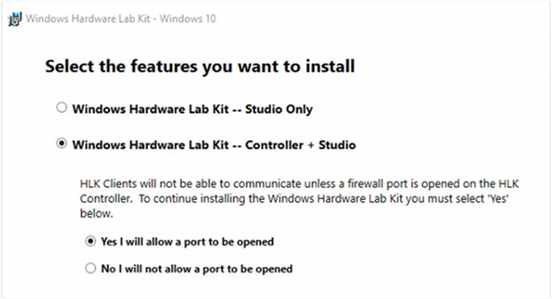
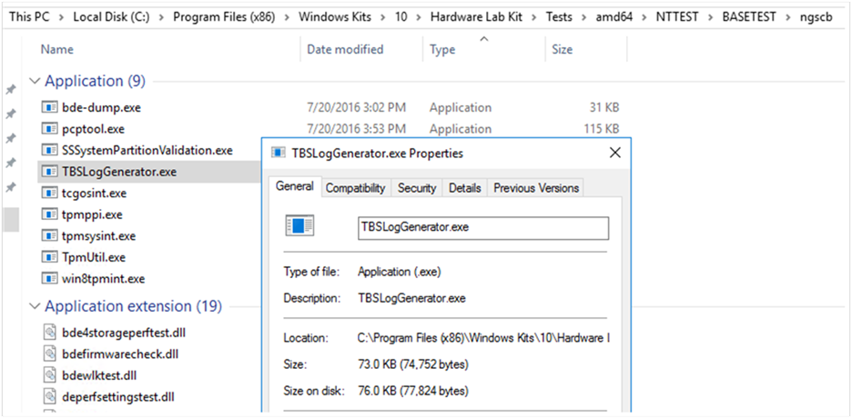
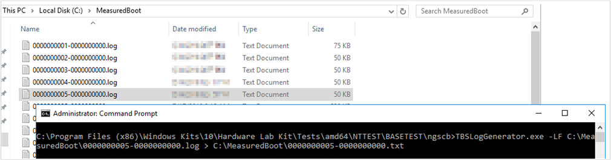
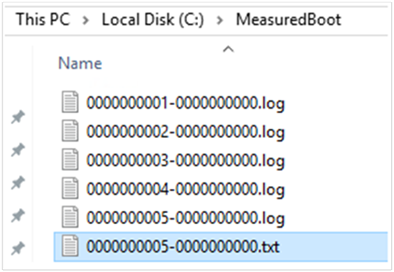
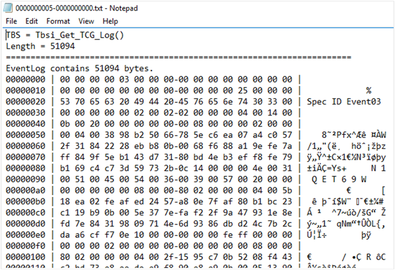
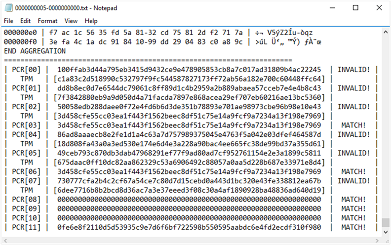
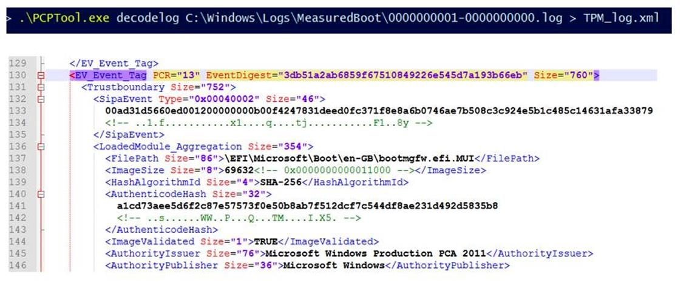

# Decode Measured Boot logs to track PCR changes

Platform Configuration Registers (PCRs) are memory locations in the Trusted Platform Module (TPM). BitLocker and its related technologies depend on specific PCR configurations. Additionally, specific change in PCRs can cause a device or computer to enter BitLocker recovery mode.  

By tracking changes in the PCRs, and identifying when they changed, insight can be gained into issues that occur or learn why a device or computer entered BitLocker recovery mode. The Measured Boot logs record PCR changes and other information. These logs are located in the *C:\Windows\Logs\MeasuredBoot\* folder.

This article describes tools that can be used to decode these logs:

- TBSLogGenerator.exe
- PCPTool.exe

For more information about Measured Boot and PCRs, see the following articles:

- [TPM fundamentals: Measured Boot with support for attestation](/windows/security/information-protection/tpm/tpm-fundamentals#measured-boot-with-support-for-attestation)  
- [Understanding PCR banks on TPM 2.0 devices](/windows/security/information-protection/tpm/switch-pcr-banks-on-tpm-2-0-devices)

## Use TBSLogGenerator.exe to decode Measured Boot logs

Use *TBSLogGenerator.exe* to decode Measured Boot logs that were collected from Windows. *TBSLogGenerator.exe* can be installed on the following systems:

- A computer that is running Windows Server 2016 or newer and that has a TPM enabled
- A Gen 2 virtual machine running on Hyper-V that is running Windows Server 2016 or newer and is using a virtual TPM.

To install the tool, follow these steps:

1. Download the Windows Hardware Lab Kit from [Windows Hardware Lab Kit](/windows-hardware/test/hlk/).

2. After downloading, run the installation file from the path where the install was downloaded to.

3. Accept the default installation path.

   

4. Under **Select the features you want to install**, select **Windows Hardware Lab Kit&mdash;Controller + Studio**.

   

5. Finish the installation.

To use *TBSLogGenerator.exe*, follow these steps:

1. After the installation finishes, open an elevated Command Prompt window and navigate to the following folder:

   *C:\Program Files (x86)\Windows Kits\10\Hardware Lab Kit\Tests\amd64\NTTEST\BASETEST\ngscb*

   This folder contains the *TBSLogGenerator.exe* file.

   

2. Run the following command:

   ```cmd
   TBSLogGenerator.exe -LF <LogFolderName>\<LogFileName>.log > <DestinationFolderName>\<DecodedFileName>.txt
   ```

   where the variables represent the following values:

   - \<*LogFolderName*> = the name of the folder that contains the file to be decoded
   - \<*LogFileName*> = the name of the file to be decoded
   - \<*DestinationFolderName*> = the name of the folder for the decoded text file
   - \<*DecodedFileName*> = the name of the decoded text file

   For example, the following figure shows Measured Boot logs that were collected from a Windows 10 computer and put into the *C:\MeasuredBoot\\* folder. The figure also shows a Command Prompt window and the command to decode the *0000000005-0000000000.log* file:

    ```cmd
    TBSLogGenerator.exe -LF C:\MeasuredBoot\0000000005-0000000000.log > C:\MeasuredBoot\0000000005-0000000000.txt
    ```

   

   The command produces a text file that uses the specified name. In this example, the file is *0000000005-0000000000.txt*. The file is located in the same folder as the original *.log* file.

   

   The content of this text file is similar to the following text:

   

   To find the PCR information, go to the end of the file.

   

## Use PCPTool.exe to decode Measured Boot logs

> [!NOTE]
> *PCPTool.exe* is a Visual Studio solution, but executable needs to be built before tool can be used.

*PCPTool.exe* is part of the [TPM Platform Crypto-Provider Toolkit](https://www.microsoft.com/download/details.aspx?id=52487). The tool decodes a Measured Boot log file and converts it into an XML file.

To download and install *PCPTool.exe*, go to the Toolkit page, select **Download**, and follow the instructions.

To decode a log, run the following command:

```cmd
PCPTool.exe decodelog <LogFolderPath>\<LogFileName>.log > <DestinationFolderName>\<DecodedFileName>.xml
```

where the variables represent the following values:

- \<*LogFolderPath*> = the path to the folder that contains the file to be decoded
- \<*LogFileName*> = the name of the file to be decoded
- \<*DestinationFolderName*> = the name of the folder for the decoded text file
- \<*DecodedFileName*> = the name of the decoded text file

The content of the XML file will be similar to the following XML:


