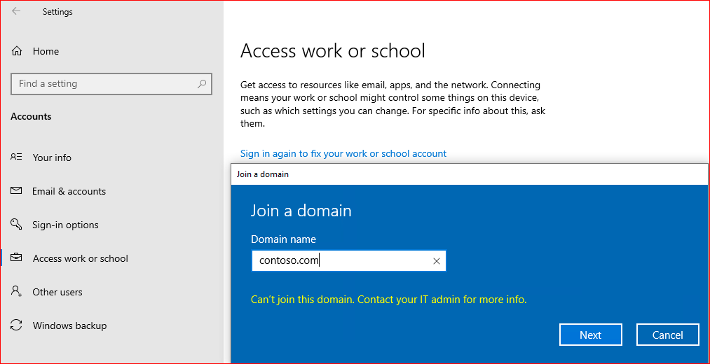
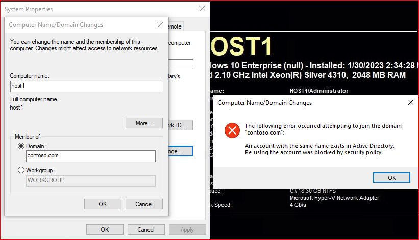

# Failure when you use an existing computer account to join a domain

This article addresses the issue of failing to join a computer to a domain when an existing computer account with the same name already exists.

## Symptom

When you try to use an existing computer account name to join a computer to a domain, the operation fails. And you receive the following error messages.





### Netsetup.log

Review the following example of the Netsetup.log on a fully updated system.

```output
02/14/2024 17:13:19:290 NetpProvisionComputerAccount:
02/14/2024 17:13:19:290 	lpDomain: contoso.com
02/14/2024 17:13:19:290 	lpHostName: host1
02/14/2024 17:13:19:290 	lpMachineAccountOU: (NULL)
02/14/2024 17:13:19:290 	lpDcName: ContosoDC1.contoso.com
02/14/2024 17:13:19:290 	lpMachinePassword: (null)
02/14/2024 17:13:19:290 	lpAccount: contoso\nonadminuser2
02/14/2024 17:13:19:290 	lpPassword: (non-null)
02/14/2024 17:13:19:290 	dwJoinOptions: 0x403
02/14/2024 17:13:19:290 	dwOptions: 0x40000003
02/14/2024 17:13:19:290 NetpLdapBind: Verified minimum encryption strength on ContosoDC1.contoso.com: 0x0
02/14/2024 17:13:19:290 NetpLdapGetLsaPrimaryDomain: reading domain data
02/14/2024 17:13:19:290 NetpGetNCData: Reading NC data
02/14/2024 17:13:19:290 NetpGetDomainData: Lookup domain data for: DC=contoso,DC=com
02/14/2024 17:13:19:290 NetpGetDomainData: Lookup crossref data for: CN=Partitions,CN=Configuration,DC=contoso,DC=com
02/14/2024 17:13:19:290 NetpLdapGetLsaPrimaryDomain: result of retrieving domain data: 0x0
02/14/2024 17:13:19:290 NetpCheckForDomainSIDCollision: returning 0x0(0).
02/14/2024 17:13:19:305 NetpGetComputerObjectDn: Cracking DNS domain name contoso.com/ into Netbios on \\ContosoDC1.contoso.com
02/14/2024 17:13:19:305 NetpGetComputerObjectDn: Crack results: 	name = CONTOSO\
02/14/2024 17:13:19:305 NetpGetComputerObjectDn: Cracking account name CONTOSO\HOST1$ on \\ContosoDC1.contoso.com
02/14/2024 17:13:19:305 NetpGetComputerObjectDn: Crack results: 	(Account already exists) DN = CN=HOST1,CN=Computers,DC=contoso,DC=com 
02/14/2024 17:13:19:305 NetpGetADObjectOwnerAttributes: Looking up attributes for machine account: CN=HOST1,CN=Computers,DC=contoso,DC=com
02/14/2024 17:13:19:305 NetpGetNCData: Reading NC data
02/14/2024 17:13:19:305 NetpReadAccountReuseModeFromAD: Searching '<WKGUID=AB1D30F3768811D1ADED00C04FD8D5CD,DC=contoso,DC=com>' for '(&(ObjectClass=ServiceConnectionPoint)(KeyWords=NetJoin*))'.
02/14/2024 17:13:19:305 NetpReadAccountReuseModeFromAD: Got 0 Entries.
02/14/2024 17:13:19:305 Returning NetStatus: 0, ADReuseMode: 0
02/14/2024 17:13:19:305 IsLegacyAccountReuseSetInRegistry: RegQueryValueEx for 'NetJoinLegacyAccountReuse' returned Status: 0x2. 
02/14/2024 17:13:19:305 IsLegacyAccountReuseSetInRegistry returning: 'FALSE''.
02/14/2024 17:13:19:305 NetpDsValidateComputerAccountReuseAttempt: returning NtStatus: 0, NetStatus: 0
02/14/2024 17:13:19:305 NetpDsValidateComputerAccountReuseAttempt: returning Result: FALSE
02/14/2024 17:13:19:305 NetpCheckIfAccountShouldBeReused: Active Directory Policy check with SAM_DOMAIN_JOIN_POLICY_LEVEL_V2 returned NetStatus:0x0.
02/14/2024 17:13:19:305 NetpCheckIfAccountShouldBeReused: Account re-use attempt was Denied by Active Directory Policy. 
02/14/2024 17:13:19:305 NetpCheckIfAccountShouldBeReused:fReuseAllowed: FALSE, NetStatus:0x0
02/14/2024 17:13:19:305 NetpModifyComputerObjectInDs: Account exists and re-use is blocked by policy. Error: 0xaac 
02/14/2024 17:13:19:305 NetpProvisionComputerAccount: LDAP creation failed: 0xaac 
02/14/2024 17:13:19:305 NetpProvisionComputerAccount: Retrying downlevel per options
02/14/2024 17:13:19:321 NetpManageMachineAccountWithSid: NetUserAdd on 'ContosoDC1.contoso.com' for 'HOST1$' failed: 0x8b0 
02/14/2024 17:13:19:321 IsLegacyAccountReuseSetInRegistry: RegQueryValueEx for 'NetJoinLegacyAccountReuse' returned Status: 0x2. 
02/14/2024 17:13:19:321 IsLegacyAccountReuseSetInRegistry returning: 'FALSE''.
02/14/2024 17:13:19:321 NetpManageMachineAccountWithSid: The computer account already exists in Active Directory.Re-using the account was blocked by security policy.
02/14/2024 17:13:19:321 NetpProvisionComputerAccount: retry status of creating account: 0xaac
02/14/2024 17:13:19:321 ldap_unbind status: 0x0
02/14/2024 17:13:19:321 NetpJoinCreatePackagePart: status:0xaac.
02/14/2024 17:13:19:321 NetpJoinDomainOnDs: Function exits with status of: 0xaac 
02/14/2024 17:13:19:321 NetpJoinDomainOnDs: status of disconnecting from '\\ContosoDC1.contoso.com': 0x0
02/14/2024 17:13:19:321 NetpResetIDNEncoding: DnsDisableIdnEncoding(RESETALL) on 'contoso.com' returned 0x0
02/14/2024 17:13:19:321 NetpJoinDomainOnDs: NetpResetIDNEncoding on 'contoso.com': 0x0
02/14/2024 17:13:19:321 NetpDoDomainJoin: status: 0xaac
```

### Error detail

|HEX|DEC|Symbolic Name|Error Description|Header|
|---|---|---|---|---|
|0x8b0|2224|NERR_UserExists|The account already exists.|lmerr.h|
|0xaac|2732|NERR_AccountReuseBlockedByPolicy|An account with the same name exists in Active Directory. Re-using the account was blocked by security policy.|lmerr.h|

## Cause

Windows introduced extra protections with updates released on and after October 11, 2022. These protections intentionally prevent domain join operations from reusing an existing computer account in the target domain unless the following specific conditions are met:

- The user attempting the operation is the creator of the existing account.
- The computer was created by a member of domain administrators, enterprise administrators, or built-in administrators groups.
- The owner of the computer account object that is being reused is a member of the "Domain controller: Allow computer account reuse during domain join" Group Policy setting. This setting requires the installation of Windows updates released on or after March 14, 2023, on all member computers and domain controllers.

## Resolution

To fix the issue, follow these steps:

1. Perform the join operation by using the same account that created the computer account in the target domain.
2. If the existing account is stale (unused), delete it before attempting to join the domain again.
3. Rename the computer and join using a different account that doesn't already exist.
4. If a trusted security principal owns the existing account, and an administrator wants to reuse the account, use the **Domain controller: Allow computer account re-use during domain join** Group Policy.

> [!WARNING]
> Don't use the **NetJoinLegacyAccountReuse** registry workaround anymore in a fully patched environment. Support for the **NetJoinLegacyAccountReuse** registry key was removed by the August 13, 2024 Windows Update. The hardening behavior persists regardless of that registry key setting. Use steps 1 - 4 in this section.
