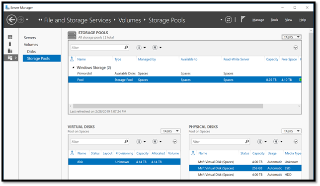
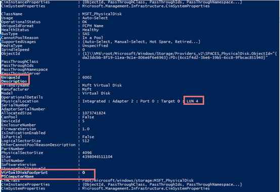

# How to extend stand-alone tiered storage spaces

This article shows how to extend stand-alone tiered storage spaces.

_Original product version:_ &nbsp; Windows Server 2019, Windows Server 2016, Windows Server 2012 R2  
_Original KB number:_ &nbsp; 4562879

The following article explains how to expand tiered storage spaces on a stand-alone server. Here's an example of a tiered space created with a 12.1 TB size in Windows Server 2016.  

 

 Here's how to extend the Tiered Storage Space:  

 1.Add hard drives to the storage pool.  
   

 2.Update the **Media Type** of the new added disk.  
   

 3.Run the get-physicaldisk | fl *cmdlet and copy the UniqueId of the newly added disk:  
 

 4.Run the following cmdlet to change the **Media Type** of the newly added disk:

  Set-PhysicalDisk -UniqueId 6002  -MediaType HDD  
  Refresh the **Server Manager**  to change the **Media Type**.  
 

 5.Run this cmdlet to expand the disk:  
  Resize-StorageTier -FriendlyName Vdisk01_Microsoft_HDD_Template -size 16.1TB
 

 6.Resize the disk volume in the **Disk Management**.
   

 7.The storage has been expanded.
   