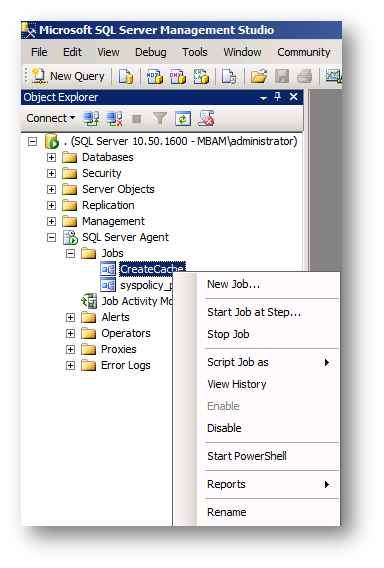

# MBAM Enterprise Reporting Not Getting Updated

This article provides a solution to an issue where Microsoft BitLocker Administration and Monitoring (MBAM) Enterprise Reports aren't updated as expected.

_Original product version:_ &nbsp; Windows 10 - all editions, Windows Server 2012 R2  
_Original KB number:_ &nbsp; 2620269

## Symptoms

When you try to View Enterprise Reports on Microsoft BitLocker Administration and Monitoring (MBAM) Server, you may not see the updated reports with computer listed as compliant or non-compliant.

## Cause

There is always latency based on how often the MBAM client talks to the MBAM server. Enterprise Compliance report runs from a SQL stored procedure and updates every 6 hours.

## Resolution

To get updated reports, open SQL Management Studio on MBAM Server.

Under SQL Server Agent, click Jobs and then click Create Cache.

Right-click on Create Cache and click Start Job at Step...

Once the Job is completed, Refresh the web page for MBAM Enterprise Reports and you will see all the Computers listed.

## More information

For more information on MBAM, please consult the following documentation.

- [Planning Guide](https://onlinehelp.microsoft.com/mdop/hh285653.aspx) 
- [Deployment Guide](https://onlinehelp.microsoft.com/mdop/hh285644.aspx) 
- [Operations Guide](https://onlinehelp.microsoft.com/mdop/hh285664.aspx) 
- [Troubleshooting MBAM](https://onlinehelp.microsoft.com/mdop/hh352745.aspx)
