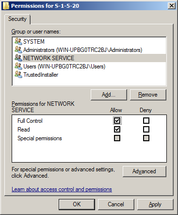

# Windows is not genuine error

This article helps fix the 0x80070005 error that occurs when you log on to a computer.

_Applies to:_ &nbsp; Windows 7 Service Pack 1, Windows Server 2012 R2  
_Original KB number:_ &nbsp; 2704233

## Symptoms

When you log on to a computer that is running Windows, you receive the following Windows Activation message:

> Windows is not genuine  
> Your computer might be running a counterfeit copy of Windows.

:::image type="content" source="media/windows-not-genuine-error/windows-not-genuine.png" alt-text="Details of the Windows is not genuine error." border="false":::

Additionally, the desktop background is black, and you receive the following error message in the lower-right corner of the screen:

> The copy of Windows in not genuine

:::image type="content" source="media/windows-not-genuine-error/copy-windows-not-genuine-error.png" alt-text="Copy of Windows is not genuine error shown in the lower-right corner of the screen.":::

When you view the System properties in Control Panel, the following information is displayed:

> [!NOTE]
> To view the System properties, click **Start**, click **Control Panel**, click **System and Security**, and then click **System**.

> You must activate today. Activate Windows now.

If you use the slmgr.vbs /dlv script to view the licensing status, you receive the following message:

> Error: 0x80070005 Access denied: the requested action requires elevated privileges

> [!NOTE]
>
> - This error message may also occur when a command that is being executed requires an elevated command prompt and is unrelated to the issue discussed here.
> - If you see a message that Windows might not be genuine, and there's no error code, go to [Genuine Windows: frequently asked questions](https://windows.microsoft.com/windows/help/genuine/faq).

## Resolution

To resolve this problem, use the following methods, depending on your scenario.

### Scenario 1: Lack of permissions

The network service account has to have full control and read permissions in the following registry subkey:

`HKEY_LOCAL_MACHINE\SOFTWARE\Microsoft\Windows NT\CurrentVersion\Profilelist\S-1-5-20`

The permissions may have been removed when a Plug and Play Group Policy Object (GPO) was applied.

To resolve the problem in this scenario, use method A or method B.

#### Method 1: Edit the permissions of the Group Policy

1. Determine the source of the policy. To do this, follow these steps:

    1. On the computer that is experiencing the Activation error message, run the Resultant Set of Policy wizard. To do this, click Start, type *rsop.msc* in the **Search** box, and then press Enter.

    2. In the navigation pane, expand the following containers: See image

        :::image type="content" source="media/windows-not-genuine-error/system-services.png" alt-text="Screenshot shows how to find the System Services in the Resultant Set of Policy wizard." border="false":::

        - Computer Configuration
        - Windows Settings
        - Security Settings

    3. In the navigation pane, click **System Services**.
    4. If the Plug and Play service is configured through a Group Policy setting, you see the GPO listed here with settings other than Not Defined. Additionally, you can see which GPO is applying this setting.

2. Open the GPO that is identified in step 1, and then open the corresponding Group Policy setting.

3. Click **Edit Security**, and then click **Advanced**.

4. In the Advanced Security Settings for Plug and Play window, click **Add**, and then add the SERVICE account.

5. Click **OK**.

6. Select the following permissions in the **Allow** section, and then click **OK**:

    - Query template
    - Query status
    - Enumerate dependents
    - Interrogate
    - User-defined control
    - Read permissions

    > [!NOTE]
    > These are the minimum required permissions.

7. Run `gpupdate /force` after you apply the previous permissions to the Group Policy setting. To do this, click Start, type `gpupdate /force` in the **Search** box, and then press Enter.

8. Make sure that the appropriate permissions are applied. To do this, click **Start**, type `sc sdshow plugplay` in the **Search** box, and then click OK.

The following are the permissions that are applied to the Plug and Play service in the security descriptor definition language (SDDL):

> D:(A;;CCDCLCSWRPWPDTLOCRSDRCWDWO;;;SY)  
(A;;CCDCLCSWRPWPDTLOCRSDRCWDWO;;;BA)  
(A;;CCLCSWLOCRRC;;;IU)  
(A;;CCLCSWLOCRRC;;;SU)  
S:(AU;FA;CCDCLCSWRPWPDTLOCRSDRCWDWO;;;WD)

*(A;;CC LC SW LO CR RC ;;;SU* is an Access Control Entry (ACE) that allows the following rights to *SU* (SDDL_SERVICE - Service logon user):  

> A: Access Allowed  
CC: Create Child  
LC: List Children  
SW: Self Write  
LO: List Object  
CR: Control Access  
RC: Read Control  
SU: Service Logon User

If there are no GPOs in place, the default registry permissions have been changed. To work around this problem, follow these steps:

1. Start Registry Editor on the computer that is receiving the error message. To do this, click Start, type *regedit* in the **Search** box, and then press Enter.

2. Right-click the registry key `HKEY_USERS\S-1-5-20`, and then click **Permissions**.

    :::image type="content" source="media/windows-not-genuine-error/registry-permissions.png" alt-text="Select the Permissions option by right-clicking the registry key.":::

3. If the NETWORK SERVICE isn't present, click **Add**.

    :::image type="content" source="media/windows-not-genuine-error/select-add.png" alt-text="Adding NETWORK SERVICE under the Security tab of the permissions settings dialog box." border="false":::

4. In **Enter the object names to select** area, type *network service*, click **Check Names**, and then click **OK**.

    :::image type="content" source="media/windows-not-genuine-error/type-network-service.png" alt-text="Enter network service in the Enter the object names to select area." border="false":::

5. Click **NETWORK SERVICE**, and then select the **Full Control** and **Read** permissions.

    

6. Click **OK**.
7. Restart the computer.
8. After you restart the computer, you may have to activate the copy of Windows. Complete the activation.

#### Method 2: Disable the Plug and Play GPO

> [!NOTE]
> This method is intended for advanced computer users and cannot be performed on computers that are running Windows 7 Home Premium, Windows 7 Home Basic, or Windows 7 Starter. For help with advanced troubleshooting, ask your system administrator or [Contact Microsoft](https://support.microsoft.com/contactus/).

To disable the Plug and Play GPO, follow these steps:

1. Determine the source of the policy. To do this, follow these steps:

    1. On the computer that is experiencing the Activation error message, run the Resultant Set of Policy wizard. To do this, click Start, type *rsop.msc* in the **Search** box, and then press Enter.
    2. In the navigation pane, expand the following containers:
        - Computer Configuration
        - Windows Settings
        - Security Settings
    3. In the navigation pane, click System Services.
    4. If the Plug and Play service is configured through a Group Policy setting, you see the GPO listed here with settings other than **Not Defined**. Additionally, you can see which Group Policy is applying this setting.

2. Disable the Group Policy settings and force the Group Policy to be reapplied. To do this, follow these steps:

3. Edit the Group Policy that is identified in Step 1 and change the setting to **Not Defined**. Or, follow the steps in Method 1 to add the required permissions for the Network Service account.

4. Reapply the Group Policy setting. To do this, click **Start**, type `gpupdate /force` in the **Search** box, and then press Enter.

> [!NOTE]
> You may have to restart the computer.

### Scenario 2: Missing registry entries

One or more of the following registry subkeys is missing:

- `HKEY_LOCAL_MACHINE\SOFTWARE\Microsoft\Windows NT\CurrentVersion\Profilelist\S-1-5-18`

- `HKEY_LOCAL_MACHINE\SOFTWARE\Microsoft\Windows NT\CurrentVersion\Profilelist\S-1-5-19`

- `HKEY_LOCAL_MACHINE\SOFTWARE\Microsoft\Windows NT\CurrentVersion\Profilelist\S-1-5-20`

To resolve this problem in this scenario, follow these steps:

1. Copy the text below into a text editor such as Notepad, and then save the text file as Profilelist.reg.

    > Windows Registry Editor Version 5.00  
    [HKEY_LOCAL_MACHINE\SOFTWARE\Microsoft\Windows NT\CurrentVersion\ProfileList\S-1-5-18]  
    "Flags"=dword:0000000c  
    "State"=dword:00000000  
    "RefCount"=dword:00000001  
    "Sid"=hex:01,01,00,00,00,00,00,05,12,00,00,00  
    "ProfileImagePath"=hex(2):25,00,73,00,79,00,73,00,74,00,65,00,6d,00,72,00,6f,\  
    00,6f,00,74,00,25,00,5c,00,73,00,79,00,73,00,74,00,65,00,6d,00,33,00,32,00,\  
    5c,00,63,00,6f,00,6e,00,66,00,69,00,67,00,5c,00,73,00,79,00,73,00,74,00,65,\  
    00,6d,00,70,00,72,00,6f,00,66,00,69,00,6c,00,65,00,00,00  
    [HKEY_LOCAL_MACHINE\SOFTWARE\Microsoft\Windows NT\CurrentVersion\ProfileList\S-1-5-19]  
    "ProfileImagePath"=hex(2):43,00,3a,00,5c,00,57,00,69,00,6e,00,64,00,6f,00,77,\  
    00,73,00,5c,00,53,00,65,00,72,00,76,00,69,00,63,00,65,00,50,00,72,00,6f,00,\  
    66,00,69,00,6c,00,65,00,73,00,5c,00,4c,00,6f,00,63,00,61,00,6c,00,53,00,65,\  
    00,72,00,76,00,69,00,63,00,65,00,00,00  
    "Flags"=dword:00000000  
    "State"=dword:00000000  
    [HKEY_LOCAL_MACHINE\SOFTWARE\Microsoft\Windows NT\CurrentVersion\ProfileList\S-1-5-20]  
    "ProfileImagePath"=hex(2):43,00,3a,00,5c,00,57,00,69,00,6e,00,64,00,6f,00,77,\  
    00,73,00,5c,00,53,00,65,00,72,00,76,00,69,00,63,00,65,00,50,00,72,00,6f,00,\  
    66,00,69,00,6c,00,65,00,73,00,5c,00,4e,00,65,00,74,00,77,00,6f,00,72,00,6b,\  
    00,53,00,65,00,72,00,76,00,69,00,63,00,65,00,00,00  
    "Flags"=dword:00000000  
    "State"=dword:00000000

2. Merge profilelist.reg. To do this, right-click the file that you saved in step 1, and then click **Merge**.
3. Restart the computer.
4. Activate Windows.

Check whether the problem is fixed. If the problem is fixed, you're finished with this section. If the problem isn't fixed, you can [contact support](https://support.microsoft.com/contactus/).

#### Advanced information

Because the Licensing service uses Plug and Play to obtain hardware ID information and binds the license to the computer, this setting can result in an activated system appearing to be out of tolerance. The default permissions of the Plug and Play policy don't grant the Licensing service the appropriate rights to access the Plug and Play service. The Licensing service runs under the Network Service account.

## Data collection

If you need assistance from Microsoft support, we recommend you collect the information by following the steps mentioned in [Gather information by using TSS for deployment-related issues](../../windows-client/windows-troubleshooters/gather-information-using-tss-deployment.md).
