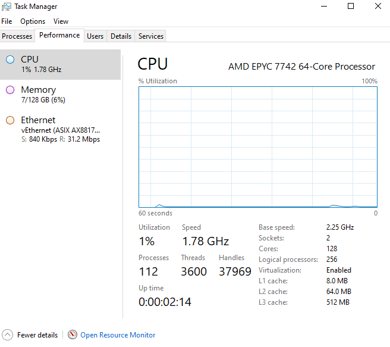

# Windows Server support and installation instructions for the AMD Rome family of processors

This article introduces the Windows Server operating system (OS) install instructions and support statements for AMD EPYC 7xx2 processors. Additionally, this article describes several known limitations to the support for these processors.

_Original product version:_ &nbsp; Windows Server 2019, Windows Server 2016, Windows Server 2012 R2  
_Original KB number:_ &nbsp; 4514607

## Windows Server support

- Windows Server 2019

    Windows Server 2019 supports AMD EPYC 7xx2-series CPUs. Use the refreshed media image of Windows Server 2019 that was released in early October, 2019. You can obtain this image from the appropriate licensing channel, as applicable.

- Windows Server 2016

    Windows Server 2016 supports AMD EPYC 7xx2-series CPUs. The support is limited to no more than 255 logical processors. Windows Server 2016 does not support X2APIC mode, and you should disable this mode in the computer's basic input/output system (BIOS). Use the refreshed media image of Windows Server 2019 that was released in early October, 2019. You can obtain this image from the appropriate licensing channel, as applicable.

- Windows Server 2012 R2

    Windows Server 2012 R2 supports AMD EPYC 7xx2-series CPUs. The support is limited to no more than 255 logical processors. Windows Server 2012 R2 does not support X2APIC mode, and you should disable this mode in the computer's BIOS.

    > [!NOTE]
    > Windows Server 20012 R2 is in [extended support cycle](/lifecycle/products/?alpha=Windows%20Server%202012%20R2). We recommend that you upgrade to the latest modern Windows Server 2019 operating system.

## AMD Processor SKU support

The following table lists support for each AMD processor SKU and Windows Server OS version.

|AMD EPYC 7XX2 (AMD Rome)|Windows Server 2019|Windows Server 2016|Windows Server 2012 R2|
|---|---|---|---|
|AMD EPYC 7742 64C|Supported|Supported: You have to disable AMD simultaneous multithreading (SMT).|Supported: You have to disable AMD SMT.|
|AMD EPYC 7702 64C|Supported|Supported: You have to disable AMD SMT.|Supported: You have to disable AMD SMT.|
|AMD EPYC 7702P 64C|Supported|Supported: Requires AMD SMT to be disabled.|Supported: Requires AMD SMT to be disabled.|
|AMD EPYC 7552 48C|Supported|Supported|Supported|
|AMD EPYC 7502 32C|Supported|Supported|Supported|
|AMD EPYC 7502P 32C|Supported|Supported|Supported|
|AMD EPYC 7402 24C|Supported|Supported|Supported|
|AMD EPYC 7402P 24C|Supported|Supported|Supported|
|AMD EPYC 7352 24C|Supported|Supported|Supported|
|AMD EPYC 7302 16C|Supported|Supported|Supported|
|AMD EPYC 7302P 16C|Supported|Supported|Supported|
|AMD EPYC 7262 8C|Supported|Supported|Supported|
|||||

## Install Windows Server on a computer that uses AMD EPYC 7xx2 (AMD Rome) processors

To install Windows Server on a computer that uses AMD EPYC 7xx2 (AMD Rome) processors, follow these steps:

1. In the computer's BIOS, disable the SMT settings (such as the logical processors setting).
2. In the computer's BIOS, disable the X2APIC setting.
3. Use the OS media to install Windows Server.
4. Install the latest Windows Server updates for the respective Windows Server OS that you installed.

## Known UI limitations for Windows Server task manager, WMI, or PowerShell queries to pull CPU information

- Task Manager does not display L2 and L3 cache sizes, or displays incorrect L2 and L3 cache sizes.

    For example, see the following figure.

    :::image type="content" source="./media/windows-server-support-installation-for-amd-role-family-processor/screenshot-of-l2-l3-cache-size.jpg" alt-text="L2 and L3 cache display issue.":::

- Task Manager displays an incorrect number of sockets.

    For example, for a single-CPU one-socket system, Task Manager displays two sockets. For a two-socket system, Task Manager displays four sockets.

- Task manager displays an incorrect number of Numa nodes.

    For example, for a one-socket system, Task Manager displays two Numa nodes. For a two-socket system, Task Manager displays four Numa nodes.

    
