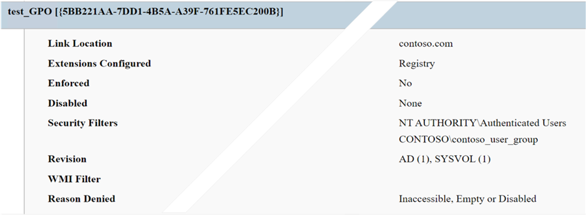

# Can't apply user Group Policy settings when computer objects don't have GPO Read permissions

This article describes how to grant **Read** permissions to computer objects, which are needed to apply user Group Policy settings.

_Applies to:_ &nbsp; Windows Server (all supported versions), Windows Client (all supported versions)

## Symptoms

You remove the default permissions for the **Authenticated Users** group from one or more Group Policy Objects (GPOs). Afterwards, you can't successfully apply user Group Policy settings.

## Cause

When a user signs in to Windows, Windows retrieves the user Group Policy settings that apply to that user. Before security update [MS16-072: Security update for Group Policy: June 14, 2016](https://support.microsoft.com/topic/ms16-072-security-update-for-group-policy-june-14-2016-7570425d-d460-3003-b2ac-a464c874725d), Windows used the user security context for this operation. This security update changed this functionality so that Windows uses the computer's security context to retrieve user Group Policy settings.

Because of this change, the computer account has to have **Read** permissions on GPOs that apply to the signed-in user. By default, the **Authenticated Users** group has **Read** and **Apply group policy** permissions on all the GPOs in the domain. The computer accounts in the domain all belong to the **Authenticated Users** group and inherit these permissions.

When the default permissions are in place, the **Scope** tab of the Group Policy Management Console (GPMC) lists **Authenticated Users** in the **Security Filtering** section, as shown in this screenshot.

Additionally, the **Delegation** tab lists the allowed permission for **Authenticated Users** as **Read (from Security Filtering)**. This permission corresponds to the Windows permissions **Read** and **Apply Group Policy**.

Some administrators remove **Authenticated Users** from **Security Filtering**, to improve security or to use more granular security groups for filtering. This action removes both the **Read** and the **Apply group policy** permissions from the group and all its members. For user GPOs to function correctly, you must restore the **Read** permission to the computer objects.

> [!NOTE]  
> This issue usually does not affect users who use domain controllers to sign in to a domain. By default, the built-in **Enterprise Domain Controllers** group has **Read** permission on all GPOs in the domain, so domain controllers do not rely on the **Authenticated Users** group for this permission.

## Resolution

If you have removed the **Read (from Security Filtering)** permission from **Authenticated Users**, you have to use an alternate method to assign **Read** permission to the computer objects:

- Assign **Read** permission to the **Authenticated Users** group.

  This approach restores the **Read** permission without restoring the **Apply group policy** permission.

- Assign **Read** permission to the **Domain Computers** group.

  All the computers in the domain belong to the **Domain Computers** group in that domain.

- Assign **Read** permission to specific computer objects or to a security group that the computers belong to.

> [!IMPORTANT]  
> Whenever you modify Group Policy permissions, make sure that user objects, computer objects, or groups to which those objects belong are not explicitly denied access to the GPOs. An explicit denial always overrides a permission that would otherwise allow access.

To resolve the issue, follow these steps:

1. In GPMC, on the **Delegation** tab, select **Add**.

1. In the **Add Group or User** dialog box, select the group or object that you want, and then in the **Permissions** box, select **Read**.

1. Select **OK**.

After you finish these steps, the **Delegation** tab lists the allowed permission for the selected object or group as **Read**. instead of **Read (from Security Filtering)**. This difference indicates that the object or group does not have the **Apply group policy** permission.

### Example scenario

Consider a GPO that defines only user settings. You want to apply the GPO to specific users, who all belong to a group that's named **contoso_user_group**. In GPMC, on the **Scope** tab for the GPO, you add **contoso_user_group** to the **Security Filtering** list. To limit the GPO to only the users in that group, you remove **Authenticated Users** from the list.

To test this configuration, you run `gpresult /h gpresult.html` on a user's computer. Then open the *gpresult.html* file to view the policy results. In this scenario, the report indicates an error (listed at the bottom of the following screenshot).

To resolve this error, you have to grant **Read** permission to the computer objects that represent the computers that the members of **contoso_user_group** use to sign in. In this scenario, that means creating a group named **contoso_computer_group**, and adding the affected computers to that group. Then, using the procedure described earlier in this article, using the **Delegation** tab to assign **Read** permission to that group.
