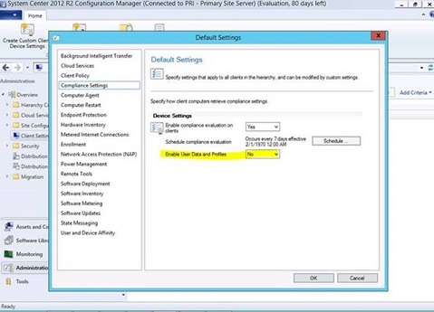

# Folder Redirection group policy is not applied

This article helps fix an issue that prevents folder redirection policy from working in Microsoft System Center Configuration Manager (SCCM).

_Original product version:_ &nbsp;Windows 10  
_Original KB number:_ &nbsp;3060058

## Symptoms

Computers running Windows 8 and later versions may not apply Folder Redirection Group Policy objects (GPOs) as expected. This issue can occur if the computers are domain clients and are managed by System Center 2012 Configuration Manager Service Pack 1 (ConfigMgr 2012 SP1) or later.

## Resolution

To work around this issue, disable the **Enable User Data and Profiles**  device setting in the System Center 2012 Configuration Manager console.

For more information, see [How to create User Data and Profiles Configuration items in Configuration Manager](https://technet.microsoft.com/library/jj591610.aspx?f=255&mspperror=-2147217396).
