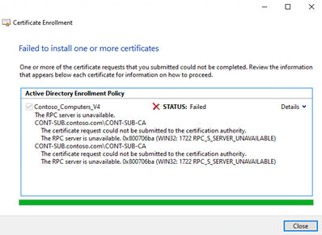

# Error 0x800706ba "The RPC Server is unavailable" when you enroll a certificate

When you try to enroll a certificate on a Windows Server, it fails with the error 0x800706ba "The RPC Server is unavailable". This article introduces how to solve this issue.

_Applies to:_ Supported versions of Windows Server  
_Original KB number:_ 4042719, 4516764, 5021150  

## Issue details

When the issue occurs, if we add the user account that is used to request the certificate to the local administrators group on the CA, the enrollment succeeds for a user-based template. However, enrollment against a machine based template still returns the same error.

Besides, you see one or more of the following symptoms:

### Error messages

  

  

### Network capture

When you capture network trace, it indicates LDAP queries to the configuration partition in Active Directory was successful, and the templates available are revealed in the trace.

Then, the requesting server try to do RPC to the CA and get the response ACCESS DENIED.

For example:

> 10167 \<time\> \<requesting server IP address\> \<CA IP address\> ISystemActivator 918 RemoteCreateInstance request  
> 10174 \<time\> \<CA IP address\> \<requesting server IP address\> DCERPC 86 Fault: call_id: 3, Fragment: Single, Ctx: 1, status: nca_s_fault_access_denied

Additionally, we can find MSRPC bind attempt and error:

> 1093    10:56:34 AM 10/26/2022    92.5590216     (0)    SourceIP    52237 (0xCC0D)    DestIP    135 (0x87)    MSRPC    MSRPC:c/o Bind: IRemoteSCMActivator(DCOM) UUID{000001A0-0000-0000-C000-000000000046}  Call=0x3  Assoc Grp=0x8A9E  Xmit=0x16D0  Recv=0x16D0  
> 1097    10:56:34 AM 10/26/2022    92.5940283     (652)    SourceIP    135 (0x87)    DestIP    52237 (0xCC0D)    MSRPC    MSRPC:c/o Bind Nack:  Call=0x3  Reject Reason: invalid_checksum

### Event log

If auditing is enabled, a DCOM error can be observed on the CA server detailing an **ANONYMOUS LOGON** attempt:

> Log Name: System  
> Source: Microsoft-Windows-DistributedCOM  
> Date: \<date\>  
> Event ID: 10027  
> Task Category: None  
> Level: Warning  
> Keywords: Classic  
> User: ANONYMOUS LOGON  
> Computer: \<CA FQDN\>
>
> Description:  
> The machine wide limit settings do not grant Remote Activation permission for COM Server applications to the user NT AUTHORITY\ANONYMOUS LOGON SID (S-1-5-7) from address \<IP address\> running in the application container Unavailable SID (Unavailable). This security permission can be modified using the Component Services administrative tool.

### Other data

We identify the call being made correctly with 'dce_c_authn_level_pkt_integrity' RPC Integrity level which enforces Kerberos/NTLM as an authentication mechanism. This is enforced by default starting 6B.22 (KB5004442—Manage changes for Windows DCOM Server Security Feature Bypass (CVE-2021-26414) (microsoft.com))

3. The client performs a KRB_AP_REQ which is rejected by the server side.

Server side's Kerberos.etl displays the following -

[0] 02B4.11CC::10/27/22-17:17:58.2914208 [KERBEROS] krbtoken_cxx3567 KerbCreateTokenFromTicketEx() - KerbCreateTokenFromTicket for CHILD\sagiv, (null)
[0] 02B4.11CC::10/27/22-17:17:58.2914876 [KERBEROS] krbtoken_cxx3595 KerbCreateTokenFromTicketEx() - Failed to create token: 0xc000015b
[2] 02B4.11CC::10/27/22-17:17:58.2950944 [KERBEROS] logonapi_cxx9910 LsaApLogonTerminated() - LsaApLogonTerminated called: 0x0:0xf4eb9b0
[2] 02B4.11CC::10/27/22-17:17:58.2956518 [KERBEROS] ctxtapi_cxx4235 SpAcceptLsaModeContext() - Failed to create token from ticket: 0xc000015b
[2] 02B4.11CC::10/27/22-17:17:58.2956804 [KERBEROS] ctxtapi_cxx5078 SpAcceptLsaModeContext() - SpAcceptLsaModeContext returned 0xc000015b, Context 0000000000000000, Pid 0x0
[2] 02B4.11CC::10/27/22-17:17:58.2956808 [KERBEROS] ctxtapi_cxx5079 SpAcceptLsaModeContext() - SpAcceptLsaModeContext (0000000000000000) returned 0xc000015b
5. The server attempts to procure an access token for the user who presented the TGS and fails with 0xc000015b - 'STATUS_LOGON_TYPE_NOT_GRANTED'

