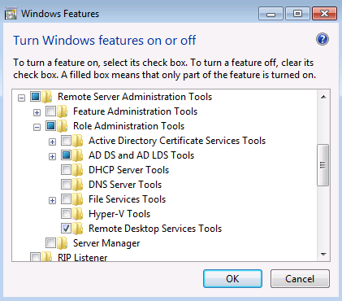
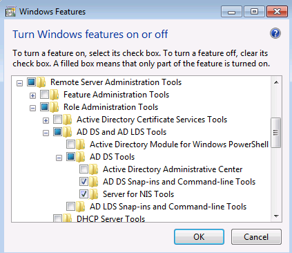

# Windows 7 RSAT: Multiple tabs are missing when viewing user properties in Active Directory Users and Computers

This article provides a solution to an issue where multiple tabs are missing when you view user properties in Active Directory Users and Computers.

_Applies to:_ &nbsp; Windows 7 Service Pack 1  
_Original KB number:_ &nbsp;2028835

## Symptoms

After installing the Remote Server Administration Tools for Windows 7 (Windows 7 RSAT) on a domain-joined Windows 7 client, you add the Role Administration Tools for "AD DS Snap-ins and Command-line Tools":

You then start the **Active Directory Users and Computers** snap-in **(DSA.MSC)** and examine the properties of a user. You notice that some or all of the following tabs are missing:
Published Certificates
Password Replication
Object
Security
Attribute Editor
Environment
Sessions
Remote Control
Remote Desktop Services Profile
Personal Virtual Desktop
UNIX Attributes
Dial-in
These tabs are visible when running **DSA.MSC** on the console of Windows Server 2008 R2 servers.

## Cause

Multiple root causes exist. See the **Resolution** section for more information.

## Resolution

1. Enable "Advanced Features" via the View menu. This will show at least the following new tabs:  
Published Certificates  
Password Replication  
Object  
Security  
Attribute Editor
2. If still not seeing the "Environment", "Sessions", "Remote Control", "Personal Virtual Desktop", and "Remote Desktop Services Profile" tabs, add the following RSAT feature: "Remote Desktop Services Tools". Then restart DSA.MSC and enable the Advanced View to make these tabs appear.  

3. If still not seeing the "UNIX Attributes" tab, add the following RSAT feature: "Server for NIS Tools". Restart DSA.MSC with Advanced View enabled to make this tab appear.  

4. The "Dial-In" tab will always be missing, as its libraries are not included in Remote Server Administration Tools for Windows 7.
