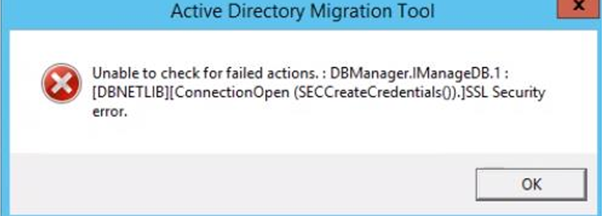

# Support information for ADMT and PES

This article describes information about Active Directory Migration Tool version 3.2 (ADMT v3.2) and Password Export Server version 3.1 (PES v3.1).

_Applies to:_ &nbsp; Windows Server 2019, Windows Server 2016, Windows Server 2012 R2  
_Original KB number:_ &nbsp; 4089459

## Summary

This article provides the free Active Directory migration tools and documentation. The tools are ADMT v3.2 and PES v3.1. This article also describes the known problems and limitations of the toolset.

## ADMT Guide

The following guide provides guidance for migration of domains by using the Active Directory Migration Tool:  

[Active Directory Migration Tool (ADMT) Guide: Migrating and Restructuring Active Directory Domains](https://www.microsoft.com/download/details.aspx?id=19188)

> [!NOTE]
>
> - ADMT has not been updated for Windows 8.1 and 10 workstation migration.
> - Windows Server 2012, Windows Server 2012 R2 and later version of Windows Server have not been tested for modern applications and profile migrations. Your experience may vary, depending on many factors, including the Windows version that you are migrating. Use the tools suite at your own risk.
> - An alternative to the ADMT tools suite is also available from Microsoft Services:Active Directory Migration Services(ADMS). This tool runs in the Azure cloud. For entry-level information, see [Taste of Premier: Directory Consolidation with Windows Azure Active Directory Migration Services](https://channel9.msdn.com/Blogs/Taste-of-Premier/Taste-of-Premier-Directory-Consolidation-with-Windows-Azure-Active-Directory-Migration-Services) and [Microsoft Azure Active Directory Migration Service](https://download.microsoft.com/download/0/7/F/07FA8BFC-17D5-4F55-AD4F-3A987A7324AA/microsoft-azure-active-directory-migration-service-solution-brief.pdf).

## Known issues and limitations

- Installing PES on Windows Server 2012 and later

    Old ADMT guides don't mention the need to run the pedmig.msi file at an elevated command prompt. The latest ADMT guide mentions this requirement. The latest guide is dated February 26, 2018, and is available from the Microsoft Download Center.

- Computer running ADMT must not use Credential Guard

    The workstation that is driving the migration is not doing the migration by itself. The object movement is executed on the target domain controller (DC). It is delegating the user running the migration task when migrating a user from the source domain.

    By default, domain controllers are set up for unconstrained delegation that is not allowed by Credential Guard anymore.

    If you have ADMT installed on a Windows Server 2016-based member server or a later version Windows Server-based member server, you must disable Credential Guard to run migrations. Or, you can move the ADMT installation to the target domain DC, where you don't have to delegate. Also, Credential Guard is not supported on target DCs.

- DC cannot use unconstrained delegation

    Because of existing attack vectors, Microsoft is restricting and blocking the use of unconstrained delegation. This also affects DCs. ADMT logs the following error:

    > ADMT log error: Failed to move source object. Verify that the caller's account is not marked sensitive and therefore cannot be delegated. hr=0x8009030e No credentials are available in the security package

    The change of behavior for Windows Server 2008 R2 is contained in [March 12, 2019-KB4489885 (Security-only update)](https://support.microsoft.com/help/4489885).

    Microsoft PFE discussed this problem in [Get rid of accounts that use Kerberos Unconstrained Delegation](/archive/blogs/389thoughts/get-rid-of-accounts-that-use-kerberos-unconstrained-delegation). Another blog outlines the [release plan](https://blogs.technet.microsoft.com/askpfeplat/2019/04/11/changes-to-ticket-granting-ticket-tgt-delegation-across-trusts-in-windows-server-askpfeplat-edition/).

    You can configure the target domain DCs for constrained delegation and allow the target domain DCs to delegate to the source DCs ([resource-based constrained delegation](/windows-server/security/kerberos/kerberos-constrained-delegation-overview)). This is only possible when your DCs are Windows Server 2012 or later version of Windows Server.

    In Windows Server 2008 R2 or earlier version of Windows Server, you can only move the ADMT installation to a target domain DC. Then you don't have the need to delegate.

- The ADMT computer must have TLS 1.0 enabled in order to connect to SQL Server

    If TLS 1.0 is disabled, you receive a message on the ADMT computer that resembles the following:

    > Unable to check for failed actions. : DBManager.ImanaDB.1 : [DBNETLIB][ConnectionOpen (SECCreateCredentials()).]SSL Security error.

    

    Additionally, if TLS 1.0 is disabled, the Admin tool does not load the snap-in when it opens. You receive a message that resembles the following:

    :::image type="content" source="./media/support-for-admt-and-pes/error-when-snap-in-not-open.png" alt-text="Screenshot of an error that occurs when Admin tool doesn't load snap-in.":::

- Users running ADMT must not be member of an authentication silo

    The user account that is used to drive the migration of SidHistory must not be in an [authentication silo](/windows-server/security/credentials-protection-and-management/authentication-policies-and-authentication-policy-silos). When migrating SidHistory across forest, the target DC creates a network session to the source DC and authenticates by using NTLM. For the Admin user accounts that are in an authentication silo, in some OS, NTLM is not allowed for these user accounts by default, or is disabled by users.

- Domains in the authentication flow of ADMT tasks must not restrict NTLM

    For the same reason as avoiding authentication silos, the domains that are used for ADMT SidHistory migrations must not restrict the use of [NTLM by one of the policies](/previous-versions/windows/it-pro/windows-server-2008-R2-and-2008/dd560653(v=ws.10)).

- SQL Server versions

    There is no version check for SQL Server versions that have ADMT. The last tests were run in 2013. Therefore, computers that are running SQL Server 2014 and later versions were not tested. Perform your own testing of ADMT in a test environment before you use the tool for production migration.

- Group Managed Service Accounts

    As of February 27, 2018, the ADMT Guide describes how to handle Managed Service Accounts as implemented in Windows Server 2008 R2. There was no testing done for Group Managed Service Accounts (GMSA). Given the special handling of these accounts in several places, you should follow these guidelines:

  - Do not try to migrate GMSA across forest boundaries.
  - Use caution when you try to move GMSA within a forest.

- Client operating systems

    Although the latest toolset was released after Windows 8.0 entered the market, there was no testing for Windows 8.xand 10.x computer account migration and, in particular, no testing for full migration of user profiles.

    We found several migrations problems that are related to the correct transition of user profiles. This is particularly true for modern application registrations and profile permissions.

- Repeat migrations for password updates

    Some customers are running repeat migrations of accounts to transfer a new password from a source account to a new account in another forest. ADMT is not designed for this approach. It tracks each migration job in its database. Over time, the ADMT database size increases. Eventually, it might experience the following:

  - The database exceeds the licensed size of the database (for SQL Express Deployments).
  - The database exceeds the available disk space on the computers that are running SQL Server.
  - Migration jobs slow down. This is because the tool scans the migration history when you run a new job.

    > [!NOTE]
    > If you intend to use ADMT in this manner for several weeks or months and you have a frequent synchronization schedule, we recommend a solution based on a synchronization solution, such as [Microsoft Identity Manager](/microsoft-identity-manager/microsoft-identity-manager-2016).

## References

- [Details on Authentication silos](/windows-server/security/credentials-protection-and-management/authentication-policies-and-authentication-policy-silos)

- [Details on NTLM restriction policies](/previous-versions/windows/it-pro/windows-server-2008-R2-and-2008/dd560653(v=ws.10))
