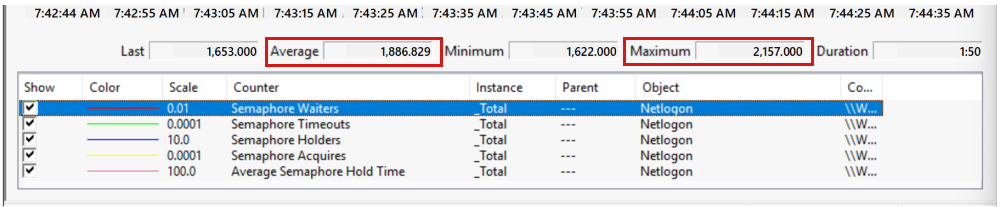

# Remediating MCA issues, part 1: Identify computers that have MCA issues

This article describes how to collect and analyze data to determine whether you have an issue that you can remediate by using the `MaxConcurrentApi` registry entry (also known as an MCA issue). It also helps you determine which computers in your infrastructure are affected by this issue.

_Applies to:_ &nbsp; Windows Server 2012 and newer versions, Windows 8 and newer versions

## Summary

Technically, `MaxConcurrentApi` defines the number of *lsass.exe* threads per secure channel that are available to the Netlogon service. This value is set in the registry of each server. You should not change it unless you have first done the following:

- Identified specific servers that show evidence of an MCA issue.
- Calculated a specific `MaxConcurrentApi` value for each affected server.

If you change the value without following these rules, you might not fix the issue. In fact you could cause other problems.

This article describes how to identify the servers that you should modify, using the following process:

1. Identify the data that you need to collect.
1. Identify the computers on which you need to collect data
1. Determine whether your infrastructure has an MCA issue.
1. Identify specific servers that can benefit from a tuned `MaxConcurrentApi` value.

## What data can help identify an MCA issue and tune MaxConcurrentApi?

The following table lists the types of data that you need for the methods that this article describes.

| Data type | Source | Most useful for |
| --- | --- | --- |
| Error messages<br/> [More information about Netlogon logs and error messages](#more-information-about-netlogon-logs-and-error-messages) | Netlogon logs | Identifying an MCA issue |
| Server connection messages | Netlogon logs | Identifying which domain controllers participate in authentication transactions |
| Events<br/> [More information about events](#more-information-about-events) | System Event log<br/>Netlogon logs | Identifying an MCA issue<br/> Identifying possible causes of authentication delays |
| Performance counters<br/> [More information aobut Netlogon performance counters](#more-information-about-netlogon-performance-counters) | Performance monitor<br/> Netlogon logs<br/> System event log | Identifying an MCA issue<br/> Tune MCA values |
| Server-to-server transaction details, including domain controller interactions<br/> [How to start and stop network traces](#how-to-start-and-stop-network-traces) | netsh<br/> Network Monitor | Identifying which domain controllers participate in authentication transactions<br/> Identifying possible causes of authentication delays |
| User reports | Users | Indicating that an MCA issue might be occurring |

> [!NOTE]  
> This list of data and data sources is not exhaustive. Other data types and data sources, such as [event tracing for windows (ETW)](/windows-hardware/drivers/devtest/event-tracing-for-windows--etw-) and the NTLM/Operational event log, are beyond the scope of this article.

### How to start and stop network traces

You can use the Windows native [netsh](https://docs.microsoft.com/windows-server/networking/technologies/netsh/netsh) utility to collect network traces. To start tracing, open a  Command Prompt window on the affected server, and then enter the following command:

```console
netsh trace start capture=yes tracefile=c:\temp\<Filename>.etl
```

> [!NOTE]  
> In this command, \<*Filename*> represents the name of the file that stores the trace data.

To stop tracing, sign in to the server by using the same account that you used when you started tracing, and then at the command prompt, enter the following command:

  ```console
  netsh trace stop
```

After tracing stops, netsh generates ETL and CAB files in the location that you provided. You can use [Network Monitor](https://www.microsoft.com/download/details.aspx?id=4865) or Message Analyzer (deprecated, no longer available for download) to review the files.

### More information about Netlogon performance counters

The **Netlogon** performance counters provide most precise data for tuning the `MaxConcurrentApi` value.

> [!NOTE]  
>
> - The **Security System-Wide Statistics** object in Performance Monitor provides a number of authentication-related counters, but they do not provide data that you can apply directly to `MaxConcurrentApi`.
> - Other performance counters, such as CPU and network counters, don't reflect performance information that's relevant to `MaxConcurrentApi`.

The following table describes the most relevant counters (in Performance Monitor, these counters belong to the **Netlogon** object).

| Performance Counter | Technical Explanation | The Grocery Store Scenario (an easier way to think of it) |
| --- | --- | --- |
| **Semaphore Holders** | The number of threads that are holding the semaphore. This number can be any value up to the currently configured value of MaxConcurrentApi. | The number of people currently checking out at the cash registers in the grocery store. |
| **Semaphore Waiters** | The number of threads that are waiting to obtain the semaphore. | The number of people waiting in line to check out. |
| **Semaphore Timeouts** | The total number of times that a thread has timed out while waiting for the semaphore, over the lifetime of the secure channel (or since system startup). | The total number of people abandoned the line because they ran out of time to wait to check out (if the line was quicker, or there were more lines, this may not have happened). |
| **Average Semaphore Hold Time** | The average time (measured in seconds) that the semaphore is held over the last sample | The average time it took a person to get through the line and check out |
| **Semaphore Acquires** | The total number of times the semaphore has been obtained over the lifetime of the secure channel (or since system startup) | The total number of people that successfully checked out. |

### More information about events

The following table lists the events that are associated with MCA issues. You can find these events by using Event Viewer or the Netlogon log files and quickly get an indication of whether a computer might have an MCA issue.

| Event source and ID | Event description | Related performance counters |
| --- | --- | --- |
| Netlogon 5816 | Netlogon has failed an authentication request of account \<*username*> in domain \<*user domain FQDN*>. The request timed out before it could be sent to domain controller \<*directly trusted domain controller FQDN*> in domain \<*directly trusted domain name*>. This is the first failure. If the problem continues, consolidated events will be logged about every \<*event log frequency in minutes*> minutes. | **Semaphore Timeouts** has a non-zero value.<br/>Authentication requests are failing. |
| Netlogon 5817 | Netlogon has failed an additional \<*count*> authentication requests in the last \<*event log frequency in minutes*> minutes. The requests timed out before they could be sent to domain controller \<*directly trusted domain controller FQDN*> in domain \<*directly trusted domain name*>. | **Semaphore Timeouts** has a non-zero value.<br/>Authentication requests are failing. |
| Netlogon 5818 | Netlogon took more than \<*warning event threshold*> seconds for an authentication request of account \<*username*> in domain \<*user domain FQDN*>, through domain controller \<*directly trusted domain controller FQDN*> in domain \<*directly trusted domain name*>. This is the first warning. If the problem persists, a recurring event will be logged every \<*event log frequency in minutes*> minutes. | **Semaphore Waiters** has a non-zero value.<br/>Authentication requests are slowing down. |
| Netlogon 5819 | Netlogon took more than \<*warning event threshold*> seconds for \<*count*> authentication requests through domain controller \<*directly trusted domain controller FQDN*> in domain \<*directly trusted domain name*> in the last \<*event log frequency in minutes*> minutes. | **Semaphore Waiters** has a non-zero value.<br/>Authentication requests are slowing down. |

> [!NOTE]  
> Kerberos Event ID 7 might indicate an MCA issue. The event has the following description:  
>
> The Kerberos subsystem encountered a PAC verification failure. This indicates that the PAC from the client in realm had a PAC which did not verify or was modified. Contact your system administrator.
>
> However, situations other than an MCA issue can also trigger this event.

For information about how to modify the logging frequency and warning threshold of event IDs 5816-5819, see [New event log entries that track NTLM authentication delays and failures in Windows Server 2008 R2 are available](https://support.microsoft.com/topic/new-event-log-entries-that-track-ntlm-authentication-delays-and-failures-in-windows-server-2008-r2-are-available-f72c93de-cabd-f23f-c0ac-e4d6643163d4).

### More information about Netlogon logs and error messages

When Netlogon logging is enabled on a server, The Netlogon service generates Netlogon.log and Netlogon.bak files. For more information, see [Enabling debug logging for the Net Logon service](/troubleshoot/windows-client/windows-security/enable-debug-logging-netlogon-service). You can use the error messages and events to identify MCA issues when they occur, to identify which domain controllers are responding to authentication requests, and to help identify trends in when issues occur.

You can use a text editor to review the log files. If Netlogon.bak files are available, review those as well as the Netlogon.log files. When an authentication request times out because of an MCA issue, you see a pattern of log entries that resembles the following excerpt:

```output  
06/03 14:16:58 [LOGON] SamLogon: Network logon of <Domain>\User1 from WORKSTATION1 Entered  
06/03 14:17:43 [CRITICAL] <Domain>: NlAllocateClientApi timed out: 0 258  
06/03 14:17:43 [CRITICAL] <Domain>: NlpUserValidateHigher: Can't allocate Client API slot.  
06/03 14:17:43 [LOGON] SamLogon: Network logon of <Domain>\User1 from WORKSTATION1 Returns 0xC000005E  
```

The first line documents the authentication request. The second line, 45 seconds later, documents the timeout.

> [!NOTE]  
> In a typical log file, there may be hundreds of unrelated log entries between these two lines.  

Two error messages follow the timeout line:

- **Can't allocate Client API slot.** This message is diagnostic of an MCA issue.
- **Network logon...Returns 0xC000005E.** This message always accompanies the previous message. However, other problems can also generate this message, so it's not considered to be diagnostic by itself.

When an MCA issue occurs, the Netlogon log might also record Netlogon events (event ID 5816-5819).

Log entries that resemble the following can help you trace the paths that authentication requests are taking through your systems:

```output
12/25 01:39:03 [PERF] NlSetServerClientSession: Not changing connection (000000000A10FA48): "\\DC01.FAKEDOMAIN.LOCAL"
```

## Where to start looking for the problem

As with any bottleneck, your environment&mdash;particularly your domain topology and your network infrastructure&mdash;affects how an MCA issue manifests. A problem on one server might induce related problems on other servers. The most likely servers to have MCA issues are the domain controllers and the application servers (front-end or back-end servers). MCA issues are rare on workstations.

> [!NOTE]  
> If you know of a user and workstation that consistenly has authentication problems, you can also review verbose Netlogon logs from the workstation. These logs might provide insight into the issue. However, they are unlikely to lead you to the root cause of the issue.

### Identify your potential authentication paths and chokepoints

An *authentication path* is the path from one server to the next that a Netlogon-based authentication request follows. For the purposes of this discussion, the application server receives the request first. The request travels to a domain controller, which completes the authentication and sends the response back to the application server. However, this is the highly simplified view. The details of the process depend on your infrastructure and your domain topology, among other factors. This process is important because to identify an MCA issue, you have to analyze data from every application server and domain controller that might handle an authentication request.

> [!IMPORTANT]  
> Any of the servers along the authentication path might be a choke point where an MCA issue slows authentication requests. Additionally, more than one server might have an MCA issue at the same time.

When the application server has to authenticate a user, the application server first tries to contact a "nearby" domain controller (within the same Active Directory logical site). If there isn't a domain controller within the same site, the application server sends the authentication request to any domain controller that's available in the local domain. If the use is not a member of the domain, the domain controller has to pass the request on. The system uses several criteria for determining where the request goes next:

- If the domain has a shortcut trust or external trust that connects to another domain, the next domain controller in the path belongs to the domain that the trust dictates.  
- If the domain is not the forest root domain, the next domain controller belongs to the forest root domain.
- If the user is a not a member of the forest root domain, that domain controller determines whether the user belongs to another domain in the same forest.
- If the user belongs to another domain in the forest, the next domain controller belongs to the user's domain.
- If the user doesn't belong to the forest, the request goes next to the root domain of any trusted forest.
- If the user's domain is in a trusted forest, a domain controller in that forest's root domain sends the request to a domain controller in the user's domain.

When the final domain controller in the path authenticates the user, it sends the authentication response back to the application server. The response follows the same path as the request, in reverse.

> [!IMPORTANT]  
> When you use Active Directory Domain Services (AD DS)-integrated DNS, the AD DS site topology can simplify or complicate the authentication path. The DNS records for the domain controllers contain site information. As a result, when a domain controller queries DNS to find a domain controller in a target domain, it may actually send two DNS queries.  
>
> - The first query requests a list of domain controllers that belong to the same AD DS site in the target domain.
> - If that request fails, the domain controller queries again to get a list of all of the domain controllers in the target domain.
>
> In either case, any of the domain controllers in the list might receive the authentication request. The selection algorithm doesn't account for other factors such as connection speed. In complex topologies, sites can constrain possible authentication paths to selected subsets of domain controllers that have high-capacity connections.
>
> For more information about how Windows directs authentication requests when you use site names in multiple forests, see [Domain Locator Across a Forest Trust](https://techcommunity.microsoft.com/t5/ask-the-directory-services-team/domain-locator-across-a-forest-trust/ba-p/395689).
>
> For more information about Active Directory-integrated DNS, see [Reviewing DNS Concepts](/windows-server/identity/ad-ds/plan/reviewing-dns-concepts#resolving-names-by-using-forwarding).

The following diagram provides a very high-level overview of the criteria that determine an authentication path.

:::image type="content" source="./media/maxconcurrentapi-1-identify-computers-that-have-mca-issues/dc-target-decision-tree.svg" alt-text="Diagram that shows the criteria that Windows uses to determine the path of an authentication request.":::


### Examples of how to identify authentication paths and potential chokepoints

The following examples illustrate how to identify the servers that you should check for MCA issues.

#### Example 1: Single-forest topology

Consider the following topology:

:::image type="content" source="./media/maxconcurrentapi-1-identify-computers-that-have-mca-issues/single-forest-three-domain-auth-path.svg" alt-text="Diagram that shows how authentication requests travel from child domains to the root domain in a single-forest topology.":::


The web server in domain B services users from domain C and uses NTLM authentication. Both Domain B and Domain C are in the same forest. Domain A is the forest root domain.

Each time a user accesses a web server resource, an authentication request follows these steps:

1. The web server receives the authentication request, and then sends it to a "nearby" domain controller (a domain controller in the same logical site in the web server's domain).  

   If there isn't a domain controller in the same site, the web server resends the request to any domain controller in domain B.

2. The domain B domain controller determines that the user isn't in domain B and passes the authentication request up to the forest root (domain A).  

   Again, the domain B domain controller first tries to send the request to a domain controller in the same site, and if that doesn't work, it sends the request to any available domain controller in domain A.

3. The domain A domain controller determines that the user doesn't belong to domain A, but does belong to domain C in the same forest. It sends the request to domain C (either a same-site domain controller, or any domain controller in the domain).

4. The domain C domain controller authenticates the user, and then sends the authentication response.

5. To complete the authentication process, the response travels back along the same chain to the web server in domain B.

Depending on the site topology, the following servers are the potential chokepoints:

| Path segment | Sending and receiving servers within one site | Sending and receiving servers in different sites |
| --- | --- | --- |
| 1 | Web server<br/>Domain B domain controllers within the site | Web server<br/>All domain B domain controllers |
| 2 | Domain A domain controllers within the site | All domain A domain controllers |
| 3 | Domain C domain controllers within the site | All domain C domain controllers |

#### Example 2: Simple two-forest topology

Consider the following topology:

:::image type="content" source="./media/maxconcurrentapi-1-identify-computers-that-have-mca-issues/two-forest-six-domain-auth-path.svg" alt-text="Diagram that shows how authentication requests travel from child domains to the root domain in a two-forest topology.":::


Domain A is the root domain of forest A, and domain D is the root domain of forest B. Domains A and B have a forest trust.

Domains B and C belong to forest A, and domains E and F belong to forest B. A web server in domain B uses NTLM authentication to service users in domain E.

The web server in domain B services users from domain E and uses NTLM authentication. Domain B is a child domain of Domain A (forest root), with domain A holding a forest trust with Domain D, which contains Domain E (the child domain holding the user accounts).

Each time a user accesses a web server resource, an authentication request follows these steps:

1. The web server receives the authentication request, and then sends it to a "nearby" domain controller (a domain controller in the same logical site in the web server's domain).  

   If there isn't a domain controller in the same site, the web server resends the request to any domain controller in domain B.

2. The domain B domain controller determines that the user isn't in domain B and passes the authentication request up to the forest root (domain A).  

   Again, the domain B domain controller first tries to send the request to a domain controller in the same site, and if that doesn't work, it sends the request to any available domain controller in domain A.

3. The domain A domain controller determines that the user doesn't belong to domain A, and that the user's domain is not in forest A. It forwards the authentication request across the forest trust to domain D (either a same-site domain controller, or any domain controller in the domain).

4. The domain D domain controller determines that the user doesn't belong to domain D, but does belong to domain E in the same forest. It sends the request to domain E (either a same-site domain controller, or any domain controller in the domain).

5. The domain E domain controller authenticates the user, and then sends the authentication response.

6. To complete the authentication process, the response travels back along the same chain to the web server in domain B.

Depending on the site topology, the following servers are the potential chokepoints:

| Path segment | Sending and receiving servers within one site | Sending and receiving servers in different sites |
| --- | --- | --- |
| 1 | Web server<br/>Domain B domain controllers within the site | Web server<br/>All domain B domain controllers |
| 2 | Domain A domain controllers within the site | All domain A domain controllers |
| 3 | Domain D domain controllers within the site | All domain D domain controllers |
| 4 | Domain E domain controllers within the site | All domain E domain controllers |

### Example 3: Internal/external forest topology

Consider the following topology:

:::image type="content" source="./media/maxconcurrentapi-1-identify-computers-that-have-mca-issues/two-domain-external-trust-auth-path.svg" alt-text="Diagram that shows how authentication requests travel from child domains to the root domain in a two-forest topology.":::


Domain A and domain D have an external trust. The web server in domain A services users from domain D and uses NTLM authentication.

> [!NOTE]  
> This is the same method that would apply for shortcut trusts.

Each time a user accesses a web server resource, an authentication request follows these steps:

1. The web server receives the authentication request, and then sends it to a "nearby" domain controller (a domain controller in the same logical site in the web server's domain).  

   If there isn't a domain controller in the same site, the web server resends the request to any domain controller in domain A.

2. The domain A domain controller determines that the user doesn't belong to domain A. It forwards the authentication request across the external trust to domain D (either a same-site domain controller, or any domain controller in the domain).

3. The domain D domain controller authenticates the user, and then sends the authentication response.

4. To complete the authentication process, the response travels back along the same chain to the web server in domain A.

Depending on the site topology, the following servers are the potential chokepoints:

| Path segment | Sending and receiving servers within one site | Sending and receiving servers in different sites |
| --- | --- | --- |
| 1 | Web server<br/>Domain A domain controllers within the site | Web server<br/>All domain A domain controllers |
| 2 | Domain E domain controllers within the site | All domain E domain controllers |

### Quick reference: Potential chokepoints in different scenarios

This table covers possible choke points in a more generalized scope, just to provide pointers on where to look. When reviewing the table, keep in mind that in front-end/back-end configurations, both the front-end and back-end application servers are potential choke points. Similarly, you have to collect data on all members of load-balanced groups of servers.

#### Single forest scenarios

| Example bottleneck scenarios | Possible choke points (aka where do I collect data?) |
| --- | --- |
| Application server sending credentials for users in the same domain<br/><br/>Scenario details:<br/><ul><li>Users in Domain B</li><li>Application server in Domain B</li><li>Domain controllers in Domain B</li></ul> | <ul><li>Application server</li><li>Domain controller from Domain B (same logical and physical site)</li><li>Domain controller from Domain B (same logical site name; possibly remote physical site)</li><li>Domain controller from Domain B (different logical site name)</li></ul> |
| Application server sending credentials for users in a different directly trusted domain (non-transitive external trust OR transitive trust with forest root)<sup>*</sup><br/><br/>Scenario details<br/><ul><li>Users in Domain A</li><li>Application server in Domain B</li><li>Domain controllers in Domain B</li><li>Domain Controllers in Domain A</li></ul> | <ul><li>Application server</li><li>Domain controller from Domain B (same logical and physical site)</li><li>Domain controller from Domain B (same logical site; possibly remote physical site)</li><li>Domain controller from Domain B (different logical site)</li><li>Domain controller from Domain A (same logical site name)</li><li>Domain controller from Domain A (different logical site name)</li></ul> |
| Application server sending credentials for users in different a child domain (within the same forest)<br/><br/>Scenario details<br/><ul><li>Users in Domain C</li><li>Application server in Domain B</li><li>Domain controllers in Domain B</li><li>Domain Controllers in Domain C</li><li>Domain Controllers in Domain A (forest root)</li></ul> | <ul><li>Application server</li><li>Domain controller from Domain B (same physical site)</li><li>Domain controller from Domain B (same logical site; possibly remote physical site)</li><li>Domain controller from Domain B (different logical site)</li><li>Domain controller from Domain A (same logical site name)</li><li>Domain controller from Domain A (different logical site name)</li><li>Domain controller from Domain C (same logical site name)</li><li>Domain controller from Domain C (different logical site name)</li></ul> |

\* This is the scenario that's described in [Example 2: Simple two-forest topology](#example-2-simple-two-forest-topology).

#### Multi-forest scenarios

| Example bottleneck scenarios | Possible choke points (aka where do I collect data?) |
| --- | --- |
| Application server in child domain sending credentials for users in the forest root in a different forest (over a forest trust)<br/><br/>Scenario details<br/><ul><li>Users in Domain D</li><li>Application server in Domain B</li><li>Domain controllers in Domain B</li><li>Domain controllers in Domain A (forest root)</li><li>Domain controllers in Domain D (trusted forest root)</li></ul> | <ul><li>Application server</li><li>Domain controller from Domain B (same physical site)</li><li>Domain controller from Domain B (same logical site; possibly remote physical site)</li><li>Domain controller from Domain B (different logical site)</li><li>Domain controller from Domain A (same logical site name)</li><li>Domain controller from Domain A (different logical site name)</li><li>Domain controller from Domain D (same logical site name)</li><li>Domain controller from Domain D (different logical site name)</li></ul> |
| Application server in child domain sending credentials for users in the child domain of a different forest (over a forest trust)<sup>*</sup><br/><br/>Scenario details:<br/><ul><li>Users in Domain E</li><li>Application server in Domain B</li><li>Domain controllers in Domain B</li><li>Domain controllers in Domain A (forest root)</li><li>Domain controllers in Domain D (trusted forest root)</li><li>Domain controllers in Domain E (child domain of trusted forest)</li></ul> | <ul><li>Application server</li><li>Domain controller from Domain B (same physical site)</li><li>Domain controller from Domain B (same logical site; possibly remote physical site)</li><li>Domain controller from Domain B (different logical site)</li><li>Domain controller from Domain A (same logical site name)</li><li>Domain controller from Domain A (different logical site name)</li><li>Domain controller from Domain D (same logical site name)</li><li>Domain controller from Domain D (different logical site name)</li><li>Domain controller from Domain E (same logical site name)</li><li>Domain controller from Domain E (different logical site name)</li></ul> |
| And for a *slightly* more complex scenario, as I mentioned above this table...<br/><br/>A front-end/back-end application server configuration (such as Microsoft Exchange) in child domain sending credentials for users in the child domain of a different forest (over a forest trust)<br/><br/>Scenario details:<br/><ul><li>Users in Domain E</li><li>Application server in Domain B</li><li>Domain controllers in Domain B</li><li>Domain controllers in Domain A (forest root)</li><li>Domain controllers in Domain D (trusted forest root)</li><li>Domain controllers in Domain E (child domain of trusted forest)</li></ul> | <ul><li>Front-end application server</li><li>Back-end application server</li><li>Domain controller from Domain B (same physical site)</li><li>Domain controller from Domain B (same logical site; possibly remote physical site)</li><li>Domain controller from Domain B (different logical site)</li><li>Domain controller from Domain A (same logical site name)</li><li>Domain controller from Domain A (different logical site name)</li><li>Domain controller from Domain D (same logical site name)</li><li>Domain controller from Domain D (different logical site name)</li><li>Domain controller from Domain E (same logical site name)</li><li>Domain controller from Domain E (different logical site name)</li></ul> |

## Preliminary investigation: Is there an MCA issue?

After you've identified the potential choke points in your infrastructure, you can start collecting and analyzing data. The first priority is to identify whether there's actually an MCA issue. Later, you'll narrow down exactly which server (or servers) has a problem. 

> [!IMPORTANT]  
> To collect data, enable Netlogon logging on *all* of the chokepoints that you identified in the previous section. If you have a large number of potential chokepoints, review both this section and the next section, [Narrowing your scope and identifying trends](#narrowing-your-scope-and-identifying-trends).

To identify an MCA issue, you have to collect performance data while the servers are under heavy load. Heavy load occurs when the servers see the most client requests. For example, in an email server scenario, the best time to collect the performance data is when users arrive at work and check their email messages. Therefore, you must make sure that all servers in a given scenario have their performance data reviewed while they are busy servicing heavy loads.

### Quick scan: Performance counters and event logs

The Netlogon performance counters and event logs provide at-a-glance view of whether or not there is an issue. You might also be able to identify whether the problem is on the server that provided the data or another server within the same site or domain.

To help interpret the counter values, check whether the server that provided the data already has a non-default `MaxConcurrentApi` value. To do this, follow these steps:

1. Select **Start**, and then enter *regedit* in the **Search** bar. In the search results, select **Registry Editor**.
1. Go to the following registry subkey:  
   `HKEY_LOCAL_MACHINE\SYSTEM\CurrentControlSet\Services\Netlogon\Parameters\MaxConcurrentApi`
1. If the `MaxConcurrentApi` key doesn't exist, you can assume that the computer uses the default value for `MaxConcurrentApi`. The default values are as follows:

   - Domain controllers and member servers (Windows Server 2012 and later versions): **10**
   - Client computers and workstations (Windows 8 and later versions): **1**

> [!NOTE]  
> Client computers and workstations rarely use a value greater than **1**.

The following table lists events and counter values that you might see together on a single computer, and the significance of each combination.

| Events | Counter values | What Does It Mean? |
| --- | --- | --- |
| N/A | **Semaphore Holders** is equal to the currently configured MCA setting on the local server. | The local server (or another server at the same level of the authentication chain) might have an MCA issue. |
|5816<br/>5817 | **Semaphore Timeouts** has a non-zero value | Authentication timeouts are occurring. The local server might have an MCA issue. |
| 5818<br/>5819 | **Semaphore Waiters** has a non-zero value that continues for any length of time<br/>&ndash;and&ndash;<br/> **Semaphore Holders** has a value that's less than the MCA setting on the local server | There might be an MCA issue on a different server in the authentication chain. |

### Quick scan: Netlogon log files

To use the Netlogon log files to identify an MCA issue, search the files for `Can't allocate client API slot`. You can do this by using a text editor such as Notepad, a script, or command-line commands. Use a non-case sensitive search. If this string appears in the log file, you have an MCA issue.

For example, if you have stored *netlogon.log* and *netlogon.bak* in the *c:\temp* folder, you can open a Command Prompt window and run the following commands:

```console
Find /I "Can't allocate client API slot" c:\temp\netlogon.log > c:\temp\MCA-detect-sample.txt
Find /I "Can't allocate client API slot" c:\temp\netlogon.bak >> c:\temp\MCA-detect-sample.txt
```

If the log files do contain the string, the results file, *MCA-detect-sample.txt*, contains text that resembles the following excerpt:

```output
---------- C:\temp\NETLOGON.LOG
[3]12/25 07:12:02 [CRITICAL] <Domain>: NlpUserValidateHigher: Can't allocate Client API slot.
[5]12/25 07:12:02 [CRITICAL] <Domain>: NlpUserValidateHigher: Can't allocate Client API slot.
[7]12/25 07:12:02 [CRITICAL] <Domain>: NlpUserValidateHigher: Can't allocate Client API slot.
[10]12/25 07:12:02 [CRITICAL] <Domain>: NlpUserValidateHigher: Can't allocate Client API slot.
[12]12/25 07:12:02 [CRITICAL] <Domain>: NlpUserValidateHigher: Can't allocate Client API slot.
[17]12/25 07:12:02 [CRITICAL] <Domain>: NlpUserValidateHigher: Can't allocate Client API slot.
[19]12/25 07:12:02 [CRITICAL] <Domain>: NlpUserValidateHigher: Can't allocate Client API slot.
```

> [!NOTE]  
> In this excerpt, \<*Domain*> represents the domain that responded to the authentication request.  

If you don't find any matches on a particular server, search the files for *0xC000005E*. This error code indicates that an authentication request has timed out, and it might indicate that one of the other computers that handled the authentication request has an MCA error. Use this information to identify the computers to examine next. If you're dealing with a large number of servers, see the next section for help in narrowing the scope of your analysis.

## Narrowing your scope and identifying trends

This section provides tips to help you deal with a large number of potential chokepoints.

To use `MaxConcurrentApi` effectively, you have to pinpoint specific servers to mitigate. In the longer term, you have to understand why these specific servers were overloaded. Using that information, you can improve your topology so that it no longer needs `MaxConcurrentApi` adjustments (described in [Part 3](maxconcurrentapi-3-troubleshoot-causes-of-mca-issues.md) of this series).

> [!NOTE]  
> You can use applications such as Notepad or Microsoft Excel to sort and search through log files.

Trends to look for include the following:

- As described previously, Netlogon logs include connection messages that you can use to identify which domain controllers are involved in an authentication path. Such log entries resemble the following excerpt:  

   ```output
   12/25 01:39:03 [PERF] NlSetServerClientSession: Not changing connection (000000000A10FA48): "\\DC01.CONTOSO.LOCAL"
   ```

- When you identify which domain controllers a server tries to connect to, check that the request actually arrived at one of them.

  For example, suppose that you find `Can't allocate client API slot` errors in your application server logs. Such errors indicate that the application server itself has an MCA issue. Double-check any domain controllers that the application server attempted to contact. If the application server is the root of the issue, it's likely that the domain controllers never received the request.

- Use the timestamps in Netlogon logs and network traces (and potentially performance counters) to compare the speed of each "hop" in the authentication path.  

  For example, consider an authentication request that has to travel between two child domains in a single forest. The time needed to pass the request from the requesting child domain to the root domain is significantly shorter than the time needed to pass from the root domain to the destination child domain. In this case, something might be delaying the request on the root domain controller or the destination (child) domain controller.

- Check which users are affected, and when. Are all the affected users from the same domain or forest? Does the issue only affect specific users, or all users? Does the time of day make a difference? You can use Netlogon log entries that resemble the following excerpts to track requests for specific users:

  ```output
  [8]12/25 07:12:02 [LOGON] SamLogon: Network logon of CONTOSO\User1 from WIN7CLIENT1 Returns 0xC000005E
  ```

  ```output
  [3905][29654]12/25 07:16:03 [LOGON] SamLogon: Network logon of CONTOSO\User1 from WIN7CLIENT1 Returns 0xC000005E
  ```

## Example: Use Performance Monitor to search for an MCA issue

As a real-world example, consider a Performance Monitor data (BLG) file from an application server that runs IIS and FTP as well as file and print server functions. The data file starts a few hours after the problem appeared. For this example, assume that the server that produced this data is the only one in the environment that's suspected to have an MCA issue.

The following view in Performance Manager shows a 110-second segment of the data:  

:::image type="content" source="/media/maxconcurrentapi-2-calculate-and-change-mca/perfmon-min-max-semaphore-timeouts.png" alt-text="Screenshot that shows a two-minute interval of semaphore timeout data in Performance Monitor.":::  
  

### Are authentication requests timing out?

First, use the data for the **Semaphore Timeouts** counter to calculate the number of semaphore timeouts during this interval. This counter is cumulative, so the value at the beginning of the duration is the minimum, and the value at the end of the duration is the maximum. Subtracting the minimum number of timeouts from the maximum number of timeouts produces a value of 2,253 timeouts during this interval. The expected value for this counter is zero. Clearly, there's an MCA issue here.

### What's the volume of delayed requests?

Look at the data for the **Semaphore Waiters** counter during the same interval. This counter tracks the requests that are waiting, but have not timed out yet. This information can indicate the maginitude of the issue.  

:::image type="content" source="/media/maxconcurrentapi-2-calculate-and-change-mca/perfmon-avg-max-semaphore-waiters.png" alt-text="Screenshot that shows a two-minute interval of semaphore timeout data in Performance Monitor.":::  
  

In this case, during this interval there are up to 2,157 "waiters".

### Conclusion

The example server has a significant authentication timeout problem. We'll continue this example in part 2 of this series to show how to calculate a `MaxConcurrentApi` value for this server.

## Next steps

- [Remediating MCA issues, part 2: Calculate and change the MCA value](maxconcurrentapi-2-calculate-and-change-mca.md)
