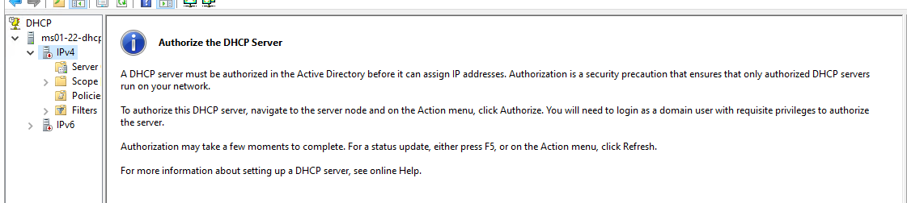
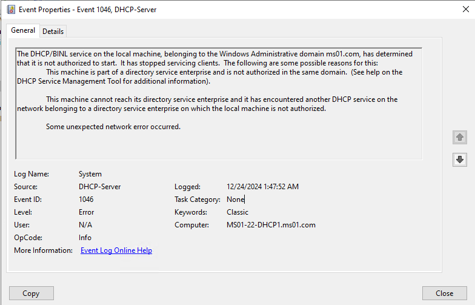
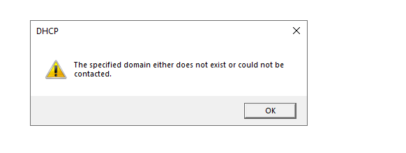
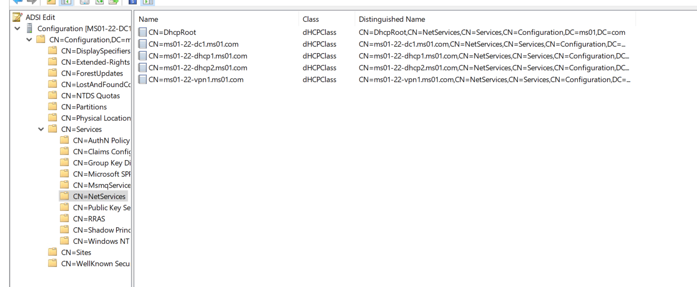
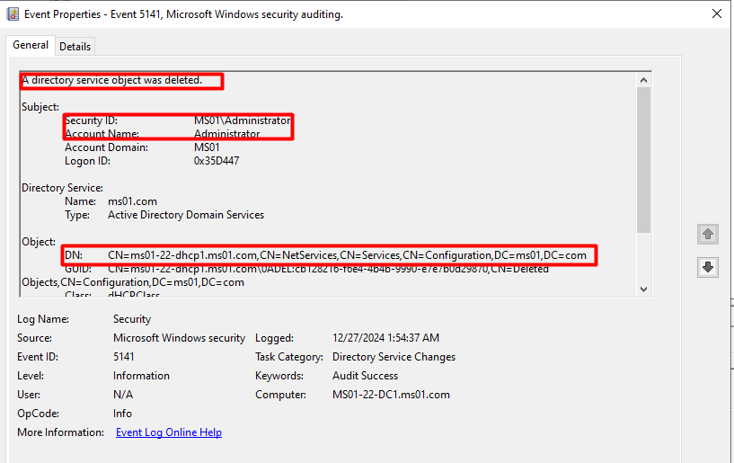

# Troubleshooting Guide: DHCP Authorization Failures

This guide provides a detailed step-by-step process for diagnosing and resolving DHCP authorization failures in an Active Directory (AD) environment.

## Symptoms

During the post-installation phase of the DHCP role on a server, you encounter an error message stating "Authorizing DHCP server ….. Failed.  The authorization of DHCP server failed with Error Code: 20070. The DHCP service could not contact Active Directory"

The DHCP console displays a downward red arrow on the IPv4 section, indicating that the server is not authorized.

Event ID 1046 is logged in the System event logs indicating that the DHCP server is not authorized to lease out IP addresses. 

“The DHCP/BINL service on the local machine, belonging to the Windows Administrative domain <domain name>, has determined that it is not authorized to start.  It has stopped servicing clients”

Manual attempts to authorize the DHCP server can also fail with an error message similar to below

“The specified domain either does not exist or could be contacted”

## Flow

DHCP authorization is a process that ensures only authorized DHCP servers can operate within an Active Directory domain. This mechanism prevents unauthorized DHCP servers from distributing IP addresses, which could cause network conflicts and security issues.

When a DHCP server is authorized, an entry is created in the AD under the list of authorized servers through LDAP communication between the DC and the DHCP server. This list resides in the Configuration container of the AD schema.

The DHCP server validates its authorization status in AD DS every hour using the LDAP protocol. If the server's IP address is not found in the list, it will de-authorize itself.

## Causes of Authorization Failure

Permission Issues: The account used to authorize the server does not have sufficient privileges.

Missing Entries in AD: The DHCP server’s entry in the AD Configuration container may have been deleted.

Connectivity Issues: The DHCP server cannot communicate with the DC due to network or firewall problems.

AD Replication Problems: Replication delays or issues can cause inconsistent entries, leading to duplicate or conflicting entries (e.g., CNF objects) in the AD Configuration container. With these entries, the DHCP server will fail authorization.

## Troubleshooting Steps

### Step 1: Verify Permissions

Enterprise Admin account should be used to authorize the DHCP server. This account has the necessary permissions to make changes to AD.

### Step 2: Check Authorization Status

Run the following commands to verify if the DHCP server’s entry is in the AD authorized server list:

**PowerShell Command:**

Get-DhcpServerInDC

**Command Prompt Command:**

netsh dhcp show server

Alternatively, use **ADSI Edit** to connect to the Configuration partition and verify if the server is in the list

Open adsiedit.msc on the DC.

Connect to the Configuration container.

Navigate to Configuration > Services > NetServices.

Check if the DHCP server’s name is listed in the right pane.

### Step 3: Attempt Manual Authorization

If you find that the server’s entry is not present under the list, then Open the DHCP Management Console.

Right-click on the DHCP server name.

Select **Authorize**.

If the authorization fails, proceed to the next steps.

### Step 4: Verify Connectivity

Ensure the DHCP server can connect to the DC using tools like:

**Ping**: To check basic network connectivity between DHCP server and the DC

**Test-****Net****Connection** to the DC IP on TCP port 389 in PowerShell 

Verify that LDAP ports (TCP/UDP 389) are open and functional.

Review firewall settings to ensure these ports are not blocked and resolve any connectivity issues that you might have identified in this step. 

Additionally, you can capture Wireshark tracings to identify any packet drops between the DC and the DHCP server. 

### Step 5: Identify and Resolve Conflicting Entries

Open adsiedit.msc and navigate to Configuration > Services > NetServices.

Look for entries with the CNF tag (conflicting objects) with the server name. The CNF tag would be added under the attribute CN

In this case, the CNF object (conflicting object) needs to be deleted. It is recommended to take AD backup and then delete this object. Once it is deleted, you can re-authorize the DHCP server

## Additional troubleshooting

It could be possible that when you manually try to authorize the server it works, only for it fail again in couple days due to its entry being deleted in AD. In such cases, it would be important to understand why the entry keeps getting deleted in AD or who is deleting the entry from AD. 

To find who deleted the entry from the DC for the DHCP server, we will have to enable auditing on the DC which is not enabled by default.  You can follow the steps in the article to enable logging:

### Enabling Auditing of Active Directory

Open **Group Policy Management console on the DC or gpmc.msc**

Navigate to Domains à <Domain Name> à Domain Controllers à** ****Default Domain Controller Policy**.

Right Click and Edit the **Default Domain Controller Policy**.

Navigate to: Computer Configuration > Policies à Windows Settings > Advanced Audit Policy Configuration à Audit Policies à DS Access à Audit Directory Service Changes , enable success and failure attempts.

### Enabling Auditing on the Configuration Container

Open adsiedit.msc.

Connect to the Configuration container.

Navigate to Services > NetServices.

Right-click and select **Properties**.

Go to the **Security** tab and click **Advanced**.

In the Auditing tab, click **Add**.

Add the group **Everyone** and enable auditing for:

Write All Properties

Delete

Delete Subtree

Apply changes.

When the issue re-occurs, export the security event logs on the DC to identify who deleted or modified the DHCP entry. Below is an example of the event deletion

## Reference

[https://learn.microsoft.com/en-us/defender-for-identity/deploy/configure-windows-event-collection#configure-auditing-on-the-configuration-container](https://learn.microsoft.com/en-us/defender-for-identity/deploy/configure-windows-event-collection#configure-auditing-on-the-configuration-container) 

## Data collection

Before contacting Microsoft support, you can gather information about your issue. 

Follow the steps provided in [this](https://learn.microsoft.com/en-us/troubleshoot/windows-client/windows-tss/introduction-to-troubleshootingscript-toolset-tss) document to download and collect logs using TSS tool. 

Use this command for enabling log collection on the impacted machine -  

.\TSS.ps1 -Scenario NET_DHCPsrv

