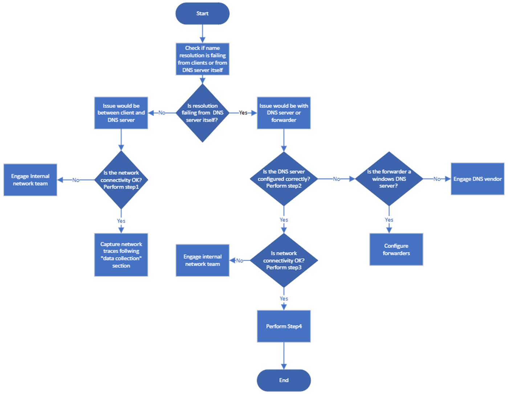
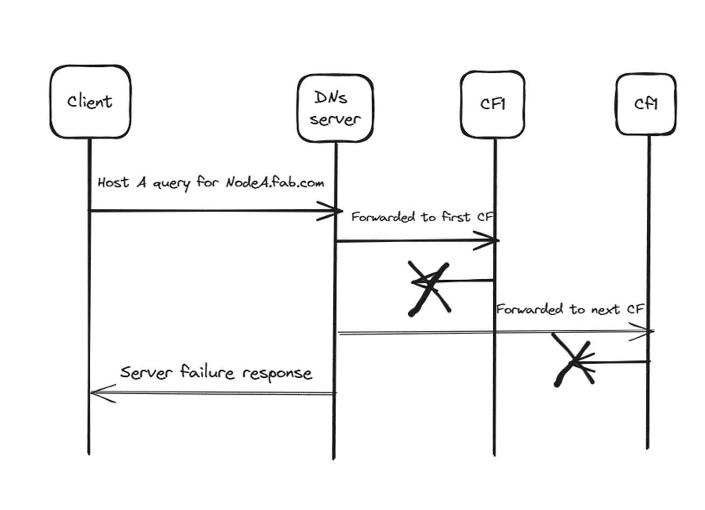
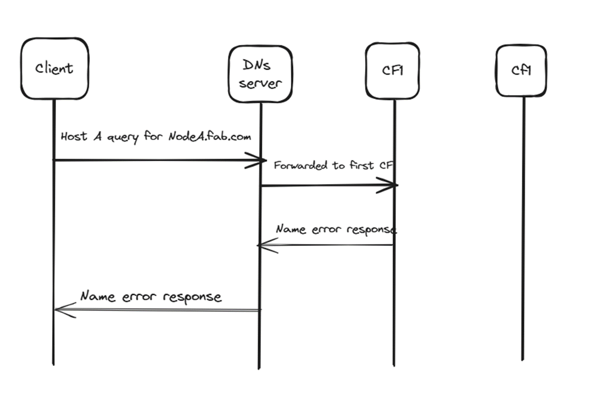

# Troubleshoot DNS name resolution failures related to DNS forwarders

You have forwarders or conditional forwarders, or Root hints configured to perform name lookup for external names. However, you cannot resolve external names from clients by using nslookup or Resolve-DnsName. This article introduces how to troubleshoot DNS forwarders related name resolution failures.

## Analysis of the symptoms

1. External or internal:  
   Check whether the clients that cannot resolve the names are external or internal. If the issue is specific to an internal domain or just external names, this information will help you to look at the domain specific configuration on the DNS server.
2. Client:  
   Check whether all clients facing the issue or only specific clients facing the issue. This can help isolate if the issue is specific to a DNS forwarding server
3. DNS server check:
   - If the name resolution is failing from the clients, at the same time, check whether the name resolution failing from your preferred DNS server configured as well.
   - Check whether the resolution is failing from the DNS server itself. If so, you can rule out any issue with the client or the network between the client and DNS server.

   

## Troubleshooting flowchart



## Troubleshooting Steps

### Step 1: Check Network Connectivity Between Client and DNS Server

1. Verify DNS Configuration. Run `ipconfig /all` on the client and confirm the correct DNS server IP is configured. If incorrect, configure it using the following command:

   ```powershell
   Set-DnsClientServerAddress -InterfaceAlias "Interface-Name" -ServerAddresses ("IP1")
   ```

2. Check UDP Port 53 Communication. Ensure that UDP port 53 communication is allowed between the client and DNS server.
3. Perform a ping test from the client to the DNS server and vice versa to ensure basic network connectivity.

### Step 2: Check DNS Server Configuration

We need to validate if this DNS server is configured correctly to be able to resolve the names that are not local to itself.

1. Check whether a conditional forwarder is configured for the domain in question:

    ```powershell
    Get-DnsServerZone -Name <domainname>
    ```

2. If no conditional forwarder is found, check whether there are general forwarders configured:

   ```powershell
   Get-DnsServerForwarder
   ```

   Verify if **Useroothints** is set to TRUE.

3. Root Hints: if no forwarders are configured, check for root hints:

   ```powershell
   Get-DnsServerRootHint
   ```

If none of them are configured, then it is expected for the name resolution to fail. You need to go ahead and create a Conditional forwarder if it’s internal domain or a forwarder if it’s for external domains(preferably).

> [!NOTE]
> The Conditional Forwarder or the forwarders which are again DNS servers, need to have the records for the name OR need to be configured to resolve the name.

### Step 3: Check DNS Service Status and Connectivity

1. Ensure the DNS server service is running on both the forwarding and forwarder DNS servers:

   ```powershell
   Get-Service -Name DNS
   ```

   Start the service if it is not running:

   ```powershell
   Start-Service -Name DNS
   ```

2. Ensure UDP port 53 communication is allowed between the DNS forwarding server and the forwarder servers.

### Step 4: Collect Network Captures to Track DNS Packets

Before taking a network capture, on the client machine, it is always suggested to clear the DNS client-side cache:

```console
ipconfig /flushdns
```

Then collect a network capture:

- Start a network capture tool (e.g., Wireshark) on the client, DNS server, and forwarder.
- Perform `nslookup <name>` on the client to reproduce the failure.
- Stop the capture and review the traces. Filter for UDP port 53 to view relevant DNS traffic.

Analyze Scenarios. The following sections list several scenarios that you might meet one of them. These scenarios involve a conditional forwarder configuration, but the troubleshooting steps are the same if you're dealing with a standard forwarder as well.

#### Scenario 1: Network Latency or Timeout

DNS name server 192.168.10.10 forwarded the query to the first forwarder 192.168.5.5. Due to network latency or issues with the intermediate network, the response does not reach the DNS server within the **ForwarderTimeout** period. Hence, the DNS server forwarded the query to the next forwarder configured out it which is 192.168.5.6. Again, due to latency or issues with the intermediate network, the response did not reach DNS server. Since the DNS server could not fetch the response for the query nodeA.contoso.com, it sends out **Server failure** response to the client.



Resolution: Collaborate with the network team to address the latency. If the latency is expected, we need to make sure DNS server is given ample amount of time to wait for the response from the conditional forwarders before timing out by increasing the **ForwarderTimeout** and **RecursionTimeout** periods.

To do this, see <https://learn.microsoft.com/en-us/windows-server/administration/windows-commands/forwarders-resolution-timeouts>

#### Scenario 2: Query Refusal by Forwarder

DNS name server 192.168.10.10 forwarded the query to the conditional forwarder 192.168.5.5. On this server, if there is any policy configured to refuse or deny queries for a particular record or zone, the conditional forwarder responds to the forwarding DNS name server with "Refused" response. Now, the DNS server will in-turn forward this error to the client as "server failure". Note that the DNS server will not contact the second conditional forwarder as we already got a response from the first one (even though it’s an error response)

Resolution: If the forwarder is a Microsoft windows DNS server, check if there are any DNS query resolution policies configured on the Conditional forwarders to "deny" the queries for the zone fab.com or for certain records such as NodeA.fab.com. You can get the list of configured policies from the command "get-dnsserverqueryresolutionpolicy". To do so, see [Get-DnsServerQueryResolutionPolicy](/powershell/module/dnsserver/get-dnsserverqueryresolutionpolicy).

If there are any such policies which should not be placed, remove them to resolve the issue.

If it is a third-party DNS server, contact the respective vendor.

#### Scenario 3: Missing Records on Forwarder

DNS name server 192.168.10.10 forwarded the query to the first conditional forwarder 192.168.5.5. On the conditional forwarder, there is no host A record present for the name NodeA under the fab.com zone. In such an event, the conditional forwarder will respond to the DNS server with "Name error". The DNS server will then forward the same response to the client. The DNS server will not contact the second conditional forwarder here as well as we already got a response from the first one. Usually, if this scenario occurs, you see the symptom to be where the resolution is failing for certain names and not necessarily for all the names of the fab.com domain.



Resolution: Register the missing records on the forwarder for the zone in question, either statically or dynamically.

## Data Collection

If you need help from Microsoft support, we recommend that you collect information about your issue before contacting Microsoft support.

1. Follow the steps provided in [this document](../../windows-client/windows-tss/introduction-to-troubleshootingscript-toolset-tss.md) to download and collect logs using TSS tool.
2. Run this command for enabling log collection on the impacted machine:
   - On DNS servers:

     ```console
     .\TSS.ps1 -Scenario NET_DNSsrv
     ```

   - On DNS clients:

     ```console
     .\TSS.ps1 -Scenario NET_DNScli
     ```
