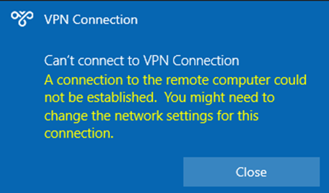

# "Error 720: Can't connect to a VPN Connection" when you try to establish a VPN connection

This article introduces how to troubleshoot the error 720 that occurs when you try to establish a VPN connection.

## Symptom

When you try to establish a VPN connection, you encounter the following error message:

```output
A connection to the remote computer could not be established. You might need to change the network settings for this connection.
```



Additionally, you find RasClient event ID: 20227 with error 720 recorded in the Application event log.

```output
Log Name: Application
Source: Ras Client
Event ID: 20227
Description: The user dialed a connection named VPN Connection which has failed. The error code returned on failure is 720.
```

## Analysis before troubleshooting

The **error 720 : ERROR_PPP_NO_PROTOCOLS_CONFIGURED** is generally caused when the **WAN Miniport (IP)** adapter is not bound properly on your PC. Even though the **WAN Miniport (IP)** looks healthy when you look into the **Device Manager** > **Network adapters**.

There are some scenarios that can cause this error. To troubleshoot this issue, firstly, check the linked driver of your **WAN Miniport (IP)**.

1. Open Windows PowerShell with the Administrator privileges.
2. Run the following command, and search for the **Name** of **WAN Miniport (IP)** interface.

   ```powershell
   Get-NetAdapter -IncludeHidden | Where-Object {$_.InterfaceDescription -eq "WAN Miniport (IP)"}
   ```

   For example, the name can be **Local Area Connection\* 6**.
3. Run the following command with the **Name** you confirmed in step 2.

   ```powershell
   Get-NetAdapterBinding -Name "<interface_name>" -IncludeHidden -AllBindings
   ```

Based on the output, choose the proper troubleshooting scenario below:

## Scenario 1

If you see **ms_wanarp** is disabled as below, re-enable it with the following command.

```output
Name                   DisplayName                                        ComponentID          Enabled
----                   -----------                                        -----------          -------
<interface_name>       QoS Packet Schedular                               ms_pacer             True        
<interface_name>       Remote Access IP ARP Driver                        ms_wanarp            False　<<<<< ★
<interface_name>       WFP Native MAC Layer LightWeight                   ms_wfplwf_lower      True 
```

Run this command:

```powershell
Enable-NetAdapterBinding -Name "<interface_name>" -IncludeHidden -AllBindings -ComponentID ms_wanarp 
```

## Scenario 2

If you see **Steelhead Mobile Filter Driver** is bound as below, disable it with the following command.

```output
Name                   DisplayName                                        ComponentID          Enabled
----                   -----------                                        -----------          -------
<interface_name>       QoS Packet Schedular                               ms_pacer             True        
<interface_name>       Remote Access IP ARP Driver                        ms_wanarp            True
<interface_name>       Symantec Endpoint Protection Firewall              symc_teefer2         True        
<interface_name>       Steelhead Mobile Filter Driver                     rbt_filter           True　<<<<< ★
<interface_name>       WFP Native MAC Layer LightWeight                   ms_wfplwf_lower      True
```

Run this command:

```powershell
Disable-NetAdapterBinding -Name "<interface_name>" -IncludeHidden -AllBindings -ComponentID rbt_filter 
```

## Other scenarios

If the above steps do not fix your issue, Re-Install the 'WAN Miniport (IP)' interface driver.

1. Open **Device Manager**.
2. Right-click all of the network adapters which name starts from 'WAN Miniport' and click **Uninstall device**. Here are some adapters you may observe.
   * WAN Miniport (IP)
   * WAN Miniport (IPv6)
   * WAN Miniport (GRE)
   * WAN Miniport (L2TP)
   * WAN Miniport (Network Monitor)
   * WAN Miniport (PPPOE)
   * WAN Miniport (PPTP)
   * WAN Miniport (SSTP)
3. From the menu-bar of the device manager, click **Action** > **Scan for hardware changes**. This will automatically re-install your WAN Miniport devices.
