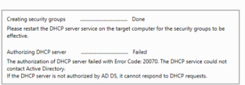
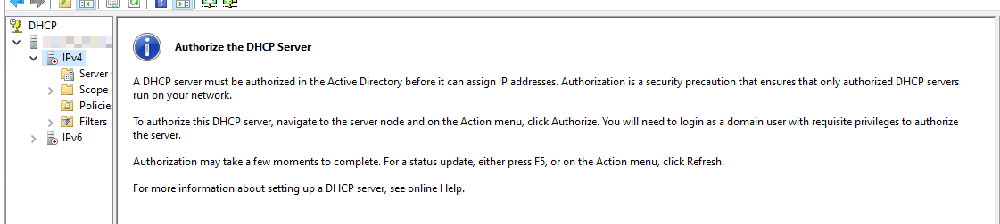
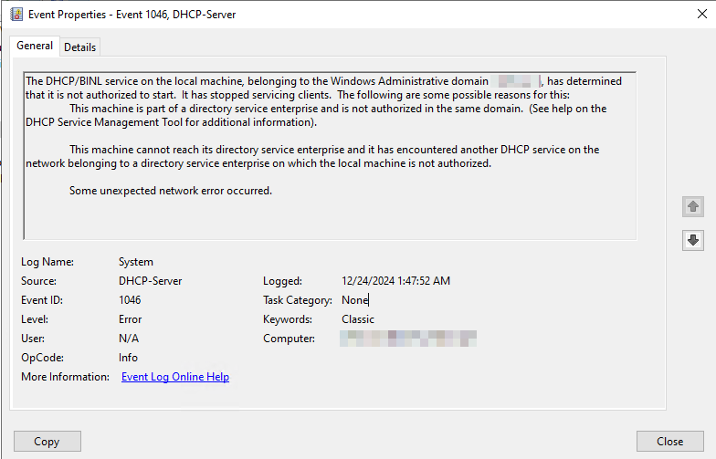
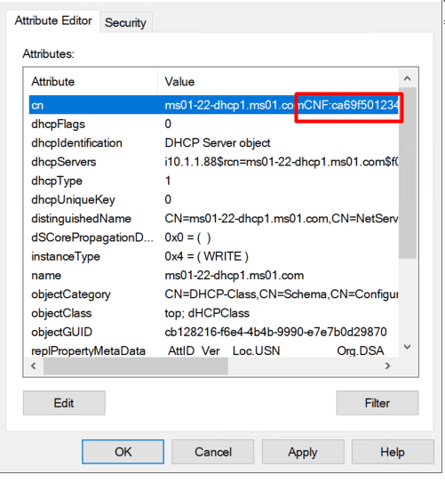

# Troubleshooting guide: DHCP authorization failures

This guide provides a detailed step-by-step process for diagnosing and resolving Dynamic Host Configuration Protocol (DHCP) authorization failures in an Active Directory (AD) environment.

## Symptoms

During the post-installation phase of the DHCP role on a server, you encounter the following error message:

> Authorizing DHCP server ….. Failed  
> The authorization of DHCP server failed with Error Code: 20070. The DHCP service could not contact Active Directory.



The DHCP console displays a downward red arrow on the IPv4 section, indicating that the server isn't authorized.



Event ID 1046 is logged in the System event logs, indicating that the DHCP server isn't authorized to lease out IP addresses:

> The DHCP/BINL service on the local machine, belonging to the Windows Administrative domain &lt;domain_name&gt;, has determined that it is not authorized to start. It has stopped servicing clients.



Manual attempts to authorize the DHCP server can also fail with the following error message:

> The specified domain either does not exist or could be contacted.


## DHCP authorization flow

DHCP authorization ensures that only authorized servers can operate within an AD domain. This mechanism prevents unauthorized servers from distributing IP addresses, which could cause network conflicts and security issues.

When a DHCP server is authorized, an entry is created in AD under the list of authorized servers. This behavior is accomplished through Lightweight Directory Access Protocol (LDAP) communications between the Domain Controller (DC) and the DHCP server. This list resides in the **Configuration** container of the AD schema.


The DHCP server validates its authorization status in Active Directory Domain Services (AD DS) every hour using LDAP. If the server's IP address isn't found in this list, the server deauthorizes itself.

## Causes of authorization failure

- **Permission Issues:** The account used to authorize the server doesn't have sufficient privileges.
- **Missing Entries in AD:** The entry for the DHCP server might be deleted from AD's **Configuration** container.
- **Connectivity Issues:** Network or firewall problems prevent communication between the DC and the DHCP server.
- **AD Replication Problems:** Delays or issues can cause inconsistent entries, leading to duplicate or conflicting entries (for example, CNF objects) in AD's **Configuration** container. The DHCP server fails authorization with these entires.

## Troubleshooting steps

### Step 1: verify permissions

Use an Enterprise Admin account to authorize the DHCP server. This account has sufficient permissions for making changes to AD.

### Step 2: check authorization status

Run these commands to verify if the DHCP server's entry exists in AD's list of authorized servers:

**PowerShell Command:**

```powershell
Get-DhcpServerInDC
```

**Command Prompt Command:**

```cmd
netsh dhcp show server
```

Alternatively, use **ADSI Edit** to connect to the **Configuration** partition and verify if the server appears there:

1. Open *adsiedit.msc* on the DC.
2. Connect to the **Configuration** container.
3. Navigate through **Configuration** > **Services** > **NetServices**.
4. Check if the DHCP server's name appears on the right pane.

### Step 3: attempt manual authorization

If there's no existing entry for your server, follow these steps:

1. Open **DHCP Management Console**.
2. Right-click on your DHCP Server name.
3. Select **Authorize**.

If this fails, proceed further.

### Step 4: verify connectivity

Use the following tools to test the connectivity between the DHCP server and DC:

- **Ping** command for basic network connectivity checks between both servers.
- **Test-NetConnection** command for TCP port 389 via PowerShell. For example:

  ```powershell
  Test-NetConnection -ComputerName <DC-IP> -Port 389
  ```

Verify LDAP ports (TCP/UDP 389) are open and functional. Review firewalls settings to ensure these ports aren't blocked; resolve detected connectivity issues accordingly.

Additionally, you can capture Wireshark traces to identify packet drops between the DC and the DHCP server.

### Step 5: identify and resolve conflicting entries

1. Open *adsiedit.msc* and navigate to **Configuration** > **Services** > **NetServices**.

2. Look for entries with the CNF tag (conflicting objects) with the server name. The CNF tag would be added under the attribute CN.

   

In this case, the CNF object (conflicting object) needs to be deleted. It is recommended to take AD backup and then delete this object. Once the object is deleted, you can reauthorize the DHCP server.

## Extra troubleshooting steps

It could be possible that when you manually try to authorize the server, it works. Only for it fail again in couple days due to its entry being deleted in AD. In such cases, it would be important to understand why the entry keeps getting deleted in AD or who is deleting the entry from AD.

To find who deleted the entry from the DC for the DHCP server, we can enable auditing on the DC which isn't enabled by default.  You can follow the steps in the article to enable logging.

### Enabling auditing of active directory changes

1. Open **Group Policy Management console** on the DC or run *gpmc.msc*.

2. Navigate to Domains > &lt;domain_name&gt; > Domain Controllers > **Default Domain Controller Policy**.

3. Right-click and Edit the **Default Domain Controller Policy**.

4. Navigate to: **Computer Configuration** > **Policies** > **Windows Settings** > **Advanced Audit Policy Configuration** > **Audit Policies** > **DS Access** > **Audit Directory Service Changes**. Enable **Success** and **Failure** attempts.

### Setting up audits within Configuration containers

1. Open *adsiedit.msc*.

2. Connect to the **Configuration** container.

3. Navigate to **Services** > **NetServices**.

4. Right-click and select **Properties**.

5. Go to the **Security** tab and select **Advanced**.

6. In the **Auditing** tab, select **Add**.

7. Add the group **Everyone** and enable auditing for:

   - Write All Properties
   - Delete
   - Delete Subtree

8. Apply changes.

9. When the issue reoccurs, export the security event logs on the DC to identify who deleted or modified the DHCP entry.

The following screenshot is an example of the event deletion:


## Reference

For more information, see [Configure auditing on configuration containers](https://learn.microsoft.com/en-us/defender-for-identity/deploy/configure-windows-event-collection#configure-auditing-on-the-configuration-container).

## Data collection

Before contacting Microsoft support, you can gather information about your issue.

Follow the steps provided [here](../../windows-client/windows-tss/introduction-to-troubleshootingscript-toolset-tss.md) to download and collect logs using TSS tool.

Use this command for enabling log collection on the impacted computers.

```powershell
.\TSS.ps1 -Scenario NET_DHCPsrv
```
