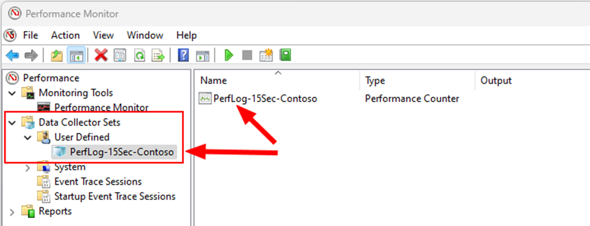
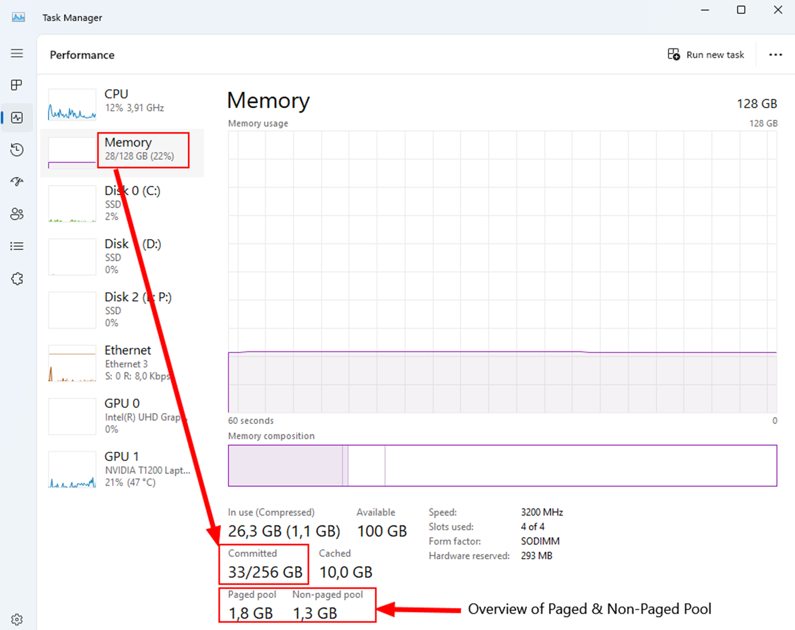

# Scenario guide: troubleshoot performance problems in Windows

This scenario guide explains how to use Performance Monitor to collect data, and use the data to narrow down the bottleneck that makes the computer slow. Using Performance Monitor is a general approach and is trying to explain you concepts in troubleshooting.

## Use Performance Monitor to record performance data

Every full version of Windows comes with an inbox tool called Performance Monitor. We can utilize this tool to track performance related information about various aspects of the Windows system. We do this by using performance counters which are built into windows that provide us with more information on central processing units (CPU) usage or memory usage.

Every counter is constructed in the same simple way:  
[Performance counter object]\\\<Instance\>\\\<Counter Name\>

For example:  
[Processor Information]\\\<CPU 0\>\\%Processor time

To store the performance data provided by the counters, we can use **Data collector Sets** within the Performance Monitor. See the following screenshot:



To create those **Data Collector Sets**, we can use the graphical user interfaces (GUI) or use the `logman.exe` command. To create a data collector set, you can run the following command in an elevated command console window:

```console
logman.exe create counter PerfLog-15Sec-Contoso -o "c:\perflogs\Contoso_PerfLog-15sec.blg" -f bincirc -v mmddhhmm -max 800 -c "Hyper-V Dynamic Memory Balancer (*)\*" "Hyper-V Hypervisor Virtual Processor(*)\*" "Hyper-V Hypervisor Logical Processor(*)\*" "\LogicalDisk(*)\*" "\Memory\*" "\Cache\*" "\Network Interface(*)\*" "\Paging File(*)\*" "\PhysicalDisk(*)\*" "\Processor(*)\*" "\Processor Information(*)\*" "\Processor Performance(*)\*" "\Process(*)\*" "\Process V2(*)\*" "\Redirector\*" "\Server\*" "\System\*" "\Server Work Queues(*)\*" "\Terminal Services\*" -si 00:00:15
```

Command to start the counter (please use an elevated cmd):

```console
logman.exe start PerfLog-15Sec-Contoso
```

Command to stop the counter (please use an elevated cmd):

```console
logman.exe stop PerfLog-15Sec-Contoso
```

This command generates a "flight box recorder" like monitor on your system. The monitor logs performance data every 15 seconds (see -si 00:00:15 for the interval). The impact on the system should be less than 1% and it will not use more than 800 MB (megabytes) on your local hard disk each time the collector set is started. If you restart the computer, you need to run the command to start the monitor again.

The data collector set also follows the principle of [Performance counter object]\\\<Instance\>\\\<Counter Name\>. Note that the counter object is called "Memory" as this one does not have an instance. The reason is that we only have one memory within Windows, but we might have more than one hard disk or CPU.

We now have a data collector set that is logging data every 15 seconds. We choose every 15 seconds because of a limitation of the tool that we use to analyze the data: Performance Monitor.

There can only display up to 1000 data points within the graph. If we configure the data collector to log data every seconds, the graph can only display the data in 16 minutes and 40 seconds. If we have more data in the log, we start to "summarize and combine" those data points. We call this a high density capture.

This might lead to a situation where the graph is not showing you accurate numbers. You can spot that by looking at the graph and compare it with the number of **minimum** or **maximum**.

In this example, we are looking at the counter **%idle time** of the instance  **_Total** for counter object **Processor**. Based on the minimum value, we should see the graph hitting the blue line (which is placed on 32%) but we do not see that. As the number and the graph do not match, we need to verify how many samples we have within the displayed period (22min 01 seconds). When we do a mouse over, we will see a “fly out” that will show us how many samples are in this data points. As you can see, we have 10 Samples, therefore we are forced to **summarize and combine** as this was a capture with a 1 second interval.


## Simplify Windows

Now that we have our performance counter log, let's try to simplify Windows in a way that helps us with the analysis. We do this by breaking down a System into its logical components: Memory, Storage, CPU, Network.


We already mapped a few performance monitor objects towards the physical resource. In addition, we also must remember that Windows is split into two major areas called **Kernel** and **User mode**.

**Kernel** refers to the operating system and drivers (this also includes your Antivirus Filter driver). **Kernel** is represented in Windows in a logical construct called **System Process** which always has the Process ID 4. For security reasons, this area is strongly protected. Even with inbox tools like Performance Monitor, we only get a little information out of it. For example, we see how much **Non-Paged Pool** we are using, but not who is using it.

The **User mode** is where we run all applications (modern Appx, Services, executables). With Performance Monitor, we can get a lot of information for each process.

## Introduce the 18 most important counters

To simplify, the following sections introduce 18 most important counters and their threshold broken down by the physical resource this is related to.

### Storage

| Primary counters                     | Healthy | Warning | Critical |
| :----------------------------------- | :------ | :------ | :------- |
| \\LogicalDisk(*)\\Avg. Disk sec/Read   | < 15 ms | > 25 ms | > 50ms   |
| \\LogicalDisk(*)\\Avg. Disk sec/Write  | < 15 ms | > 25 ms | > 50 ms  |
| \\PhysicalDisk(*)\\Avg. Disk sec/Read  | < 15 ms | > 25 ms | > 50 ms  |
| \\PhysicalDisk(*)\\Avg. Disk sec/Write | < 15 ms | > 25 ms | > 50 ms  |

Comment: Short spikes can be tolerated. We should investigate longer period of latencies (over 1 minute time or longer).

This counter represents latency. Latency is defined in how much time we spend getting the information we are after. In disk performance perspective, we need to take a closer look at the setup. For a normal hard disk instead of a solid state hard drives (SSD), normally the disk has a rotation speed mentioned like 5400 Revolutions Per Minute (RPM). That means we turn the Spindle (where we store the information as blocks) 5400 times per minute. We should be able to calculate the time that it takes to read any block from the disk:

1 block / (RPM / 60) = latency for 1 block  
1 block / 5400 RPM / 60 = 0.011111 sec = 11 ms

Therefore, in theory, we should be able to read any block within 11ms. If we now see a latency of ~100ms, we should have been able to read the block at least 8 times, so why the delay? Is the disk overwhelmed, and if so, who is using it?

To identify who is using it, we can now check the Process counter object:

Process Counter to relate to Disk operations:

- \\Process(*)\\IO Read Operations/sec (process-specific disk read times)  
- \\Process(*)\\IO Write Operations/sec (process-specific disk write times)

We can use those counters and try to correlate the latency or disk usage with the process usage.

Let´s move on to our next physical component.

### Memory

| Virtual Memory and Physical Memory counters      | Healthy                                 | Warning | Critical                 |
| :----------------------------------------------- | :-------------------------------------- | :------ | :----------------------- |
| \\Memory\\Pool Paged Bytes | Pool Nonpaged Bytes | 0–50%                                   | 60–80%  | 80–100%                  |
| \\Memory\\Available MBytes                       | > 10% or at least 4 GB (gigabytes) free | < 10%   | < 1% or less than 500 MB |
| \\Memory\\% Committed Bytes In Use               | 0–50%                                   | 60–80%  | 80–100%                  |

This section is about the following counter:  
Pool Paged Bytes | Pool Nonpaged Bytes

This counter represents a kernel resource that is shared by the entire system. Even when processes can claim Paged & Non-Paged Pool, this is mostly done by drivers, and therefore the data is not visible for Performance Monitor. While Paged Pool can be paged out to the page file, this is not possible for Non-Paged Pool. Keep in mind that those kernel resources are depending on the size of Memory (random access memory (RAM)) you have in the system. The limit of Non-Paged-Pool is 75% of your RAM and they do have a direct impact on your **Available MBytes**. **Available MBytes** is the amount of RAM available to all programs including the kernel.

If you want to understand the impact of your process towards the RAM-Utilization, you can use the following counter:

| Process Counter         | Comment                                                                                                                                                                   |
| :---------------------- | :------------------------------------------------------------------------------------------------------------------------------------------------------------------------ |
| \Process(*)\Working Set | Try to relate to “Available MB” to identify top consumer of your RAM. Working Set is defined as the amount of RAM (not pagefile) a process is using at any point in time. |

Keep in mind that **Memory\% Committed Bytes in Use** represents the virtual memory that you have in Windows. This is the combination of Page file and RAM and can be viewed in **Task Manager** within the **Performance** tab after selecting **Memory**:



This system has 128 GB of RAM and a page file of 128 GB, so the **Committed** is 256GB. You can also get a quick glance on **Paged Pool** and **Non-paged Pool**.

When investigating memory issues, you need to keep in mind that both areas (Kernel and User) are in fact sharing the SAME physical resource. Therefore, if the computer has low memory, try to find out who is using it.

Lets move on the next physical resource.

### CPU

When troubleshooting CPU performance, we again, face the splitting of the operating systems (OS) into **Kernel** and **User** mode. However, it is easier to understand, as the user mode is represented by any application or service, also include the applications that run in user mode, that is consuming CPU-Cycles that do not involve other hardware than the CPU. If we do need to access hardware, this results in kernel mode as we need to talk to drivers to access GPU, Storage, or Network.

Here are some examples:

- SQL Server doing a calculation = User mode  
- SQL Server writing log files to the Disk = Kernel mode  
- File Server accessing network shares = Kernel mode  

Then, let us look at the primary counters:

| Primary counters                                            | Healthy | Warning | Critical |
| :---------------------------------------------------------- | :------ | :------ | :------- |
| \\Processor Information(*)\\% User Time (User mode)         | < 50%   | 50–80%  | > 80%    |
| \\Processor Information(*)\\% Privileged Time (kernel mode) | < 30%   | 30–50%  | > 50%    |
| \\Processor Information (*)\\% idle Time                    | >20%    | >10%    | <10%     |

Again, short spikes are acceptable, but if you do see it for a longer period than 1 minute, start investigating.

Each time a CPU is used, we either consume **%User time** (User mode) or **%Priviliged time** (Kernel Mode). If you encounter a high CPU-situation (= low % idle Time), we need to find out who is using it. To do this, we can look at the following secondary counters:

| Secondary counters              | comment                                                                                                                                                                                                                      |
| :------------------------------ | :--------------------------------------------------------------------------------------------------------------------------------------------------------------------------------------------------------------------------- |
| \\Process(*)\\% User Time       | Keep in mind you might have more than 1 process active                                                                                                                                                                       |
| \\Process(*)\\% Privileged Time | Keep in mind we only get limited information on the system process. The System Process is normally the top driver for % Priviliged time as we host drives inside this logical construct. However, it is not limited to this. |

Important here is the following:

100% Process\% User time = 1 CPU. If you have 16 CPUs (central processing units), the maximum usage a process can reach is 1600 %. Let me demonstrate this:


Here we have used a tool to simulate CPU-Usage (%User mode). We have limited it to running only on 4 CPUs (CPU 12,13,14,15). Once we see 4 threads active, we can see how all the CPUs reach 100% while the application itself (CPU Stress) reaches 400%. Here we can also see the relationship between the CPU-Usage of CPU Stress and the CPU-Load on the CPUs we have limited the application to run on. This is the kind of relationship we try to create to fully understand what is going on.

This brings us to the last physical object:

### Network

Here i would like to call out that performance monitor is a local tool and we can get only basic information from the network. However, i do would like to call out a few counters:

| Primary counters                             | Healthy             | Warning | Critical |
| :------------------------------------------- | :------------------ | :------ | :------- |
| \\Network Interface(*)\\Bytes Total / sec    | < 50%               | 50–80%  | > 80%    |
| \\Network Interface(*)\\Bytes sent  / sec    | Expected behaviour? |         |          |
| \\Network Interface(*)\\Bytes received / sec | Expected behaviour? |         |          |

Note: The values are related to the speed of the network card, and you do need to do the calculation. When doing so, remember that network speed is measured in BIT and 8 BIT = 1 BYTES. So, if you have 1 GB Network card, you can reach up to 125 Megabytes / sec in terms of throughput.

While the Bytes Total / sec helps you to understand the overall utilization of your network card, the other two counters are helping you to understand if you are receiving or sending more data. If you have this information, you can then compare it with the expected behaviour. If you do wish to investigate your network, we will require a different toolset as we will require end-to-end traces from BOTH sides to fully understand the network behaviour.

This concludes the break down and the physical components of a windows system and i wanted to point out that if we face a bottleneck on any physical components, your system will have problems. And with your system, your application is also impacted. 
We hope this Scenario guide helps you to get a basic understanding of Performance Monitor and how to prepare your system for a “black box” capture like a flight recorder. If you do need further help analysing the data, please feel free to reach out to us by opening a support ticket.
