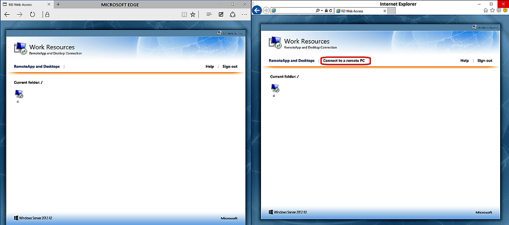

# WinX: Remote Desktop tab in RDWEB is missing from Microsoft Edge browser

This article provides a resolution for an issue that prevents the Microsoft Edge browser from working correctly with websites or apps that require ActiveX controls.

_Original product version:_ &nbsp;Windows 10 - all editions  
_Original KB number:_ &nbsp;3092523

## Symptoms

Microsoft Edge is the new default web browser for Windows 10. However, if you're running Remote Desktop Web Access (RDWEB) or web apps that require ActiveX controls, the Edge browser may not work, and we recommend that you continue to use Internet Explorer 11.

As seen in the following side-by-side images, the **Connect to a remote PC**  tab is missing from the Edge UI (the image on the left), but in Internet Explorer (the image on the right) this tab is still displayed. 

When Internet Explorer is configured to work in this scenario, the MsRdpClientShell - MsRdpWebAccess.dll  add-on is loaded as an ActiveX control.

## Cause

This issue occurs because, by design, ActiveX controls aren't supported in Microsoft Edge.

## Resolution

Microsoft Edge is the default browser in Windows 10, with Internet Explorer provided to handle legacy sites.

If you have specific websites and apps that have compatibility issues with Microsoft Edge, you can use the Enterprise Mode site list. This lets you continue to use Microsoft Edge as your default browser while also making sure that sites and apps that rely on Internet Explorer continue to work.

To download the Enterprise Mode Site List Manager tool from the Internet Explorer Download Center, go to [Enterprise Mode Site List Manager](https://go.microsoft.com/fwlink/?linkid=394378).

To add sites to your Enterprise Mode site list, see [https://technet.microsoft.com/library/mt270205.aspx#fix_specific_sites](https://technet.microsoft.com/library/mt270205.aspx#fix_specific_sites).

## More information

To learn how to use Enterprise mode and the Enterprise Mode Site List Manager tool in your company, see [Enterprise Mode for Internet Explorer 11](https://technet.microsoft.com/library/mt269903.aspx).

For information about how to configure RD Session Host and RD Connection Broker servers to take advantage of the Web SSO feature when you start RemoteApp programs from RD Web Access, see [Introducing Web single sign-on for RemoteApp and Desktop connections](http://blogs.msdn.com/b/rds/archive/2009/08/11/introducing-web-single-sign-on-for-remoteapp-and-desktop-connections.aspx).

For information about Remote Desktop Web Access single sign-on in Windows Server 2012, see [Remote Desktop Web Access single sign-on now easier to enable in Windows Server 2012](http://blogs.msdn.com/b/rds/archive/2012/06/25/remote-desktop-web-access-single-sign-on-now-easier-to-enable-in-windows-server-2012.aspx).
