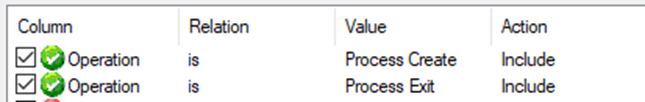
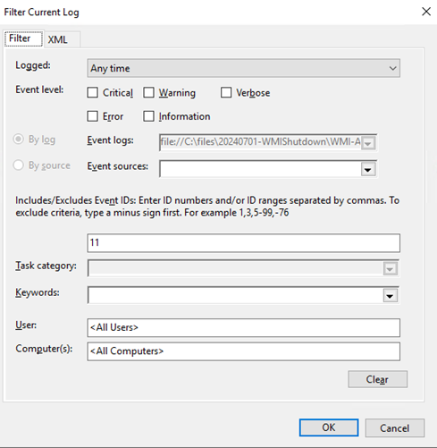

# How to identify the cause of unexpected WMI shutdown

This article introduces how to identify the source of a Windows Management Instrumentation \(WMI\) request that shuts down a computer.

## Symptom

A computer is shut down unexpectedly. You found the event 1074 in the System log. The event indicates that the request comes from a WMIPrvSE process:

```output
Log Name:      System
Source:        User32
Date:          <date and time>
Event ID:      1074
Level:         Information
User:          <User>
Computer:      <FQDN>
Description:
The process C:\Windows\system32\wbem\wmiprvse.exe (<computer name>) has initiated the shutdown of computer <computer name> on behalf of user <user> for the following reason: No title for this reason could be found
 Reason Code: 0x80070015
 Shutdown Type: shutdown
 Comment:
```

## Analysis

WMI can shut down a computer by calling the Win32Shutdown method of the Win32_OperatingSystem class. However, the difficulty lies in identifying the source of this request. A script or an application can be deployed to call this method without including the information of where and when it runs.

To troubleshoot unexpected shutdowns caused by WMI, a WMI trace needs to be collected continuously until the behavior occurs. The trace can be collected by enabling the log `Application and Services Logs / Microsoft / Windows / WMI-Activity / Trace` (The log is not visible by default in Event Viewer). To view this log, enable the option **View** -> **Show Analytic and Debug Logs**.

The trace reveals the process ID and the user where the request comes from. You'll also need to capture a Process Monitor trace to identify that process.

You can download Process Monitor from [Process Monitor](/sysinternals/downloads/procmon).

## Troubleshooting steps

### Preparations

To start the investigation, follow these steps:

1. Create a folder on the C: drive, such as *C:\WMI*.
2. Extract the Process Monitor archive file to the folder.
3. Create these two batch files in the folder:

   StartTrace.bat:

   ```console
   wevtutil sl Microsoft-Windows-WMI-Activity/Trace /e:true /q
   procmon /Quiet /Minimized /Backingfile %0\..\procmon.pml /LoadConfig %0\..\filter.pmc
   ```

   Stop trace.bat:

   ```console
   procmon /Terminate
   wevtutil sl Microsoft-Windows-WMI-Activity/Trace /e:false
   wevtutil epl Microsoft-Windows-WMI-Activity/Trace %0\..\WMI-ActivityLog.evtx /ow:true
   ```

### Create Process Monitor filters

Create a Process Monitor configuration with an event filter to only capture what is needed for this investigation. Follow these steps:

1. Start Process Monitor.
2. Select the **Reset** button at the **Process Monitor Filter** dialog box, if it shows up.
3. Unselect the third button in the toolbar to stop the automatic capture.
4. Select the **Filter** menu, and then select the **Filter** option.
5. In the **Process Monitor Filter** dialog box, select **Operation**, **is**, type *Process Create*, and then select **Add**.  
   Also define another filter by selecting **Operation**, **is**, type *Process Exit*, and then select **Add**.|
   
6. Select **OK** to confirm the filter configuration.
7. Select the **File** menu then **Export Configuration...**, save the file *C:\WMI\filter.pmc*.

### Create a scheduled task

Then, create a scheduled task to stop the capture when the reboot occurs. Follow these steps:

1. Open **Task Scheduler**.
2. Right click the **Task Scheduler Library** node, and then select **Create Task...**.
3. Type a name for the task.
4. Select the **Run whether or not user is logged on**.

   

5. Select the **Triggers** tab.
   1. select **New...**, and then select **On an event** for the **Begin the task** option.
   2. In **Log** select **System**.
   3. In **Source** type *User32*.
   4. In **Event ID** type *1074*.
   5. Select **OK**.

      

6. Select the **Actions** tab.
   1. Select **New...**.
   2. Keep the default for the **Action** option: **Start a program**.
   3. Select **Browse...**, and then select the **StopTrace.bat** batch file in the *C:\WMI* folder.
   4. Select **OK**.
7. Select **OK** to confirm the task. When you're asked for the credentials, provide the user account that is a member of the Administrators group.

### Start the capture

Now you're ready for the capture. From an elevated Command Prompt window, go to the C:\WMI folder, and then run StartTrace.bat.

> ![NOTE]
> A Process Monitor capture has been started at this point. You will be able to see the PML file in that folder. Even with a filter defined, the capture is left running for long time. Multiple PML files will be created that can consume a lot of this space.
>
> Make sure to monitor the size and number of these PML files. If the unexpected shutdown doesn't happen, you may want to stop and restart the trace to clear out older PML files that are no longer needed for the investigation.

When the reboot occurs, the StopTrace.bat batch file is called. The Process Monitor trace capture is stopped and the WMI trace is saved.

### Investigate the trace

After the reboot, follow these steps to conclude the investigation:

1. Go to the *C:\WMI* folder, and double click the WMI-ActivityLog.evtx file.
2. Right click the log name in the left pane then select **Filter Current Log...**.

   

3. Type *11* in the **Event ID** text box

   

4. After the filter is applied, the first event on the top should be the one with the shutdown request. If not, press the Ctrl key and the F key, and then type *shutdown*.

   Here's a sample of the event log:

   ```output
   Log Name:      Microsoft-Windows-WMI-Activity/Trace
   Source:        Microsoft-Windows-WMI-Activity
   Date:          <date and time>
   Event ID:      11
   Level:         Information
   User:          SYSTEM
   Computer:      <FQDN>
   Description:
   CorrelationId = {6BE1F66D-CD17-0003-6718-E26B17CDDA01}; GroupOperationId = 11687; OperationId = 11698; Operation = Start IWbemServices::ExecMethod - root\cimv2 : Win32_OperatingSystem=@::Win32Shutdown; ClientMachine = <computer name>; User = <user>; ClientProcessId = 2712; NamespaceName = 133644697772514501
   ```

   Note the **ClientProcessId**.

5. Now double click the procmon.pml file and find the corresponding line with the same process ID \(PID\).

   

6. In this example, the shutdown method was called by a PowerShell script.

   

7. Go to the **Process** tab, in the **Command Line** field, you can find the path of the script.

### Cleanup

After the investigation is finished, don't forget to reset the Process Monitor configuration:

1. Select the **File** menu, and then select **Backing files...**.
2. Select the option **Use virtual memory**.
3. Select **OK**
