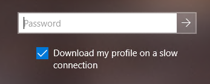

# Managing User Profile Service slow link detection

This article describes how to optimize slow link detection to effectively balance the quality of the bandwidth estimate against the amount of time spent calculating the estimate.

_Original product version:_ &nbsp; Windows Server 2019, Windows Server 2016, Windows Server 2012 R2, Windows Server 2012, Windows Server 2008 R2, Windows Server 2008, Windows 10, Windows 8.1, Windows 8

## Summary

Windows User Profile Service can use slow link detection to determine whether to download a roaming user profile to the client computer when the user signs in. If the service determines that the connection to the client computer is slow (or if you disable slow link detection) the client skips the download and loads the local copy of the roaming user profile. The service also records an event that resembles the following:

> Log Name:      Application  
> Source:        Microsoft-Windows-User Profiles Service  
> Event ID:      1543  
> Task Category: None  
> Level:         Error  
> Keywords:  
> Description:  
> A slow network connection is detected for the roaming profile `\\profileserver.contoso.com\profileshare$\USER\RWacker.V6`. It will not be synchronized with the profile on this computer.

The user might also receive a message that resembles the following:

> Your roaming profile isn't synchronized with the server because a slow network connection is detected. You've been signed in with a local profile.

The default configuration of the slow link detection settings should correctly identify slow links in most deployments. However, if Windows does not appear to identify slow links correctly, consider modifying the slow link detection settings. For example, if the User Profile Service determines that a network connection is a fast link, but in reality the connection is slow, the user sign-in experience may be unusually slow. The user might see the “Waiting for the User Profile Service” message for an unacceptably long time.

## More information

The following sections describe how the slow link detection algorithm works, and recommends a starting point and factors to consider in your own testing and tuning.

### How Windows detects slow links

When slow link detection is enabled, the User Profile Service uses a temporary file on the server to perform a set of file writes and reads. To calculate the link speed and delay during these operations, the service uses statistics that are measured by the Network Location Awareness (NLA) service.

The size of the temporary file is specified by the **PingBufferSize** registry entry. This entry is defined as follows:

- **Subkey:** "HKLM\Software\Microsoft\Windows NT\CurrentVersion\Winlogon"  
- **Value:** "PingBufferSize"  
- **Type:** REG_DWORD  
- **Data:** File transfer size in bytes
  - Default: **65,536**
  - Minimum: **2,048**
  - Maximum: **65,536** or **4,194,304**  
    > [!NOTE]  
    > The maximum value of **PingBufferSize** depends on the version of Windows, as described later in the article.

The quality of the estimate depends on the sizing of **PingBufferSize** and how well the metrics of the algorithm match the actual transfer patterns and network topology.

#### How slow link detection works in older operating systems

For Windows Server 2016 and earlier versions, and Windows 10 version 1803 and earlier versions, the maximum value of **PingBufferSize** is **65536**. During the link test, the service writes **PingBufferSize** + 200 bytes of data, and then measures the statistics.

This algorithm doesn't provide a refined enough estimate to effectively identify slow links. It can produce false positives (a connection is labeled a slow link despite being fast enough) or false negatives (a connection isn't labeled a slow link despite being slow).

#### How slow link detection works in current operating systems

The slow link detection process has changed in Windows Server 2019 and Windows 10, version 1809 and newer versions. Additionally, the maximum **PingBufferSize** has increased to **4194304**. The changes are available in the following updates:

- Windows Server 2019 and Windows 10 1809: [KB 4601383, February 16, 2021-KB4601383 (OS Build 17763.1790) Preview](https://support.microsoft.com/help/4601383)
- Windows 10 1909: [KB 4601380, February 16, 2021—KB4601380 (OS Build 18363.1411) Preview](https://support.microsoft.com/help/4601380)
- Windows 10 20H1/20H2: [KB 4601382, February 24, 2021—KB4601382 (OS Builds 19041.844 and 19042.844) Preview](https://support.microsoft.com/help/4601382)

The new algorithm uses a different file access pattern. Instead of writing data once and then measuring, the new algorithm uses a combination of writing and reading.

1. Write (*PingBufferSize* + 8 KB) of data.
2. Read the data four times (4 &times; (*PingBufferSize* + 8 KB)).

This algorithm produces more accurate delay and throughput measurements, and the new maximum **PingBufferSize** provides more flexibility. However, if the link is very slow, a large **PingBufferSize** might slow down the algorithm itself to the point where it delays the whole process of downloading the user profile.

#### Settings that control slow link detection

Windows provides several Group Policy settings that control slow link detection. The following table describes some of the most important of these policies. For more information about using these policies, see [Policy CSP - ADMX_UserProfiles: ADMX_UserProfiles/SlowLinkTimeOut](https://docs.microsoft.com/windows/client-management/mdm/policy-csp-admx-userprofiles#admx-userprofiles-slowlinktimeout).

> [!IMPORTANT]  
> The policy [**Disable detection of slow network connections**](https://gpsearch.azurewebsites.net/#2571), when enabled, turns off slow link detection. In that case, the policies described in this article are ignored.

|Policy |Purpose |
| --- | --- |
|[Control&nbsp;slow&nbsp;network connection timeout for user profiles](https://gpsearch.azurewebsites.net/#2582) |If you enable this policy setting, you can change how long Windows waits for a response from the server before it considers the connection to be slow.  If you disable or don't configure this policy setting, Windows considers the network connection to be slow if the server returns less than 500 kilobits of data per second or takes 120 milliseconds to respond. |
|[Wait&nbsp;for&nbsp;remote user profile](https://gpsearch.azurewebsites.net/#2581) |If you enable this policy setting, the system waits for the remote copy of the roaming user profile to load, even if the download speed is slow.  If you disable this policy setting or don't configure it, when a remote profile is slow to download, the system loads the local copy of the roaming user profile. |
|[Prompt user when a slow network connection is detected](https://gpsearch.azurewebsites.net/#2572) |If you enable this policy setting, users will be allowed to define whether they want their roaming profile to be downloaded when a slow link with their roaming profile server is detected. |

### Testing the factors that affect profile download speed for your deployment

To optimize user profile downloads for your environment, you need to balance the following factors:

- The Service Level Agreement (SLA) that governs the acceptable time allowed for the total sign-in and sign-out process for your users.
- The factors that affect profile download speed for your users.
- The policy and registry settings that optimize the slow link detection algorithm for your user's network connections.

The following values are the defaults for the [policy and registry settings](#settings-that-control-slow-link-detection).

- **Connection speed**: 500 kbps
- **Time to wait**: 120 milliseconds
- **PingBufferSize**: 65,536 bytes

We've tested slow link detection by using < 10 Mbit/s broadband links plus VPN, Wi-Fi networks, and LAN connections. This testing shows that a **PingBufferSize** of **1,048,576** (1 MB) provides an effective balance between effectively identifying slow links and delaying the link detection process. We recommend that you use this value to start testing. Depending on your environment, the actual value that you should use might be lower or higher.

To make sure that slow link detection works reliably under a variety of conditions, you should test several combinations of profiles (both full and incremental sync) and network conditions.

#### Network factors to consider

- **Slowest potential speeds**.
  Account for the slowest network links that you expect your users to have. Typically, these include mobile carrier connections (such as LTE or UMTS) and home internet connections (such as DSL and cable).

  These networks tend to have asymmetric speeds. They download files at higher speeds than they upload files. By using four times as many reads as writes of the same data, the new slow link detection algorithm is well suited to analyzing asymmetric-speed networks.

  > [!NOTE]  
  > When a user signs out of Windows, Windows uploads any profile files that were updated during the user session. A link that has been identified as a fast link may still produce a slow sign-out experience.

- **Metering**.
  These links may also be metered (priced according to the amount of data transmitted). Both the profile transfer and the slow link detection operations contribute to the data transmission total, so a larger **PingBufferSize** could increase network costs.

- **Encryption**.
  VPN connections typically compress and encrypt data. Compression, encryption, and decryption add time to the network transfers, especially because some user profile data doesn't compress well.

#### User profile factors to consider

When the user signs in to Windows, the User Profile Service enumerates all of the files in the user profile to determine what to update on the local copy. This update may involve downloading a few files that have changed (an incremental update) or downloading the entire user profile (full sync). When the user signs out, Windows uploads any profile files that have changed. This transaction resembles an incremental update.

For testing purposes, consider the time needed to download the entire user profile.

Also, consider the largest profile you have. Because the User Profile Service enumerates the files, the "size" of a profile depends both on the number of files and the total amount of data in those files.

Make sure that the user sign-in experience meets the SLA even when doing a full download of the largest profile.

#### Tuning the user profiles

You can improve the sign-in experience over slow links by configuring the user profiles in the following ways:

- Use the [Limit profile size](https://gpsearch.azurewebsites.net/#2575) policy to restrict the size of the profile.
- Redirect user folders to locations outside the profile (for example, save user files in a [OneDrive for Business](https://docs.microsoft.com/onedrive/redirect-known-folders) folder).
- Use the [Exclude directories in roaming profile](https://gpsearch.azurewebsites.net/#2573) to selectively exclude folders.

## See also

- Group Policy Search (GPS) (gpsearch.azurewebsites.net)
  - [Control slow network connection timeout for user profiles](https://gpsearch.azurewebsites.net/#2582)
  - [Exclude directories in roaming profile](https://gpsearch.azurewebsites.net/#2573)
  - [Limit profile size](https://gpsearch.azurewebsites.net/#2575)
  - [Prompt user when a slow network connection is detected](https://gpsearch.azurewebsites.net/#2572)
  - [Wait for remote user profile](https://gpsearch.azurewebsites.net/#2581)
- [KB 4601383, February 16, 2021-KB4601383 (OS Build 17763.1790) Preview](https://support.microsoft.com/help/4601383)
- [KB 4601380, February 16, 2021—KB4601380 (OS Build 18363.1411) Preview](https://support.microsoft.com/help/4601380)
- [KB 4601382, February 24, 2021—KB4601382 (OS Builds 19041.844 and 19042.844) Preview](https://support.microsoft.com/help/4601382)
- [Redirect and move Windows known folders to OneDrive](https://docs.microsoft.com/onedrive/redirect-known-folders)
- [Policy CSP - ADMX_UserProfiles: ADMX_UserProfiles/SlowLinkTimeOut](https://docs.microsoft.com/windows/client-management/mdm/policy-csp-admx-userprofiles#admx-userprofiles-slowlinktimeout)
