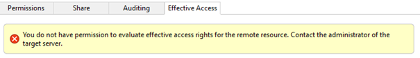
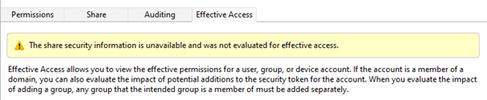
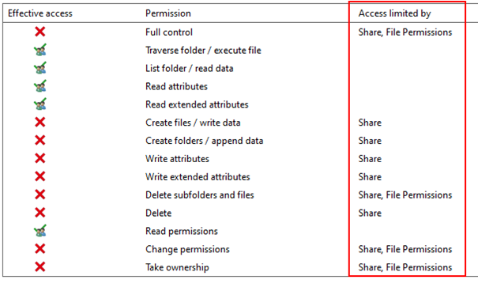

# How to evaluate effective permissions for resources on remote computers

_Applies to:_&nbsp; Windows Server 2022, Windows Server 2019, Windows Server 2016, Windows Server 2012 R2

## Symptoms and causes

When you check a user's effective permissions on a remote resource, you may not see the correct results, or you may see errors.

The details of the behavior and the resolution depend on how you obtain the effective permissions:

- If you're using an existing Windows application, you can use the **Effective Access** tab of the **Advanced Security** dialog for the resource.
- If you're using the Authorization Manager Runtime engine (AuthZ.dll) application programming interface (API), you can call the following functions:

  - **AuthzInitializeContextFromSid**
  - **AuthzInitializeRemoteResourceManager**
  - **AuthzAccessCheck**
  - **AuthzCachedAccessCheck**

Windows Server 2012 R2 introduced changes to the way in which Windows evaluates effective permissions, especially for remote resources.

### Using the Effective Access tab

If you're using the **Effective Access** tab, the tab may display errors or warnings:





For details about how to resolve these issues, see [Remote resources including SMB](#remote-resources-including-smb).

### Using AuthZ API calls

You may observe the issue when you use the API calls under either of the following conditions:

- The application makes the calls remotely from the resource server.
- The user account that is running the application isn't in the same domain as the resource.

In this case, some **Allow** permissions may be missing, or some **Deny** permissions may appear as **GrantedAccessMask** permissions.

Here's a sample scenario:

- There's a global group in domain A and a domain-local group in domain B. The resource is located in domain B.
- The domain-local group has full access to the resource. This access includes **Delete** permissions.
- The global group is a member of the domain-local group. The global group doesn't have direct access to the resource.
- Using an Administrator-level user account and computer in domain A, you remotely retrieve the resource permissions of a user who is a member the global group.

In the results that you retrieve, the user doesn't appear to have **Delete** permissions for the resource. In practice, however, the user does have **Delete** permissions.

AuthZ.dll uses a Kerberos Service for User (Kerberos S4U) transaction to obtain a token for the user. However, this token is relative to the administrative station or to the station where the server application executes. The token isn't relative to the resource server. Therefore, when the resource meets one of the following conditions, the token doesn't include the domain-local groups of the computer that hosts the resource:

- The resource is in a different domain than the administrative station or the administrative user.
- The resource has permissions that are assigned to built-in groups. Built-in groups may be misused.

## How to obtain effective permissions using AuthZ API calls

Use one of the following methods to resolve this issue.

- Use the **AuthzInitializeRemoteResourceManager** function to include a handle to the remote resource when you  call the **AuthzInitializeContextFromSid** function.
- **Local Authz context:**

  - If your configuration enables Kerberos S4U, make sure the administrative user account is in the same domain as the resource.
  - If you check the effective permissions for an Active Directory object, run the administrative tools on a domain controller that has a full copy of the object (configuration naming context (NC), domain NC, or application NC).
  - If you check the effective permissions for a clustered resource, you can run the administrative tools from any cluster node. Alternatively, run the administrative tools from the resource server.  

- **Turn off Kerberos S4U:** Switch the Authz engine to avoid the Kerberos S4U approach and revert to Active Directory (AD) Lightweight Directory Access Protocol (LDAP) and standalone server Security Account Manager (SAM) queries to collect the users group list by using the **UseGroupRecursion** registry entry. To do this, follow these steps:

  1. Open Registry Editor, and then navigate to the **HKEY_LOCAL_MACHINE\SOFTWARE\Microsoft\Windows NT\CurrentVersion\Authz** subkey.
  1. Select **Edit** > **New** > **DWORD Value**.
  1. Enter **UseGroupRecursion**.
  1. Right-click **UseGroupRecursion** and then select **Modify**.
  1. Enter **1** and then select **OK**.  
     > [!NOTE]  
     > When the value is **0** (the default value), Authz uses the Kerberos method. When the value is set to **1**, AuthZ uses AD LDAP and standalone server SAM queries.
  1. Close Registry Editor.

> [!NOTE]  
>- **UseGroupRecursion** won't be effective if you use the AUTHZ_REQUIRE_S4U_LOGON flag when you create the Authz context.
>- The application user has to have **Read** permissions for the **TokenGroups** attribute and for the domain-local groups of the resource domain.
>- The application has to be able to use SAM RPC protocol when it calls the APIs. This is because server-local groups are retrieved by using SAM APIs. You can set an access control list (ACL) on the SAM RPC interface by using the **RestrictRemoteSAM** security policy.

## How to obtain effective permissions on remote resources including SMB shares

Windows Server 2012 R2 added an AuthZ RPC interface to the LSASS process, managed by the Netlogon service. With the help of this RPC interface, you can evaluate effective permissions relative to the actual resource server.

This update also added the ability evaluate permissions set at both file system and the share level. When you use this capability, you see what part of the access check is limiting access:



When you evaluate effective access to resources, consider the following factors:

- **Authorization on the remote server**  
  To evaluate effective permissions for a resource on a remote server, a user has to belong to the **Access Control Assistance Operators** group. This built-in group makes it easier to delegate access to people who don't have administrative access to resource servers. Otherwise, users have to have administrative access to both the remote server and the share or other resource.
- **Access to SMB share information**
  - **Permissions to retrieve the security descriptor for the share**  
  The user may also require administrative access to the SMB share security descriptors. Many in-market operating system versions don't grant such access by default. To receive an update that provides this capability, contact Microsoft Support. The solution for in-market operating system versions isn't publicly available.
  - **How the server is accessed (if the resource uses share-level access control)**  
  To evaluate the effective permissions for a resource on a remote server that uses share-level access control, you have to use a UNC share path to access the resource. Don't try to use a mapped drive letter to access the resource. For example, use a path that resembles the following:

    ```console
    \\fileserver01.contoso.com\finance-data\year2022\quarter2\
    ```

    instead of a path that resembles the following:

    ```console
    f:\year2022\quarter2\
    ```

    (in this example, `f:` maps to `\\fileserver01.contoso.com\finance-data`).

If you aren't using share permissions to restrict users, you can ignore the share permissions warning.
