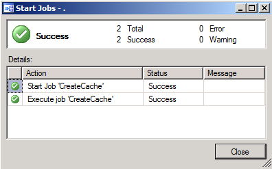
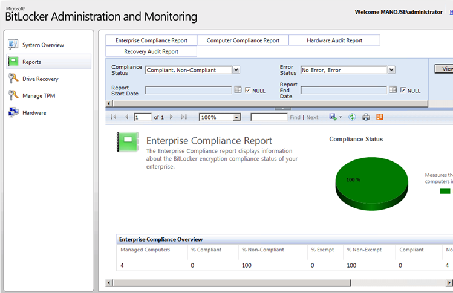

# MBAM Enterprise Reports aren't updated

This article provides a solution to an issue where Microsoft BitLocker Administration and Monitoring (MBAM) Enterprise Reports aren't updated as expected.

_Applies to:_ &nbsp; Windows 10 - all editions, Windows Server 2012 R2  
_Original KB number:_ &nbsp; 2620269

## Symptoms

When you try to view Enterprise Reports on a MBAM Server, you may not see the updated reports with computer listed as compliant or non-compliant.

## Cause

There is always latency based on how often the MBAM client talks to the MBAM server. Enterprise Compliance report runs from a SQL stored procedure and updates every 6 hours.

## Resolution

To get updated reports, open SQL Management Studio on the MBAM Server. Under **SQL Server Agent**, click **Jobs** and then click **Create Cache**. Right-click on **Create Cache** and click **Start Job at Step...**.

Once the Job is completed, refresh the web page for MBAM Enterprise Reports and you will see all the computers listed.

## References

- [Planning for MBAM](/previous-versions/hh285653(v=technet.10))
- [Deploying MBAM](/previous-versions/hh285644(v=technet.10))
- [Operations for MBAM](/previous-versions/hh285664(v=technet.10))
- [Troubleshooting MBAM](/previous-versions/hh352745(v=technet.10))
