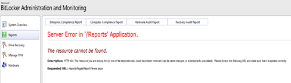

# Error message when you click Reports tab in MBAM: Server Error in /Reports Application

This article fixes an error when you click the Reports tab in MBAM.

_Applies to:_ &nbsp; Windows Server 2012 R2, Windows 10 – all editions  
_Original KB number:_ &nbsp;2620287

## Symptoms

When you try to View Reports on Microsoft BitLocker Administration and Monitoring (MBAM) Server, you may receive an error message as show below.

> Server Error in '/Reports' Application
>
> The resource cannot be found.
>
> Description: HTTP 404. The resource you are looking for (or one its dependencies) could have been removed, had its name changed or is temporarily unavailable. Please review the following URL and make sure it is spelled correctly.
>
> Requested URL: /reports/Pages/ReportViewer.aspx

## Cause

If the DNS isn't able to resolve the local host correctly, you'll see the error message mentioned above.

## Resolution

1. Open Windows Explorer and scroll to C:\\inetpub\\Malta BitLocker Management Solution\\Help Desk Website.
2. Take a backup of web.config file.
3. Open web.config file using notepad.
4. Modify the following line in the webconfig file:

    > \<add key="Microsoft.Mbam.Reports.Url"  
     value="http://servername:portnumber/reports/Pages/ReportViewer.aspx?/Microsoft+  
    BitLocker+Administration+and+Monitoring/">\</add>

    to

    > \<add key="Microsoft.Mbam.Reports.Url"  
    value="http://servername:portnumber/reports/Pages/Report.aspx?ItemPath=%2fMicrosoft+BitLocker+Administration+and+Monitoring%2f">\</add>

5. Save the web.config file.
6. Restart the IIS services on the server.

    Now you can view the Reports in MBAM.

    

## More information

For more information on MBAM, see the following documentation.

[Planning Guide](https://onlinehelp.microsoft.com/mdop/hh285653.aspx)

[hDeployment Guide](https://onlinehelp.microsoft.com/mdop/hh285644.aspx)

[Operations Guide](https://onlinehelp.microsoft.com/mdop/hh285664.aspx)

[Troubleshooting MBAM](https://onlinehelp.microsoft.com/mdop/hh352745.aspx)
